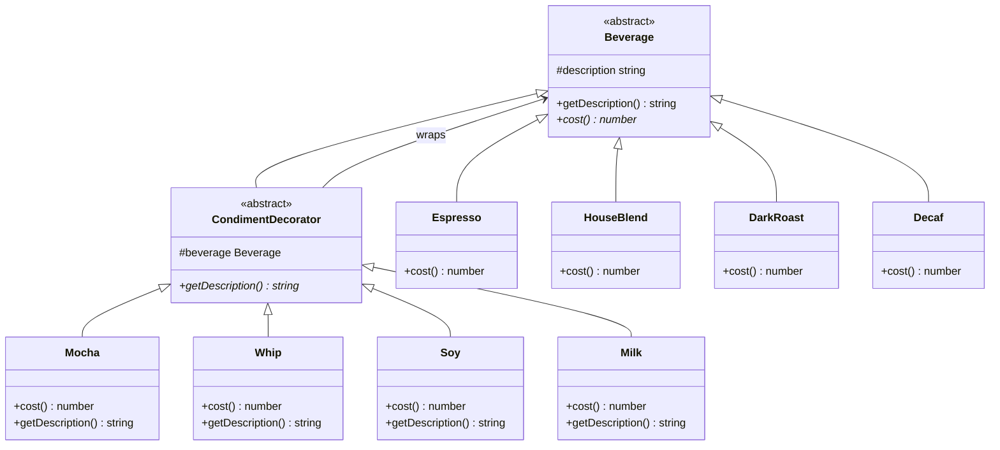

# Week 3. 데코레이터(Decorator) 패턴

## 학습 정보

- **주차**: 3주차
- **챕터**: Chapter 03 — 객체 꾸미기
- **패턴명**: 데코레이터 패턴 (Decorator Pattern)
- **학습일**: 2025-03-03
- **학습 범위**: Chapter 03 전체

---

## 학습 목표

- 상속을 남용했을 때 발생하는 클래스 폭발 문제를 이해하고, 구성(Composition)으로 해결하는 방법을 학습한다.
- 데코레이터 패턴의 구조와 동작 원리를 파악하고, TypeScript로 직접 구현한다.
- OCP(개방-폐쇄 원칙)의 의미를 이해하고, 데코레이터 패턴이 이 원칙을 어떻게 실현하는지 파악한다.

---

## 핵심 개념

### 패턴이 해결하는 문제

스타버즈 커피 주문 시스템을 예로 들어보자.
<br />
기본 음료(에스프레소, 하우스 블렌드 등)에 첨가물(우유, 모카, 휘핑크림 등)을 조합해야 하는 상황이다.

**해결 시도 1: 조합마다 서브클래스 생성**

모든 조합에 대해 클래스를 만드는 방식이다. `HouseBlendWithMocha`, `HouseBlendWithMochaAndWhip` 같은 클래스가 기하급수적으로 늘어나는 "클래스 폭발" 문제가 발생한다.
<br />
첨가물 가격이 바뀌거나 새로운 첨가물이 추가되면 수많은 클래스를 전부 수정해야 한다.

**해결 시도 2: 슈퍼클래스에 불리언 플래그 추가**

`Beverage` 클래스에 `hasMilk`, `hasSoy`, `hasMocha`, `hasWhip` 같은 불리언 변수를 두고, `cost()`에서 플래그를 확인하여 가격을 계산하는 방식이다.
<br />
클래스 수는 줄어들지만 다음과 같은 문제가 남는다.

- 첨가물 종류가 추가될 때마다 슈퍼클래스의 코드를 수정해야 한다.
- 특정 음료에 어울리지 않는 첨가물(예: 아이스티에 휘핑크림)도 상속받게 된다.
- 더블 모카처럼 같은 첨가물을 두 번 추가하는 경우를 처리할 수 없다.

두 시도 모두 "바뀌는 부분을 캡슐화한다"와 "클래스는 확장에 열려 있고 변경에 닫혀 있어야 한다(OCP)"를 지키지 못하고 있다.

데코레이터 패턴은 이 문제를 객체를 동적으로 감싸는(wrapping) 방식으로 해결한다.

### 패턴의 정의

> **데코레이터 패턴(Decorator Pattern)** 으로 객체에 추가 요소를 동적으로 더할 수 있다.
> <br />
> 데코레이터를 사용하면 서브클래스를 만들 때보다 훨씬 유연하게 기능을 확장할 수 있다.

핵심 아이디어는 다음과 같다.
<br />
기본 객체를 데코레이터 객체로 감싸고, 데코레이터는 자신이 감싼 객체에게 작업을 위임한 뒤 추가 행동을 덧붙인다.
<br />
데코레이터는 감싸는 객체와 같은 슈퍼타입을 가지므로, 원래 객체가 들어갈 자리에 데코레이터를 넣어도 문제가 없다.

### 주요 구성요소

- **Component (Beverage)**
  <br />
  구성 요소의 공통 인터페이스 또는 추상 클래스.
  <br />
  구상 구성 요소와 데코레이터 모두 이 타입을 공유한다.
- **ConcreteComponent (Espresso, HouseBlend 등)**
  <br />
  기본 행동을 구현하는 구상 클래스.
  <br />
  데코레이터로 감싸져 새로운 행동이 추가되는 대상이다.
- **Decorator (CondimentDecorator)**
  <br />
  Component를 확장하는 추상 클래스.
  <br />
  내부에 Component 참조를 가지며, 이를 통해 감싸는 객체에 작업을 위임한다.
- **ConcreteDecorator (Mocha, Whip, Soy 등)**
  <br />
  Decorator를 구현한 구상 클래스.
  <br />
  위임 결과에 자신만의 행동을 추가한다.

---

## 패턴 구조

### UML 다이어그램



여기서 상속은 **행동을 물려받기 위한 것이 아니라 타입을 맞추기 위한 것**이다.
<br />
`CondimentDecorator`가 `Beverage`를 상속하는 이유는 데코레이터가 원래 구성 요소와 같은 자리에 들어갈 수 있어야 하기 때문이다.
<br />
실제 행동의 확장은 구성(Composition)과 위임(Delegation)을 통해 이루어진다.

### 동작 방식

모카와 휘핑크림을 추가한 다크 로스트 커피의 가격 계산 과정을 예로 들어보자.

1. `DarkRoast` 객체를 생성한다.
2. `Mocha` 데코레이터로 `DarkRoast`를 감싼다.
3. `Whip` 데코레이터로 `Mocha`를 감싼다.
4. 가장 바깥쪽 `Whip`의 `cost()`를 호출한다.
5. `Whip`은 내부의 `Mocha`에게 `cost()`를 위임한다.
6. `Mocha`는 내부의 `DarkRoast`에게 `cost()`를 위임한다.
7. `DarkRoast`가 0.99를 반환한다.
8. `Mocha`가 0.99 + 0.20 = 1.19를 반환한다.
9. `Whip`이 1.19 + 0.10 = 1.29를 반환한다.

각 데코레이터는 감싸고 있는 객체에 작업을 위임한 뒤, 그 결과에 자신의 비용을 더하는 방식으로 동작한다.
<br />
데코레이터를 여러 겹 감싸도 이 위임 체인이 자연스럽게 연결된다.

---

## 코드 예제

### 예제 상황

스타버즈 커피 주문 시스템이다.
<br />
기본 음료(에스프레소, 하우스 블렌드, 다크 로스트, 디카페인)에 첨가물(모카, 두유, 휘핑크림 등)을 자유롭게 조합할 수 있어야 한다.
<br />
같은 첨가물을 여러 번 추가하는 것(더블 모카 등)도 가능해야 하며, 기존 코드를 수정하지 않고 새로운 첨가물을 추가할 수 있는 확장성이 요구된다.

### 추상 클래스 정의

```typescript
/** Component — 음료의 추상 클래스 */
export abstract class Beverage {
  protected description: string = "제목 없음";

  public getDescription() {
    return this.description;
  }

  public abstract cost(): number;
}

/** Decorator — 첨가물 데코레이터의 추상 클래스 */
export abstract class CondimentDecorator extends Beverage {
  // 감싸는 대상을 Beverage 타입으로 저장한다.
  // 어떤 음료든, 어떤 데코레이터든 감쌀 수 있다.
  constructor(protected beverage: Beverage) {
    super();
  }

  public abstract getDescription(): string;
}
```

### 구상 구성 요소: 기본 음료

```typescript
export class Espresso extends Beverage {
  constructor() {
    super();
    this.description = "에스프레소";
  }

  public cost() {
    return 1.99;
  }
}

export class HouseBlend extends Beverage {
  constructor() {
    super();
    this.description = "하우스 블렌드 커피";
  }

  public cost() {
    return 0.89;
  }
}

export class DarkRoast extends Beverage {
  constructor() {
    super();
    this.description = "다크 로스트 커피";
  }

  public cost() {
    return 0.99;
  }
}

export class Decaf extends Beverage {
  constructor() {
    super();
    this.description = "디카페인 커피";
  }

  public cost() {
    return 1.05;
  }
}
```

### 구상 데코레이터: 첨가물

```typescript
export class Mocha extends CondimentDecorator {
  constructor(beverage: Beverage) {
    super(beverage);
  }

  public getDescription() {
    return this.beverage.getDescription() + ", 모카";
  }

  public cost() {
    return this.beverage.cost() + 0.2;
  }
}

export class Soy extends CondimentDecorator {
  constructor(beverage: Beverage) {
    super(beverage);
  }

  public getDescription() {
    return this.beverage.getDescription() + ", 두유";
  }

  public cost() {
    return this.beverage.cost() + 0.15;
  }
}

export class Whip extends CondimentDecorator {
  constructor(beverage: Beverage) {
    super(beverage);
  }

  public getDescription() {
    return this.beverage.getDescription() + ", 휘핑크림";
  }

  public cost() {
    return this.beverage.cost() + 0.1;
  }
}
```

### 실행 코드

```typescript
// 1. 아무것도 넣지 않은 에스프레소
const beverage1 = new Espresso();
console.log(`${beverage1.getDescription()} $${beverage1.cost()}`);
// 에스프레소 $1.99

// 2. 더블 모카 + 휘핑크림 다크 로스트
let beverage2 = new DarkRoast();
beverage2 = new Mocha(beverage2); // 모카 추가
beverage2 = new Mocha(beverage2); // 모카 한 번 더 추가
beverage2 = new Whip(beverage2); // 휘핑크림 추가
console.log(`${beverage2.getDescription()} $${beverage2.cost()}`);
// 다크 로스트 커피, 모카, 모카, 휘핑크림 $1.49

// 3. 두유 + 모카 + 휘핑크림 하우스 블렌드
let beverage3 = new HouseBlend();
beverage3 = new Soy(beverage3);
beverage3 = new Mocha(beverage3);
beverage3 = new Whip(beverage3);
console.log(`${beverage3.getDescription()} $${beverage3.cost()}`);
// 하우스 블렌드 커피, 두유, 모카, 휘핑크림 $1.34
```

### 코드 설명

- **타입 일치를 위한 상속**
  <br />
  `CondimentDecorator`는 `Beverage`를 상속하지만, 이는 행동을 물려받기 위함이 아니다.
  <br />
  데코레이터가 원래 `Beverage` 자리에 들어갈 수 있도록 타입을 맞추는 것이 목적이다.
- **구성을 통한 행동 확장**
  <br />
  실제 행동 확장은 `beverage` 인스턴스 변수(구성)와 위임으로 이루어진다.
  <br />
  `cost()` 호출 시 감싸고 있는 객체에 먼저 위임한 뒤, 그 결과에 자신의 비용을 더한다.
- **무제한 중첩**
  <br />
  데코레이터가 `Beverage`와 같은 타입이므로 여러 겹으로 감쌀 수 있다.
  <br />
  더블 모카처럼 같은 데코레이터를 두 번 적용하는 것도 자연스럽게 처리된다.
- **기존 코드 무변경 확장**
  새로운 첨가물(예: `Milk`)을 추가할 때 기존 클래스를 전혀 수정하지 않고 `CondimentDecorator`를 상속한 새 클래스만 만들면 된다.

---

## 구현 방식 비교

데코레이터 패턴을 도입하기까지 검토한 세 가지 접근법을 비교한다.

| 구분        | 조합별 서브클래스                            | 슈퍼클래스 플래그                      | 데코레이터 패턴                       |
| ----------- | -------------------------------------------- | -------------------------------------- | ------------------------------------- |
| 방식        | 음료+첨가물 조합마다 클래스 생성             | Beverage에 불리언 플래그와 조건문 추가 | 기본 객체를 데코레이터로 동적 감싸기  |
| 클래스 수   | 조합이 늘어날수록 기하급수적 증가            | 적음 (음료 종류만큼)                   | 적당함 (음료 + 첨가물 각각)           |
| 확장성      | 새 첨가물 추가 시 모든 조합 클래스 추가 필요 | 슈퍼클래스 코드 수정 필요              | 새 데코레이터 클래스만 추가하면 됨    |
| 동적 조합   | 불가능 (컴파일 시 결정)                      | 부분적 가능 (플래그 변경)              | 완전 가능 (런타임 조합)               |
| OCP 준수    | 위반                                         | 위반                                   | 준수                                  |
| 적합한 상황 | 사용하지 않는 것이 좋다                      | 조합이 극히 단순하고 변경이 없을 때    | 조합이 다양하고 동적 확장이 필요할 때 |

---

## 실전 활용

### 언제 사용하면 좋을까?

- 기존 객체의 코드를 변경하지 않고 런타임에 기능을 추가하거나 제거해야 할 때
- 서브클래스로 확장하면 조합이 폭발적으로 늘어나는 구조일 때
- 여러 기능을 자유롭게 조합해야 하고, 같은 기능을 중복 적용할 수도 있을 때

### 장단점

**장점**

- OCP를 준수한다. 기존 코드를 수정하지 않고 새로운 행동을 추가할 수 있다.
- 상속으로 인한 클래스 폭발 문제를 해결한다.
- 런타임에 데코레이터를 자유롭게 조합하여 행동을 동적으로 확장할 수 있다.
- 같은 데코레이터를 여러 번 적용하는 것(더블 모카 등)도 자연스럽게 처리된다.

**단점**

- 자잘한 객체가 많이 생겨 코드가 복잡해질 수 있다.
- 데코레이터를 여러 겹 감싼 구조에서 디버깅이 어려울 수 있다.
- 구상 구성 요소의 구체적인 타입에 의존하는 코드에서는 데코레이터 패턴이 제대로 동작하지 않는다. 추상 타입(Component)에 의존하는 코드에서만 올바르게 작동한다.
- 데코레이터 객체의 생성과 조합을 관리하는 별도의 로직(팩토리, 빌더 등)이 필요할 수 있다.

### 실제 적용 사례

- **TypeScript/JavaScript 데코레이터**: `@log`, `@validate` 같은 데코레이터 문법으로 클래스나 메서드에 횡단 관심사를 추가한다. 문법은 다르지만 "기존 코드를 수정하지 않고 행동을 추가한다"는 핵심 원리는 동일하다.
- **Express/Koa 미들웨어**: 요청 처리 파이프라인에 미들웨어를 순서대로 추가하는 구조가 데코레이터 패턴의 변형이다. 각 미들웨어는 다음 미들웨어에 처리를 위임하기 전후에 자신의 로직을 수행한다.
- **React 고차 컴포넌트(HOC)**: `withAuth(Component)`, `withTheme(Component)` 처럼 컴포넌트를 감싸서 추가 기능을 부여하는 패턴이다.

---

## 핵심 정리

- 데코레이터 패턴은 객체를 동적으로 감싸서 기존 코드를 수정하지 않고 새로운 행동을 추가하는 패턴이다.
- 상속은 타입을 맞추는 용도로만 사용하고, 실제 행동 확장은 구성과 위임으로 이루어진다. 이 점이 단순한 상속과 데코레이터 패턴의 핵심적인 차이다.
- 데코레이터와 구성 요소는 같은 슈퍼타입을 공유하므로 원래 객체 자리에 데코레이터를 넣을 수 있고, 여러 겹으로 중첩할 수 있다.
- OCP(개방-폐쇄 원칙)를 준수하는 대표적인 패턴이지만, 자잘한 객체가 많아질 수 있으므로 팩토리나 빌더 패턴과 함께 사용하는 것이 일반적이다.

---

## 함께 등장한 디자인 원칙

| 원칙                                                        | 이 패턴에서의 적용                                                                                          |
| ----------------------------------------------------------- | ----------------------------------------------------------------------------------------------------------- |
| 바뀌는 부분은 캡슐화한다                                    | 첨가물(변하는 부분)을 데코레이터 클래스로 캡슐화하여 기본 음료 클래스와 분리                                |
| 상속보다는 구성을 활용한다                                  | 상속은 타입 일치 용도로만 사용하고, 행동 확장은 데코레이터 내부의 Component 참조(구성)로 처리               |
| 구현보다는 인터페이스에 맞춰서 프로그래밍한다               | 데코레이터와 구성 요소 모두 Beverage(추상 타입)에 의존하여 구체 클래스를 알 필요 없이 동작                  |
| 상호작용하는 객체 사이에서는 느슨한 결합을 사용한다         | 데코레이터는 감싸는 객체의 구체 타입을 모르고 Beverage 인터페이스만으로 상호작용                            |
| **클래스는 확장에 열려 있고 변경에 닫혀 있어야 한다 (OCP)** | 새로운 첨가물 추가 시 기존 Beverage나 다른 데코레이터 코드를 전혀 수정하지 않고 새 데코레이터 클래스만 추가 |

---

## 관련 패턴

- **전략 패턴 (Strategy)**: 전략 패턴은 알고리즘 전체를 교체하고, 데코레이터 패턴은 기존 행동에 새로운 행동을 겹겹이 추가한다. 전략은 "대체", 데코레이터는 "추가"에 초점이 있다.
- **팩토리 패턴 / 빌더 패턴**: 데코레이터 객체의 생성과 조합이 복잡해지면 팩토리나 빌더 패턴으로 객체 생성을 캡슐화한다. 데코레이터 패턴의 실무 적용에서 흔히 함께 사용된다.
- **어댑터 패턴 (Adapter)**: 어댑터는 인터페이스를 변환하고, 데코레이터는 인터페이스를 유지하면서 행동을 추가한다. 두 패턴 모두 래퍼(Wrapper) 구조를 사용하지만 목적이 다르다.
- **프록시 패턴 (Proxy)**: 프록시는 접근을 제어하고, 데코레이터는 기능을 추가한다. 구조적으로는 유사하지만 의도가 다르다.
