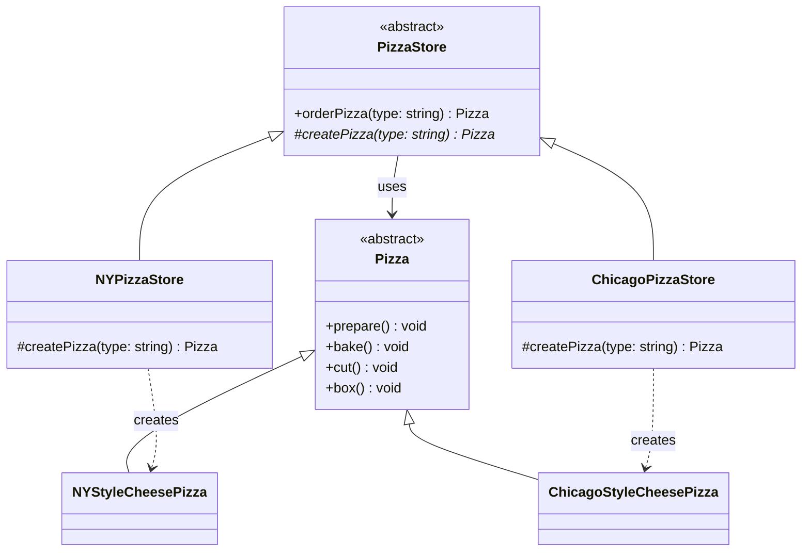
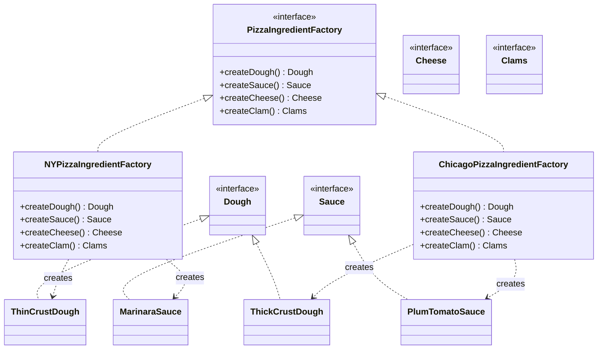

# Week 4. 팩토리(Factory) 패턴

## 학습 정보

- **주차**: 4주차
- **챕터**: Chapter 04 — 객체지향 빵 굽기
- **패턴명**: 팩토리 패턴 (간단한 팩토리 / 팩토리 메소드 / 추상 팩토리)
- **학습일**: 2025-03-10
- **학습 범위**: Chapter 04 전체

---

## 학습 목표

- `new` 연산자의 남용이 초래하는 결합 문제를 이해하고, 객체 생성을 캡슐화하는 필요성을 파악한다.
- 간단한 팩토리, 팩토리 메소드 패턴, 추상 팩토리 패턴의 차이를 명확히 구분한다.
- 의존성 뒤집기 원칙(DIP)을 이해하고, 팩토리 패턴이 이 원칙을 어떻게 실현하는지 파악한다.

---

## 핵심 개념

### 패턴이 해결하는 문제

`new`를 사용하면 반드시 구상 클래스의 인스턴스가 만들어진다. 인터페이스에 맞춰 프로그래밍하라고 배웠지만, 결국 어딘가에서는 구상 클래스를 지정해야 한다.

```typescript
let pizza: Pizza;

if (type === "cheese") {
  pizza = new CheesePizza();
} else if (type === "pepperoni") {
  pizza = new PepperoniPizza();
} else if (type === "clam") {
  pizza = new ClamPizza();
}
```

이런 코드의 문제점은 다음과 같다.

- 피자 종류가 추가되거나 제거될 때마다 이 조건문을 직접 수정해야 한다.
- 동일한 생성 로직이 여러 곳에 흩어져 있으면 변경 시 모든 곳을 찾아 고쳐야 한다.
- 구상 클래스에 직접 의존하므로 변경에 닫혀 있지 않다.

`new` 자체가 문제가 아니라, **변화하는 부분(어떤 구상 클래스를 생성할지)이 캡슐화되지 않은 것**이 문제다.
<br />
팩토리 패턴은 객체 생성 코드를 분리하여 이 문제를 해결한다.

### 패턴의 정의

이 챕터에서는 세 가지 팩토리 관련 개념을 다룬다.

> **Simple Factory**
> <br />
> 객체 생성을 처리하는 별도의 클래스를 만드는 프로그래밍 관용구다.
> <br />
> 엄밀히 말해 디자인 패턴은 아니지만, 자주 사용되는 기법이다.

> **Factory Method Pattern**
> <br />
> 객체를 생성할 때 필요한 인터페이스를 만든다.
> <br />
> 어떤 클래스의 인스턴스를 만들지는 서브클래스에서 결정한다.
> <br />
> 인스턴스 만드는 일을 서브클래스에 맡기는 패턴이다.

> **Abstract Factory Pattern**
> <br />
> 구상 클래스에 의존하지 않고도 서로 연관되거나 의존적인 객체로 이루어진 제품군을 생산하는 인터페이스를 제공한다.
> <br />
> 구상 클래스는 서브클래스에서 만든다.

### 주요 구성요소

**팩토리 메소드 패턴의 구성요소**

- **Creator (PizzaStore)**: 팩토리 메소드를 선언하는 추상 클래스. 제품을 사용하는 코드(orderPizza 등)를 포함한다.
- **ConcreteCreator (NYPizzaStore, ChicagoPizzaStore)**: 팩토리 메소드를 구현하여 실제 제품 인스턴스를 생성하는 서브클래스다.
- **Product (Pizza)**: 팩토리 메소드가 생성하는 제품의 추상 타입이다.
- **ConcreteProduct (NYStyleCheesePizza 등)**: 실제로 만들어지는 구상 제품 클래스다.

**추상 팩토리 패턴의 구성요소**

- **AbstractFactory (PizzaIngredientFactory)**: 제품군 전체를 생산하는 메소드를 정의하는 인터페이스다.
- **ConcreteFactory (NYPizzaIngredientFactory 등)**: 특정 지역/환경에 맞는 제품군을 실제로 생산하는 구상 팩토리다.
- **AbstractProduct (Dough, Sauce, Cheese 등)**: 제품군을 구성하는 각 제품의 추상 타입이다.
- **ConcreteProduct (ThinCrustDough, MarinaraSauce 등)**: 각 제품의 구상 구현이다.

---

## 패턴 구조

### UML 다이어그램 — 팩토리 메소드 패턴



### UML 다이어그램 — 추상 팩토리 패턴



### 동작 방식 — 팩토리 메소드 패턴

1. 클라이언트가 `NYPizzaStore` 인스턴스를 생성한다.
2. `orderPizza("cheese")`를 호출한다. 이 메소드는 추상 클래스 `PizzaStore`에 정의되어 있다.
3. `orderPizza()` 내부에서 `createPizza("cheese")`를 호출한다. 이 메소드는 추상 메소드이므로 서브클래스인 `NYPizzaStore`의 구현이 실행된다.
4. `NYPizzaStore.createPizza()`가 `NYStyleCheesePizza` 인스턴스를 생성하여 반환한다.
5. `orderPizza()`는 반환받은 피자에 대해 `prepare()`, `bake()`, `cut()`, `box()`를 순서대로 호출한다. 어떤 구상 피자인지는 알지 못한다.

### 동작 방식 — 추상 팩토리 패턴

1. `NYPizzaStore`의 `createPizza()`에서 `NYPizzaIngredientFactory`를 생성한다.
2. 이 원재료 팩토리를 `CheesePizza` 생성자에 전달한다.
3. `CheesePizza.prepare()`가 호출되면, 팩토리의 `createDough()`, `createSauce()`, `createCheese()` 등을 호출하여 지역에 맞는 원재료를 받아온다.
4. 피자 클래스는 어떤 구상 원재료가 사용되는지 전혀 알지 못한다. 팩토리 인터페이스에만 의존한다.

---

## 코드 예제

### 예제 상황

피자 가게 프랜차이즈 시스템이다.
<br />
본사(`PizzaStore`)에서 정한 주문 프로세스(준비 → 굽기 → 자르기 → 포장)는 모든 지점이 동일하게 따라야 한다.
<br />
하지만 피자 스타일(뉴욕: 얇은 빵 + 마리나라 소스 / 시카고: 두꺼운 빵 + 플럼토마토 소스)은 지점마다 다르다.
<br />
나아가 각 지점이 사용하는 원재료(반죽, 소스, 치즈 등)의 품질을 본사에서 관리할 수 있어야 한다.

### 1단계: 간단한 팩토리

가장 기본적인 형태로, 객체 생성 코드를 별도 클래스로 분리한다.

```typescript
// --- 제품 ---
abstract class Pizza {
  public name = "";
  public dough = "";
  public sauce = "";
  public toppings: string[] = [];

  public prepare() {
    console.log(`준비 중: ${this.name}`);
    console.log("도우를 돌리는 중...");
    console.log("소스를 뿌리는 중...");
    console.log("토핑을 올리는 중:");
    this.toppings.forEach((t) => console.log(`  ${t}`));
  }

  public bake() {
    console.log("175도에서 25분 간 굽기");
  }

  public cut() {
    console.log("피자를 사선으로 자르기");
  }

  public box() {
    console.log("상자에 피자 담기");
  }
}

class CheesePizza extends Pizza {
  constructor() {
    super();
    this.name = "치즈 피자";
    this.toppings.push("모짜렐라 치즈");
  }
}

class PepperoniPizza extends Pizza {
  constructor() {
    super();
    this.name = "페퍼로니 피자";
    this.toppings.push("페퍼로니");
  }
}

// --- 간단한 팩토리 ---
class SimplePizzaFactory {
  public createPizza(type: string) {
    switch (type) {
      case "cheese":
        return new CheesePizza();
      case "pepperoni":
        return new PepperoniPizza();
      default:
        return null;
    }
  }
}

// --- 클라이언트 ---
class PizzaStore {
  constructor(private factory: SimplePizzaFactory) {}

  public orderPizza(type: string) {
    const pizza = this.factory.createPizza(type);
    if (!pizza) return null;

    pizza.prepare();
    pizza.bake();
    pizza.cut();
    pizza.box();

    return pizza;
  }
}
```

간단한 팩토리는 디자인 패턴이 아니라 **관용구**에 가깝다.
<br />
객체 생성을 한 곳으로 모아 관리할 수 있지만, 제품 변경 시 팩토리 코드를 직접 수정해야 하므로 유연성에 한계가 있다.

### 2단계: 팩토리 메소드 패턴

지점마다 다른 스타일의 피자를 만들어야 하는 상황이다. 객체 생성을 서브클래스에 맡긴다.

```typescript
// --- 제품 ---
abstract class Pizza {
  public name = "";
  public dough = "";
  public sauce = "";
  public toppings: string[] = [];

  public prepare() {
    console.log(`준비 중: ${this.name}`);
    console.log("도우를 돌리는 중...");
    console.log("소스를 뿌리는 중...");
    console.log("토핑을 올리는 중:");
    this.toppings.forEach((t) => console.log(`  ${t}`));
  }

  public bake() {
    console.log("175도에서 25분 간 굽기");
  }

  public cut() {
    console.log("피자를 사선으로 자르기");
  }

  public box() {
    console.log("상자에 피자 담기");
  }
}

class NYStyleCheesePizza extends Pizza {
  constructor() {
    super();
    this.name = "뉴욕 스타일 소스와 치즈 피자";
    this.dough = "씬 크러스트 도우";
    this.sauce = "마리나라 소스";
    this.toppings.push("잘게 썬 레지아노 치즈");
  }
}

class ChicagoStyleCheesePizza extends Pizza {
  constructor() {
    super();
    this.name = "시카고 스타일 딥 디쉬 치즈 피자";
    this.dough = "아주 두꺼운 크러스트 도우";
    this.sauce = "플럼토마토 소스";
    this.toppings.push("잘게 조각낸 모짜렐라 치즈");
  }

  public cut() {
    console.log("네모난 모양으로 피자 자르기");
  }
}

// --- 생산자 (Creator) ---
abstract class PizzaStore {
  // 템플릿 메소드: 주문 프로세스는 고정
  public orderPizza(type: string) {
    const pizza = this.createPizza(type);
    if (!pizza) return null;

    pizza.prepare();
    pizza.bake();
    pizza.cut();
    pizza.box();

    return pizza;
  }

  // 팩토리 메소드: 어떤 피자를 만들지는 서브클래스가 결정
  protected abstract createPizza(type: string): Pizza | null;
}

class NYPizzaStore extends PizzaStore {
  protected createPizza(type: string) {
    switch (type) {
      case "cheese":
        return new CheesePizza();
      // ... 다른 뉴욕 스타일 피자들
      default:
        return null;
    }
  }
}

class ChicagoPizzaStore extends PizzaStore {
  protected createPizza(type: string) {
    switch (type) {
      case "cheese":
        return new ChicagoStyleCheesePizza();
      // ... 다른 시카고 스타일 피자들
      default:
        return null;
    }
  }
}

// --- 사용 ---
const nyStore = new NYPizzaStore();
const chicagoStore = new ChicagoPizzaStore();

nyStore.orderPizza("cheese");
chicagoStore.orderPizza("cheese");
```

핵심은 `orderPizza()`가 `createPizza()`를 호출하지만, 어떤 구상 피자가 만들어지는지 전혀 알지 못한다는 점이다.
<br />
서브클래스가 `createPizza()`를 구현함으로써 "어떤 클래스의 인스턴스를 만들지"를 결정한다.

### 3단계: 추상 팩토리 패턴

지점에서 싸구려 원재료를 사용하는 문제가 발생했다.
<br />
원재료군 전체를 팩토리로 관리하여 품질을 보장한다.

```typescript
// --- 원재료 인터페이스 ---
interface Dough {
  toString(): string;
}

interface Sauce {
  toString(): string;
}

interface Cheese {
  toString(): string;
}

interface Clams {
  toString(): string;
}

// --- 뉴욕 원재료 ---
class ThinCrustDough implements Dough {
  public toString() {
    return "씬 크러스트 도우";
  }
}

class MarinaraSauce implements Sauce {
  public toString() {
    return "마리나라 소스";
  }
}

class ReggianoCheese implements Cheese {
  public toString() {
    return "레지아노 치즈";
  }
}

class FreshClams implements Clams {
  public toString() {
    return "신선한 조개";
  }
}

// --- 시카고 원재료 ---
class ThickCrustDough implements Dough {
  public toString() {
    return "아주 두꺼운 크러스트 도우";
  }
}

class PlumTomatoSauce implements Sauce {
  public toString() {
    return "플럼토마토 소스";
  }
}

class MozzarellaCheese implements Cheese {
  public toString() {
    return "모짜렐라 치즈";
  }
}

class FrozenClams implements Clams {
  public toString() {
    return "냉동 조개";
  }
}

// --- 추상 팩토리 ---
interface PizzaIngredientFactory {
  createDough(): Dough;
  createSauce(): Sauce;
  createCheese(): Cheese;
  createClam(): Clams;
}

class NYPizzaIngredientFactory implements PizzaIngredientFactory {
  public createDough() {
    return new ThinCrustDough();
  }

  public createSauce() {
    return new MarinaraSauce();
  }

  public createCheese() {
    return new ReggianoCheese();
  }

  public createClam() {
    return new FreshClams();
  }
}

class ChicagoPizzaIngredientFactory implements PizzaIngredientFactory {
  public createDough() {
    return new ThickCrustDough();
  }

  public createSauce() {
    return new PlumTomatoSauce();
  }

  public createCheese() {
    return new MozzarellaCheese();
  }

  public createClam() {
    return new FrozenClams();
  }
}

// --- 피자 (원재료 팩토리를 사용) ---
abstract class Pizza {
  public name = "";
  public dough!: Dough;
  public sauce!: Sauce;
  public cheese!: Cheese;

  public abstract prepare(): void;

  public bake() {
    console.log("175도에서 25분 간 굽기");
  }

  public cut() {
    console.log("피자를 사선으로 자르기");
  }

  public box() {
    console.log("상자에 피자 담기");
  }
}

class CheesePizza extends Pizza {
  constructor(private ingredientFactory: PizzaIngredientFactory) {
    super();
  }

  public prepare() {
    console.log(`준비 중: ${this.name}`);
    this.dough = this.ingredientFactory.createDough();
    this.sauce = this.ingredientFactory.createSauce();
    this.cheese = this.ingredientFactory.createCheese();
  }
}

class ClamPizza extends Pizza {
  public clam!: Clams;

  constructor(private ingredientFactory: PizzaIngredientFactory) {
    super();
  }

  public prepare() {
    console.log(`준비 중: ${this.name}`);
    this.dough = this.ingredientFactory.createDough();
    this.sauce = this.ingredientFactory.createSauce();
    this.cheese = this.ingredientFactory.createCheese();
    this.clam = this.ingredientFactory.createClam();
  }
}

// --- 팩토리 메소드 + 추상 팩토리 결합 ---
abstract class PizzaStore {
  public orderPizza(type: string) {
    const pizza = this.createPizza(type);
    if (!pizza) return null;

    pizza.prepare();
    pizza.bake();
    pizza.cut();
    pizza.box();

    return pizza;
  }

  protected abstract createPizza(type: string): Pizza | null;
}

class NYPizzaStore extends PizzaStore {
  protected createPizza(type: string) {
    const factory = new NYPizzaIngredientFactory();

    switch (type) {
      case "cheese":
        const pizza = new CheesePizza(factory);
        pizza.name = "뉴욕 스타일 치즈 피자";
        return pizza;
      case "clam":
        const pizza = new ClamPizza(factory);
        pizza.name = "뉴욕 스타일 조개 피자";
        return pizza;
      default:
        return null;
    }
  }
}
```

### 코드 설명

- **간단한 팩토리 → 팩토리 메소드 → 추상 팩토리**로 점진적으로 발전하는 구조다. 각 단계마다 해결하는 문제의 범위가 넓어진다.
- **팩토리 메소드 패턴**에서 `orderPizza()`는 일종의 템플릿 메소드 역할을 한다. 주문 프로세스(prepare → bake → cut → box)는 고정하면서, 어떤 피자를 만들지만 서브클래스에 맡긴다.
- **추상 팩토리 패턴**에서 `CheesePizza`는 지역별 클래스(`NYStyleCheesePizza`, `ChicagoStyleCheesePizza`)를 따로 만들 필요가 없다. 원재료 팩토리만 바꾸면 같은 `CheesePizza` 클래스로 뉴욕 스타일과 시카고 스타일을 모두 만들 수 있다.
- **팩토리 메소드 + 추상 팩토리 결합**: `NYPizzaStore`(팩토리 메소드)가 `NYPizzaIngredientFactory`(추상 팩토리)를 생성하여 피자에 주입한다. 두 패턴이 자연스럽게 함께 사용되는 사례다.

---

## 구현 방식 비교

이 챕터에서 등장하는 세 가지 팩토리 관련 기법을 비교한다.

| 구분              | 간단한 팩토리                   | 팩토리 메소드 패턴                                      | 추상 팩토리 패턴                                      |
| ----------------- | ------------------------------- | ------------------------------------------------------- | ----------------------------------------------------- |
| 분류              | 프로그래밍 관용구               | 디자인 패턴                                             | 디자인 패턴                                           |
| 객체 생성 방식    | 별도 팩토리 객체에 위임         | 서브클래스의 메소드 오버라이드(상속)                    | 팩토리 인터페이스를 구현한 객체에 위임(구성)          |
| 생성 대상         | 한 가지 제품                    | 한 가지 제품                                            | 서로 연관된 제품군 전체                               |
| 확장 방법         | 팩토리 코드를 직접 수정         | 새로운 서브클래스 추가                                  | 새로운 구상 팩토리 추가                               |
| 유연성            | 낮음 (변경 시 팩토리 수정 필요) | 높음 (서브클래스 추가로 확장)                           | 높음 (팩토리 교체로 제품군 전체 변경)                 |
| 제품 추가 시 영향 | 팩토리 코드 수정                | 서브클래스에 조건 추가                                  | 팩토리 인터페이스 변경 필요 (모든 구상 팩토리에 영향) |
| 적합한 상황       | 간단한 객체 생성 캡슐화         | 어떤 구상 클래스를 만들지 서브클래스에서 결정해야 할 때 | 연관된 제품군을 일관성 있게 생성해야 할 때            |

---

## 의존성 뒤집기 원칙 (DIP)

이 챕터에서 새로 등장하는 핵심 디자인 원칙이다.

> **의존성 뒤집기 원칙(Dependency Inversion Principle)**
> <br />
> 추상화된 것에 의존하게 만들고, 구상 클래스에 의존하지 않게 만든다.

팩토리 패턴 적용 전에는 `PizzaStore`가 모든 구상 피자 클래스(`NYStyleCheesePizza`, `ChicagoStyleCheesePizza` 등)에 직접 의존했다.
<br />
팩토리 메소드 패턴을 적용하면 `PizzaStore`는 추상 클래스인 `Pizza`에만 의존하고, 구상 피자 클래스들도 `Pizza`에 의존한다.
<br />
고수준 모듈과 저수준 모듈 모두 추상화에 의존하게 되면서 의존성이 "뒤집힌다".

**DIP를 지키기 위한 가이드라인**

- 변수에 구상 클래스의 레퍼런스를 저장하지 않는다. 팩토리를 사용하여 구상 클래스 레퍼런스가 변수에 직접 저장되는 것을 방지한다.
- 구상 클래스에서 유도된 클래스를 만들지 않는다. 인터페이스나 추상 클래스처럼 추상화된 것으로부터 클래스를 만든다.
- 베이스 클래스에 이미 구현되어 있는 메소드를 오버라이드하지 않는다. 오버라이드가 필요하다면 베이스 클래스의 추상화가 부족한 것이다.

이 가이드라인은 항상 완벽하게 지킬 수 있는 규칙이 아니라, 지향해야 할 방향이다.
<br />
중요한 것은 원칙을 의식하면서 디자인하고, 위반하는 부분을 명확히 인지하는 것이다.

---

## 실전 활용

### 언제 사용하면 좋을까?

- **간단한 팩토리**: 객체 생성 코드가 여러 곳에 중복되어 있을 때, 한 곳으로 모아 관리하고 싶을 때
- **팩토리 메소드**: 어떤 구상 클래스를 생성할지 미리 알 수 없거나, 생성 결정을 서브클래스에 맡기고 싶을 때. 프레임워크를 만들 때 특히 유용하다.
- **추상 팩토리**: 서로 연관된 제품군을 일관성 있게 생성해야 할 때. 플랫폼별 UI 컴포넌트, 지역별 원재료 등 "제품군 단위의 교체"가 필요한 상황에 적합하다.

### 장단점

**장점**

- 객체 생성 코드를 캡슐화하여 클라이언트와 구상 클래스를 분리한다.
- DIP를 준수한다. 고수준 모듈이 저수준 모듈의 구상 클래스에 직접 의존하지 않는다.
- 팩토리 메소드 패턴은 새로운 제품 추가 시 기존 코드를 수정하지 않고 서브클래스만 추가하면 되므로 OCP를 준수한다.
- 추상 팩토리 패턴은 제품군의 일관성을 보장한다. 뉴욕 팩토리에서 시카고 원재료가 섞여 나오는 일을 방지할 수 있다.

**단점**

- 팩토리 메소드 패턴은 제품 하나를 추가할 때마다 생산자 서브클래스를 만들어야 하므로 클래스 수가 증가한다.
- 추상 팩토리 패턴은 제품군에 새로운 종류의 제품을 추가할 때 팩토리 인터페이스 자체를 변경해야 하며, 이는 모든 구상 팩토리에 영향을 미친다.
- 단순한 상황에서 팩토리 패턴을 적용하면 불필요한 복잡성이 추가될 수 있다.

### 실제 적용 사례

- **DOM의 `document.createElement()`**: 태그 이름(문자열)을 받아 해당 HTML 요소 인스턴스를 반환하는 간단한 팩토리의 전형적인 예시다.
- **React의 `createElement()`**: JSX가 컴파일되면 `React.createElement()` 호출로 변환된다. 컴포넌트 타입(문자열 또는 함수)에 따라 다른 종류의 ReactElement를 생성하는 팩토리 메소드 역할을 한다.
- **크로스 플랫폼 UI 라이브러리**: 운영체제별로 다른 UI 컴포넌트(버튼, 스크롤바, 메뉴 등)를 생성해야 할 때 추상 팩토리 패턴이 사용된다. `WindowsUIFactory`와 `MacUIFactory`가 동일한 인터페이스로 각 플랫폼에 맞는 컴포넌트군을 생산한다.
- **ORM의 Database Dialect**: TypeORM이나 Prisma 같은 ORM에서 데이터베이스 종류(MySQL, PostgreSQL 등)에 따라 다른 쿼리 빌더와 타입 매핑을 생성하는 구조가 추상 팩토리 패턴의 변형이다.

---

## 핵심 정리

- 팩토리 패턴은 객체 생성을 캡슐화하여 클라이언트 코드와 구상 클래스를 분리한다. `new`를 직접 사용하는 대신 팩토리에 위임함으로써 변경에 유연하게 대응할 수 있다.
- 간단한 팩토리는 관용구, 팩토리 메소드는 상속을 활용한 패턴, 추상 팩토리는 구성을 활용한 패턴이다. 팩토리 메소드는 "하나의 제품"을, 추상 팩토리는 "연관된 제품군"을 생성하는 데 초점이 있다.
- 의존성 뒤집기 원칙(DIP)에 따르면 고수준 모듈과 저수준 모듈 모두 추상화에 의존해야 한다. 팩토리 패턴은 이 원칙을 실현하는 대표적인 기법이다.
- 추상 팩토리의 각 메소드는 사실상 팩토리 메소드로 구현되는 경우가 많다. 두 패턴은 대립하는 것이 아니라 자연스럽게 함께 사용된다.

---

## 함께 등장한 디자인 원칙

| 원칙                                                                       | 이 패턴에서의 적용                                                                                                 |
| -------------------------------------------------------------------------- | ------------------------------------------------------------------------------------------------------------------ |
| 바뀌는 부분은 캡슐화한다                                                   | 객체 생성 코드(바뀌는 부분)를 팩토리로 분리하여 캡슐화                                                             |
| 상속보다는 구성을 활용한다                                                 | 추상 팩토리 패턴에서 팩토리 객체를 구성(Composition)으로 주입하여 제품군을 교체                                    |
| 구현보다는 인터페이스에 맞춰서 프로그래밍한다                              | 클라이언트가 구상 클래스가 아닌 Pizza, PizzaIngredientFactory 등 추상 타입에만 의존                                |
| 클래스는 확장에 열려 있고 변경에 닫혀 있어야 한다 (OCP)                    | 새로운 피자 스타일 추가 시 기존 PizzaStore 코드 변경 없이 서브클래스만 추가                                        |
| **추상화된 것에 의존하게 만들고 구상 클래스에 의존하지 않게 만든다 (DIP)** | 고수준(PizzaStore)과 저수준(구상 피자)이 모두 추상 클래스 Pizza에 의존. 팩토리를 통해 구상 클래스 직접 참조를 제거 |

---

## 관련 패턴

- **템플릿 메소드 패턴 (Template Method)**: 팩토리 메소드 패턴의 `orderPizza()`는 사실상 템플릿 메소드다. 알고리즘의 골격(주문 프로세스)을 정의하고, 일부 단계(피자 생성)를 서브클래스에 맡긴다.
- **빌더 패턴 (Builder)**: 팩토리 패턴이 "어떤 제품을 만들지"를 결정한다면, 빌더 패턴은 "복잡한 제품을 어떤 순서로 조립할지"에 초점을 둔다. 데코레이터로 음료를 감싸던 것처럼 피자 재료를 단계별로 조합하는 데 빌더 패턴을 활용할 수 있다(14장에서 다룬다).
- **싱글턴 패턴 (Singleton)**: 팩토리 객체가 하나만 존재해야 하는 경우 싱글턴 패턴과 결합하여 사용하기도 한다.
- **데코레이터 패턴 (Decorator)**: 3장에서 데코레이터 객체를 여러 겹 감싸는 코드가 복잡해지는 문제를 언급했다. 팩토리 패턴으로 데코레이터의 생성과 조합을 캡슐화하면 이 문제를 해결할 수 있다.
