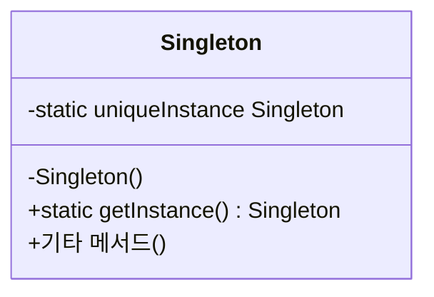

# Week 5. 싱글턴(Singleton) 패턴

## 학습 정보

- **주차**: 5주차
- **챕터**: Chapter 05 — 하나뿐인 특별한 객체 만들기
- **패턴명**: 싱글턴 패턴 (Singleton Pattern)
- **학습일**: 2025-03-17
- **학습 범위**: Chapter 05 전체

---

## 학습 목표

- 싱글턴 패턴의 필요성과 전역 변수 대비 장점을 이해한다.
- 고전적인 싱글턴 구현에서 발생하는 멀티스레딩 문제를 파악하고, 이를 해결하는 여러 가지 기법을 학습한다.
- TypeScript 환경에서 싱글턴 패턴을 구현하는 방법을 익힌다.

---

## 핵심 개념

### 패턴이 해결하는 문제

스레드 풀, 캐시, 로그 기록 객체, 디바이스 드라이버, 사용자 설정 등 애플리케이션에서 인스턴스가 하나만 존재해야 하는 객체가 있다.
<br />
인스턴스가 2개 이상 만들어지면 프로그램이 이상하게 동작하거나, 자원을 불필요하게 잡아먹거나, 결과에 일관성이 없어지는 문제가 생길 수 있다.

"인스턴스를 하나만 만들자"라는 관행을 정하거나 전역 변수를 사용하는 방법도 있지만, 둘 다 한계가 있다.

- **관행**: 강제성이 없으므로 실수로 여러 인스턴스를 만들 수 있다.
- **전역 변수**: 애플리케이션 시작 시점에 인스턴스가 무조건 생성된다. 한 번도 사용하지 않더라도 자원을 점유하며, 인스턴스 수를 제한하는 기능 자체가 없다. 네임스페이스도 지저분해진다.

싱글턴 패턴은 클래스 자체가 인스턴스 수를 관리하도록 만들어, 이 문제를 근본적으로 해결한다.

### 패턴의 정의

> **싱글턴 패턴(Singleton Pattern)** 은 클래스 인스턴스를 하나만 만들고, 그 인스턴스로의 전역 접근을 제공한다.

핵심 아이디어는 두 가지다.

첫째, 생성자를 외부에서 호출할 수 없도록 `private`으로 선언한다.
<br />
둘째, 정적 메서드(`getInstance()`)를 통해서만 인스턴스에 접근할 수 있도록 하되, 인스턴스가 없으면 생성하고 이미 있으면 기존 인스턴스를 반환한다.

### 주요 구성요소

- **Singleton 클래스**: 유일한 인스턴스를 저장하는 정적 변수, private 생성자, 인스턴스를 반환하는 정적 메서드(`getInstance()`)를 가진다.
- **정적 변수 (uniqueInstance)**: 클래스의 유일한 인스턴스를 저장한다.
- **private 생성자**: 외부에서 `new`로 인스턴스를 생성하는 것을 차단한다.
- **getInstance() 정적 메서드**: 인스턴스가 없으면 생성하고, 이미 있으면 기존 인스턴스를 반환한다.

---

## 패턴 구조

### UML 다이어그램



클래스 다이어그램에 클래스가 하나뿐인, 가장 단순한 구조의 패턴이다.
<br />
하지만 단순한 만큼 구현 시 주의해야 할 사항이 많다.

### 동작 방식

1. 클라이언트가 `Singleton.getInstance()`를 호출한다.
2. 정적 변수 `uniqueInstance`가 `null`인지 확인한다.
3. `null`이면 private 생성자를 호출하여 인스턴스를 생성하고 정적 변수에 저장한다.
4. `null`이 아니면 이미 생성된 인스턴스를 그대로 반환한다.
5. 이후 어디서 `getInstance()`를 호출하든 항상 같은 인스턴스가 반환된다.

이처럼 인스턴스가 필요한 시점까지 생성을 미루는 방식을 **게으른 인스턴스 생성(lazy instantiation)** 이라고 한다.

---

## 코드 예제

### 예제 상황

초콜릿 공장의 초콜릿 보일러(ChocolateBoiler) 시스템이다.
<br />
보일러에 초콜릿과 우유를 채우고, 끓이고, 배출하는 과정을 관리한다.
<br />
보일러 인스턴스가 2개 이상 존재하면 이미 끓고 있는 보일러에 새 재료를 넣어 500갤런의 초콜릿이 넘쳐흐르는 사고가 발생할 수 있다.

### 고전적인 구현 (문제가 있는 버전)

```typescript
class ChocolateBoiler {
  private static uniqueInstance: ChocolateBoiler | null = null;
  private empty: boolean;
  private boiled: boolean;

  // private 생성자: 외부에서 new로 인스턴스 생성 불가
  private constructor() {
    this.empty = true;
    this.boiled = false;
  }

  public static getInstance() {
    if (ChocolateBoiler.uniqueInstance === null) {
      ChocolateBoiler.uniqueInstance = new ChocolateBoiler();
    }

    return ChocolateBoiler.uniqueInstance;
  }

  public fill() {
    if (this.isEmpty()) {
      this.empty = false;
      this.boiled = false;
      console.log("보일러에 우유와 초콜릿을 채우는 중...");
    }
  }

  public drain() {
    if (!this.isEmpty() && this.isBoiled()) {
      this.empty = true;
      console.log("끓인 우유와 초콜릿을 배출하는 중...");
    }
  }

  public boil() {
    if (!this.isEmpty() && !this.isBoiled()) {
      this.boiled = true;
      console.log("보일러를 끓이는 중...");
    }
  }

  public isEmpty() {
    return this.empty;
  }

  public isBoiled() {
    return this.boiled;
  }
}
```

이 구현은 싱글스레드 환경에서는 정상 동작한다.
<br />
하지만 멀티스레드 환경에서 두 스레드가 거의 동시에 `getInstance()`를 호출하면, `uniqueInstance`가 아직 `null`인 상태에서 두 스레드 모두 `new ChocolateBoiler()`를 실행하여 인스턴스가 2개 만들어질 수 있다.

### 멀티스레딩 문제 해결 — 3가지 방법

책에서는 Java 기반으로 세 가지 해결법을 제시한다.
<br />
TypeScript/JavaScript는 싱글스레드 이벤트 루프 모델이므로 동일한 동기화 문제가 발생하지는 않지만, 패턴의 원리를 이해하기 위해 각 방법을 정리한다.

**방법 1: synchronized (동기화)**

Java에서 `getInstance()` 메서드에 `synchronized` 키워드를 추가하여 한 번에 하나의 스레드만 접근하도록 한다.
<br />
간단하지만 매번 동기화 오버헤드가 발생한다.
<br />
인스턴스가 이미 생성된 이후에도 불필요한 동기화가 계속된다는 단점이 있다.

**방법 2: 즉시 생성 (eager instantiation)**

정적 변수 선언 시점에 바로 인스턴스를 생성한다.
<br />
클래스 로딩 시 JVM이 인스턴스를 만들어주므로 스레드 안전성이 보장된다.
<br />
인스턴스를 항상 사용하는 상황이라면 가장 단순하고 효과적인 방법이다.

**방법 3: DCL (Double-Checked Locking)**

인스턴스가 `null`인지 먼저 확인하고, `null`일 때만 동기화 블록에 진입한다.
<br />
동기화 블록 내부에서 한 번 더 `null` 체크를 한다.
<br />
처음 생성 시에만 동기화되므로 이후에는 오버헤드가 없다.
<br />
Java 5 이상에서 `volatile` 키워드와 함께 사용해야 올바르게 동작한다.

### TypeScript에서의 싱글턴 구현

TypeScript(JavaScript)는 싱글스레드 기반이므로 동기화 문제는 발생하지 않는다.
<br />
대신 모듈 시스템과 `private constructor`를 활용하여 깔끔하게 구현할 수 있다.

**방법 A: 클래식한 싱글턴 (게으른 생성)**

```typescript
export class Singleton {
  private static instance: Singleton | null = null;

  // private 생성자로 외부 생성 차단
  private constructor() {}

  public static getInstance() {
    if (Singleton.instance === null) {
      Singleton.instance = new Singleton();
    }

    return Singleton.instance;
  }

  // 비즈니스 로직
  public someMethod() {
    console.log("싱글턴의 메서드 호출");
  }
}

// 사용
const s1 = Singleton.getInstance();
const s2 = Singleton.getInstance();
console.log(s1 === s2); // true
```

**방법 B: 즉시 생성**

```typescript
export class Singleton {
  // 클래스 로딩 시 즉시 생성
  private static readonly instance = new Singleton();

  private constructor() {}

  public static getInstance() {
    return Singleton.instance;
  }

  public someMethod() {
    console.log("싱글턴의 메서드 호출");
  }
}
```

**방법 C: 모듈 패턴 활용 (TypeScript/JavaScript 관용적 방식)**

```typescript
// chocolateBoiler.ts
class ChocolateBoiler {
  private empty = true;
  private boiled = false;

  public fill() {
    if (this.isEmpty()) {
      this.empty = false;
      this.boiled = false;
      console.log("보일러에 우유와 초콜릿을 채우는 중...");
    }
  }

  public drain() {
    if (!this.isEmpty() && this.isBoiled()) {
      this.empty = true;
      console.log("끓인 우유와 초콜릿을 배출하는 중...");
    }
  }

  public boil() {
    if (!this.isEmpty() && !this.isBoiled()) {
      this.boiled = true;
      console.log("보일러를 끓이는 중...");
    }
  }

  public isEmpty() {
    return this.empty;
  }

  public isBoiled() {
    return this.boiled;
  }
}

// 모듈 스코프에서 인스턴스를 하나만 생성하고 export
// ES 모듈은 최초 import 시 한 번만 실행되므로 싱글턴이 보장된다
export const chocolateBoiler = new ChocolateBoiler();
```

```typescript
// 사용하는 쪽
import { chocolateBoiler } from "./chocolateBoiler";

chocolateBoiler.fill();
chocolateBoiler.boil();
chocolateBoiler.drain();
```

### 코드 설명

- **방법 A**는 고전적인 싱글턴을 TypeScript로 옮긴 형태다. `private constructor`로 외부 생성을 차단하고, `getInstance()`로만 접근한다. 인스턴스가 필요한 시점까지 생성을 미루는 게으른 생성 방식이다.
- **방법 B**는 즉시 생성 방식이다. 클래스가 로딩되는 시점에 인스턴스가 만들어진다. 인스턴스를 반드시 사용하는 상황이라면 가장 단순하다.
- **방법 C**는 TypeScript/JavaScript에서 가장 관용적인 방식이다. ES 모듈 자체가 싱글턴 특성을 가지고 있어서(최초 import 시 한 번만 평가됨) 별도의 패턴 없이도 싱글턴이 자연스럽게 보장된다. 실무에서는 이 방식을 가장 많이 사용한다.

---

## 구현 방식 비교

| 구분                  | 게으른 생성 (Lazy)                     | 즉시 생성 (Eager)  | 모듈 패턴 (TS/JS 관용적)   |
| --------------------- | -------------------------------------- | ------------------ | -------------------------- |
| 생성 시점             | `getInstance()` 최초 호출 시           | 클래스 로딩 시     | 모듈 최초 import 시        |
| 멀티스레드 안전성     | Java: 별도 동기화 필요 / TS: 문제 없음 | 안전               | 안전 (모듈은 한 번만 평가) |
| 코드 복잡도           | 중간 (null 체크 필요)                  | 낮음               | 가장 낮음                  |
| 사용하지 않을 때 자원 | 사용 안 함                             | 사용함 (미리 생성) | 해당 모듈 import 시 생성   |
| TypeScript 권장도     | 가능하지만 굳이 필요 없음              | 가능               | 가장 권장                  |

---

## 싱글턴 패턴의 문제점과 주의사항

싱글턴 패턴은 간단해 보이지만 여러 가지 주의할 점이 있다.

**느슨한 결합 위반**: 싱글턴에 의존하는 모든 객체가 하나의 구상 클래스에 단단하게 결합된다. 싱글턴을 변경하면 연결된 모든 객체에 영향이 미칠 수 있다.

**단일 책임 원칙(SRP) 위반**: 싱글턴 클래스는 자신의 인스턴스를 관리하는 일과 본래의 비즈니스 로직, 두 가지 책임을 동시에 진다.

**테스트 어려움**: 전역 상태를 가지므로 단위 테스트에서 격리가 어렵다. 테스트 간에 상태가 공유될 수 있다.

**서브클래스 생성 곤란**: 생성자가 private이므로 상속이 불가능하다. protected로 바꾸면 외부 생성이 가능해져서 싱글턴의 의미가 퇴색된다.

**Java 특유의 문제**: 클래스 로더가 여러 개일 때 싱글턴 인스턴스가 여러 개 생길 수 있다. 리플렉션이나 직렬화/역직렬화를 통해 싱글턴이 깨질 수 있다. (Java에서는 enum을 사용하면 이러한 문제를 대부분 해결할 수 있다.)

이러한 이유로 싱글턴은 남용하지 말아야 한다.
<br />
애플리케이션에서 싱글턴을 꽤 많이 사용하고 있다면 전반적인 디자인을 다시 점검해볼 필요가 있다.
<br />
싱글턴은 특수한 상황에서 제한된 용도로 사용하려고 만들어진 패턴이다.

---

## 실전 활용

### 언제 사용하면 좋을까?

- 시스템 전체에서 하나만 존재해야 하는 자원(데이터베이스 연결 풀, 로거, 설정 관리자 등)을 관리할 때
- 여러 곳에서 동일한 인스턴스에 접근해야 하지만 전역 변수의 단점(네임스페이스 오염, 강제성 부재)을 피하고 싶을 때
- 인스턴스가 2개 이상 존재하면 논리적으로 문제가 되는 상황(캐시 불일치, 설정 충돌 등)일 때

### 장단점

**장점**

- 인스턴스가 하나만 존재함을 클래스 수준에서 보장한다. 관행이 아닌 코드로 강제한다.
- 전역 접근점을 제공하면서도 전역 변수의 단점(네임스페이스 오염, 무조건 생성)을 피할 수 있다.
- 게으른 생성을 활용하면 실제로 필요한 시점까지 자원 할당을 미룰 수 있다.

**단점**

- 느슨한 결합 원칙에 위배되기 쉽다. 싱글턴에 의존하는 객체들이 구상 클래스에 단단히 결합된다.
- 전역 상태를 가지므로 단위 테스트가 어렵다.
- 단일 책임 원칙을 위반한다. 인스턴스 관리와 비즈니스 로직이라는 두 가지 책임을 동시에 진다.
- 남용하면 실질적으로 전역 변수와 다를 바 없는 코드가 된다.

### 실제 적용 사례

- **Node.js 모듈 시스템**: ES 모듈은 최초 import 시 한 번만 평가되므로 모듈 스코프에서 생성한 인스턴스는 자연스럽게 싱글턴이 된다. `mongoose.connect()`로 반환되는 연결 객체가 대표적인 예시다.
- **Logger 라이브러리**: Winston, Pino 같은 로깅 라이브러리에서 `createLogger()`로 생성한 로거를 모듈 스코프에서 export하여 애플리케이션 전체에서 하나의 로거를 공유한다.
- **전역 상태 관리 (Redux Store)**: Redux의 Store는 애플리케이션 전체에서 하나만 존재한다. `createStore()`로 생성한 인스턴스를 전역에서 공유하는 구조가 싱글턴의 변형이다.
- **브라우저 환경의 window 객체**: `window`, `document`, `navigator` 등 브라우저 전역 객체는 런타임이 보장하는 싱글턴이다.

---

## 핵심 정리

- 싱글턴 패턴은 클래스의 인스턴스가 하나만 만들어지도록 보장하고, 그 인스턴스에 대한 전역 접근점을 제공한다.
- 고전적인 구현(private 생성자 + getInstance())은 멀티스레드 환경에서 문제가 생길 수 있으며, 동기화, 즉시 생성, DCL 등의 방법으로 해결한다.
- TypeScript/JavaScript에서는 모듈 시스템 자체가 싱글턴 특성을 제공하므로 모듈 스코프에서 인스턴스를 생성하고 export하는 것이 가장 관용적인 방법이다.
- 싱글턴은 느슨한 결합, 단일 책임 원칙, 테스트 용이성 측면에서 단점이 있으므로 꼭 필요한 상황에서만 제한적으로 사용해야 한다.

---

## 함께 등장한 디자인 원칙

| 원칙                                          | 이 패턴에서의 적용                                                                                                |
| --------------------------------------------- | ----------------------------------------------------------------------------------------------------------------- |
| 바뀌는 부분은 캡슐화한다                      | 인스턴스 생성 로직을 private 생성자와 getInstance()로 캡슐화                                                      |
| 구현보다는 인터페이스에 맞춰서 프로그래밍한다 | 싱글턴 자체는 이 원칙을 잘 따르지 못하는 편이다. 클라이언트가 구상 Singleton 클래스에 직접 의존하게 되기 때문이다 |
| 느슨한 결합을 사용해야 한다                   | 싱글턴의 약점. 싱글턴에 의존하는 객체가 구상 클래스에 단단하게 결합되므로 주의가 필요하다                         |

이 챕터에서 새로 등장하는 디자인 원칙은 없다. 대신 기존 원칙들과 싱글턴이 충돌하는 지점(느슨한 결합 위반, SRP 위반)을 인식하는 것이 이 챕터의 핵심 교훈이다.

---

## 관련 패턴

- **팩토리 패턴 (Factory)**: 4장에서 팩토리 객체가 하나만 존재해야 하는 경우 싱글턴과 결합하여 사용할 수 있다고 언급했다. 추상 팩토리나 간단한 팩토리를 싱글턴으로 구현하는 사례가 실무에서 종종 있다.
- **퍼사드 패턴 (Facade)**: 복잡한 서브시스템에 대한 단일 진입점을 제공한다는 점에서 싱글턴과 유사한 면이 있다. 퍼사드 객체를 싱글턴으로 구현하기도 한다.
- **의존성 주입 (DI)**: 싱글턴의 테스트 어려움과 결합도 문제를 해결하는 대안으로 자주 언급된다. 인스턴스 수명 관리를 DI 컨테이너에 맡기면 클래스 자체가 싱글턴 로직을 가질 필요가 없다. NestJS의 Provider가 기본적으로 싱글턴 스코프로 동작하는 것이 대표적인 예시다.
