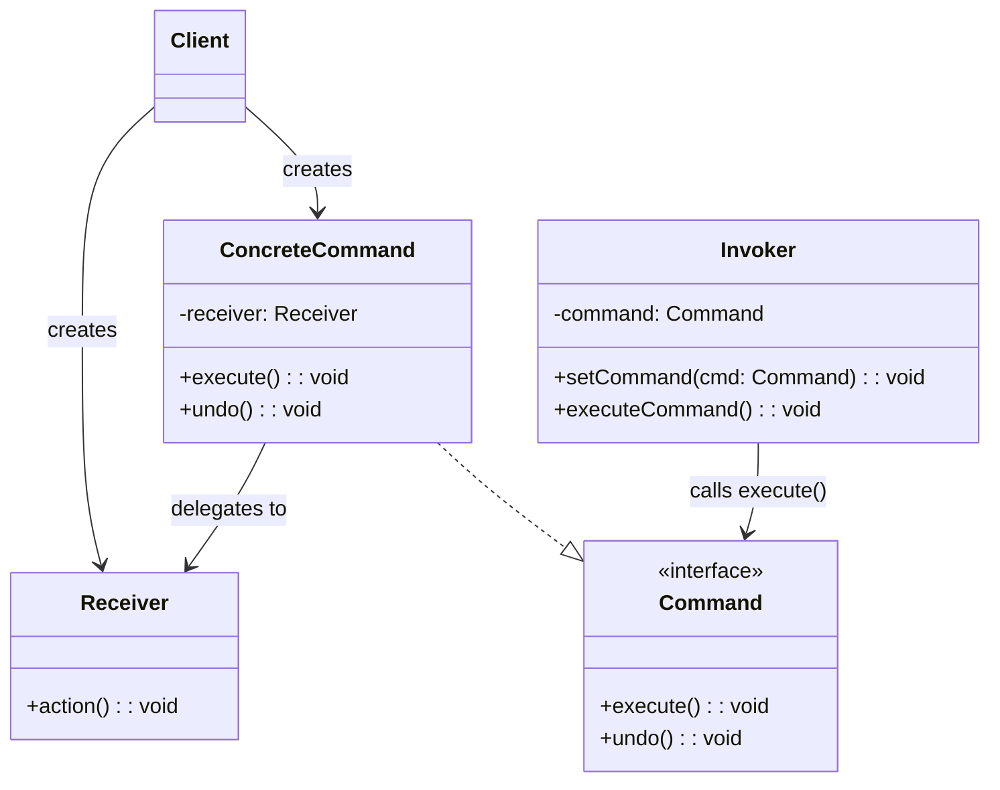

# Week 6. 커맨드(Command) 패턴

## 학습 정보

- **주차**: 6주차
- **챕터**: Chapter 06 — 호출 캡슐화하기
- **패턴명**: 커맨드 패턴 (Command Pattern)
- **학습일**: 2025-03-24
- **학습 범위**: Chapter 06 전체

---

## 학습 목표

- 요청(메서드 호출)을 객체로 캡슐화하는 커맨드 패턴의 구조와 동작 원리를 이해한다.
- 인보커와 리시버를 분리하여 느슨한 결합을 달성하는 방법을 학습한다.
- 작업 취소(Undo), 매크로 커맨드, 작업 큐 등 커맨드 패턴의 다양한 활용법을 익힌다.

---

## 핵심 개념

### 패턴이 해결하는 문제

홈 오토메이션 리모컨 API를 설계하는 상황이다.
<br />
리모컨에는 7개의 슬롯이 있고, 각 슬롯마다 ON/OFF 버튼이 있다.
<br />
각 슬롯에는 조명, 선풍기, 오디오, TV, 욕조 등 다양한 가전제품을 연결할 수 있다.

문제는 협력 업체에서 제공하는 클래스들의 인터페이스가 제각각이라는 점이다.
<br />
`Light`에는 `on()`/`off()`가, `CeilingFan`에는 `high()`/`medium()`/`low()`/`off()`가, `Stereo`에는 `on()`/`off()`/`setCd()`/`setVolume()` 등이 있다.
<br />
공통 인터페이스가 없고, 앞으로 더 많은 클래스가 추가될 수 있다.

리모컨 코드에서 각 기기의 구체적인 메서드를 직접 호출하면 다음과 같은 문제가 발생한다.

- 새로운 가전제품이 추가될 때마다 리모컨 코드를 수정해야 한다.
- 리모컨이 각 기기의 세부 동작 방식을 알아야 한다(강한 결합).
- 작업 취소(Undo) 같은 공통 기능을 구현하기 어렵다.

커맨드 패턴은 **요청 자체를 객체로 캡슐화**하여 인보커(리모컨)와 리시버(가전제품)를 완전히 분리한다.

### 패턴의 정의

> **커맨드 패턴(Command Pattern)** 을 사용하면 요청 내역을 객체로 캡슐화해서 객체를 서로 다른 요청 내역에 따라 매개변수화할 수 있다.
> <br />
> 이러면 요청을 큐에 저장하거나 로그로 기록하거나 작업 취소 기능을 사용할 수 있다.

핵심 아이디어는 "객체마을 식당" 비유로 이해할 수 있다.

- **고객(Client)**: 주문을 생성한다.
- **주문서(Command)**: 주문 내용을 캡슐화한다. `orderUp()` 메서드 하나로 식사 준비를 요청한다.
- **종업원(Invoker)**: 주문서를 받아서 `orderUp()`을 호출한다. 주문서에 무슨 내용이 있는지, 누가 요리를 하는지 전혀 알 필요가 없다.
- **주방장(Receiver)**: 실제로 식사를 준비하는 방법을 알고 있다.

종업원과 주방장이 완전히 분리되어 있듯이, 커맨드 패턴에서도 인보커와 리시버가 분리된다.

### 주요 구성요소

- **Command (인터페이스)**: 모든 커맨드 객체가 구현하는 인터페이스. `execute()`와 `undo()` 메서드를 정의한다.
- **ConcreteCommand (LightOnCommand 등)**: Command를 구현한 구상 클래스. 리시버와 행동 사이의 바인딩을 정의한다. `execute()` 호출 시 리시버의 메서드를 호출하여 실제 작업을 수행한다.
- **Invoker (RemoteControl)**: 커맨드 객체를 저장하고, 특정 시점에 `execute()`를 호출하여 요청을 실행한다. 커맨드가 어떤 일을 하는지는 전혀 모른다.
- **Receiver (Light, CeilingFan 등)**: 요구 사항을 수행할 때 어떤 일을 처리해야 하는지 알고 있는 객체다.
- **Client**: ConcreteCommand를 생성하고 Receiver를 설정한다.
- **NoCommand (널 객체)**: 아무 일도 하지 않는 커맨드 클래스. 슬롯에 커맨드가 할당되지 않았을 때 null 체크 대신 사용한다.

---

## 패턴 구조

### UML 다이어그램



### 동작 방식

1. **Client**가 Receiver(예: `Light`)를 생성하고, 해당 Receiver를 전달하여 ConcreteCommand(예: `LightOnCommand`)를 생성한다.
2. Client가 Invoker(예: `RemoteControl`)의 `setCommand()`를 호출하여 커맨드 객체를 슬롯에 저장한다.
3. 사용자가 버튼을 누르면 Invoker가 해당 슬롯의 커맨드 객체의 `execute()`를 호출한다.
4. ConcreteCommand의 `execute()` 내부에서 Receiver의 메서드(예: `light.on()`)를 호출하여 실제 작업이 수행된다.
5. Invoker는 어떤 Receiver가 어떤 작업을 수행하는지 전혀 알지 못한다. 커맨드 인터페이스의 `execute()`만 호출할 뿐이다.

---

## 코드 예제

### 예제 상황

홈 오토메이션 리모컨 시스템이다.
<br />
리모컨에는 7개의 슬롯이 있고, 각 슬롯에는 ON/OFF 버튼이 있다.
<br />
조명, 선풍기, 오디오 등 다양한 가전제품을 각 슬롯에 할당하여 제어한다.
<br />
작업 취소(Undo) 버튼도 지원해야 하며, 여러 장치를 한 번에 제어하는 매크로 커맨드도 필요하다.

### 커맨드 인터페이스와 NoCommand

```typescript
/** 모든 커맨드가 구현하는 인터페이스 */
interface Command {
  execute(): void;
  undo(): void;
}

/** 널 객체 — 아무 일도 하지 않는 커맨드 */
class NoCommand implements Command {
  public execute() {}

  public undo() {}
}
```

`NoCommand`는 널 객체(Null Object) 패턴의 적용이다.
<br />
슬롯에 커맨드가 할당되지 않았을 때 `null` 체크를 하는 대신 `NoCommand`를 기본값으로 넣어두면, `execute()`를 호출해도 아무 일도 일어나지 않으므로 안전하다.

### 리시버: 가전제품 클래스

```typescript
class Light {
  constructor(private location: string) {}

  public on() {
    console.log(`${this.location} 조명이 켜졌습니다`);
  }

  public off() {
    console.log(`${this.location} 조명이 꺼졌습니다`);
  }
}

class CeilingFan {
  static readonly HIGH = 3;
  static readonly MEDIUM = 2;
  static readonly LOW = 1;
  static readonly OFF = 0;

  private speed = CeilingFan.OFF;

  constructor(private location: string) {}

  public high() {
    this.speed = CeilingFan.HIGH;
    console.log(`${this.location} 선풍기 속도가 HIGH로 설정되었습니다`);
  }

  public medium() {
    this.speed = CeilingFan.MEDIUM;
    console.log(`${this.location} 선풍기 속도가 MEDIUM으로 설정되었습니다`);
  }

  public low() {
    this.speed = CeilingFan.LOW;
    console.log(`${this.location} 선풍기 속도가 LOW로 설정되었습니다`);
  }

  public off() {
    this.speed = CeilingFan.OFF;
    console.log(`${this.location} 선풍기가 꺼졌습니다`);
  }

  public getSpeed() {
    return this.speed;
  }
}

class Stereo {
  constructor(private location: string) {}

  public on() {
    console.log(`${this.location} 오디오가 켜졌습니다`);
  }

  public off() {
    console.log(`${this.location} 오디오가 꺼졌습니다`);
  }

  public setCd() {
    console.log(`${this.location} 오디오에서 CD가 재생됩니다`);
  }

  public setVolume(volume: number) {
    console.log(`${this.location} 오디오의 볼륨이 ${volume}로 설정되었습니다`);
  }
}
```

### 구상 커맨드: 조명

```typescript
class LightOnCommand implements Command {
  constructor(private light: Light) {}

  public execute() {
    this.light.on();
  }

  public undo() {
    // execute()의 반대 작업
    this.light.off();
  }
}

class LightOffCommand implements Command {
  constructor(private light: Light) {}

  public execute() {
    this.light.off();
  }

  public undo() {
    this.light.on();
  }
}
```

### 구상 커맨드: 선풍기 (상태를 사용하는 Undo)

선풍기처럼 단순히 on/off가 아닌 여러 단계의 상태를 가진 기기의 경우, `undo()` 구현 시 이전 상태를 저장해 두어야 한다.

```typescript
class CeilingFanHighCommand implements Command {
  private prevSpeed: number = CeilingFan.OFF;

  constructor(private ceilingFan: CeilingFan) {}

  public execute() {
    // 작업 취소를 위해 현재 속도를 저장한 후 새 속도로 변경
    this.prevSpeed = this.ceilingFan.getSpeed();
    this.ceilingFan.high();
  }

  public undo() {
    // 이전 속도로 복원
    switch (this.prevSpeed) {
      case CeilingFan.HIGH:
        this.ceilingFan.high();
        break;
      case CeilingFan.MEDIUM:
        this.ceilingFan.medium();
        break;
      case CeilingFan.LOW:
        this.ceilingFan.low();
        break;
      case CeilingFan.OFF:
        this.ceilingFan.off();
        break;
    }
  }
}

class CeilingFanOffCommand implements Command {
  private prevSpeed: number = CeilingFan.OFF;

  constructor(private ceilingFan: CeilingFan) {}

  public execute() {
    this.prevSpeed = this.ceilingFan.getSpeed();
    this.ceilingFan.off();
  }

  public undo() {
    switch (this.prevSpeed) {
      case CeilingFan.HIGH:
        this.ceilingFan.high();
        break;
      case CeilingFan.MEDIUM:
        this.ceilingFan.medium();
        break;
      case CeilingFan.LOW:
        this.ceilingFan.low();
        break;
      case CeilingFan.OFF:
        this.ceilingFan.off();
        break;
    }
  }
}
```

### 구상 커맨드: 오디오 (여러 메서드를 순서대로 호출)

```typescript
class StereoOnWithCDCommand implements Command {
  constructor(private stereo: Stereo) {}

  public execute() {
    // 오디오를 켜고 CD를 재생하고 볼륨을 설정하는 일련의 동작을 하나로 캡슐화
    this.stereo.on();
    this.stereo.setCd();
    this.stereo.setVolume(11);
  }

  public undo() {
    this.stereo.off();
  }
}
```

### 인보커: 리모컨 (Undo 지원)

```typescript
class RemoteControl {
  private onCommands: Command[];
  private offCommands: Command[];
  private undoCommand: Command;

  constructor() {
    const noCommand = new NoCommand();

    // 7개 슬롯을 NoCommand로 초기화
    this.onCommands = Array(7)
      .fill(null)
      .map(() => noCommand);
    this.offCommands = Array(7)
      .fill(null)
      .map(() => noCommand);
    this.undoCommand = noCommand;
  }

  public setCommand(slot: number, onCommand: Command, offCommand: Command) {
    this.onCommands[slot] = onCommand;
    this.offCommands[slot] = offCommand;
  }

  public onButtonWasPushed(slot: number) {
    this.onCommands[slot].execute();
    // 마지막으로 실행한 커맨드를 Undo용으로 저장
    this.undoCommand = this.onCommands[slot];
  }

  public offButtonWasPushed(slot: number) {
    this.offCommands[slot].execute();
    this.undoCommand = this.offCommands[slot];
  }

  public undoButtonWasPushed() {
    this.undoCommand.undo();
  }

  public toString() {
    let result = "\n------ 리모컨 --------\n";

    for (let i = 0; i < this.onCommands.length; i++) {
      result += `[slot ${i}] ${this.onCommands[i].constructor.name}\t${this.offCommands[i].constructor.name}\n`;
    }
    result += `[undo] ${this.undoCommand.constructor.name}\n`;

    return result;
  }
}
```

### 매크로 커맨드: 여러 동작을 한 번에 실행

버튼 하나로 조명, 오디오, TV 등을 동시에 제어하는 "파티 모드" 같은 기능이다.

```typescript
class MacroCommand implements Command {
  constructor(private commands: Command[]) {}

  public execute() {
    for (const command of this.commands) {
      command.execute();
    }
  }

  public undo() {
    // 실행의 역순으로 취소
    for (let i = this.commands.length - 1; i >= 0; i--) {
      this.commands[i].undo();
    }
  }
}
```

### 실행 코드

```typescript
const remoteControl = new RemoteControl();

// 리시버 생성
const livingRoomLight = new Light("거실");
const kitchenLight = new Light("주방");
const ceilingFan = new CeilingFan("거실");
const stereo = new Stereo("거실");

// 커맨드 생성
const livingRoomLightOn = new LightOnCommand(livingRoomLight);
const livingRoomLightOff = new LightOffCommand(livingRoomLight);
const kitchenLightOn = new LightOnCommand(kitchenLight);
const kitchenLightOff = new LightOffCommand(kitchenLight);
const ceilingFanHigh = new CeilingFanHighCommand(ceilingFan);
const ceilingFanOff = new CeilingFanOffCommand(ceilingFan);
const stereoOnWithCD = new StereoOnWithCDCommand(stereo);
const stereoOff = new StereoOffCommand(stereo);

// 슬롯에 커맨드 할당
remoteControl.setCommand(0, livingRoomLightOn, livingRoomLightOff);
remoteControl.setCommand(1, kitchenLightOn, kitchenLightOff);
remoteControl.setCommand(2, ceilingFanHigh, ceilingFanOff);
remoteControl.setCommand(3, stereoOnWithCD, stereoOff);

// 버튼 누르기
remoteControl.onButtonWasPushed(0); // 거실 조명이 켜졌습니다
remoteControl.offButtonWasPushed(0); // 거실 조명이 꺼졌습니다
remoteControl.undoButtonWasPushed(); // 거실 조명이 켜졌습니다 (Undo)

// 매크로 커맨드: 파티 모드
const partyOn: Command[] = [livingRoomLightOn, stereoOnWithCD];
const partyOff: Command[] = [livingRoomLightOff, stereoOff];
const partyOnMacro = new MacroCommand(partyOn);
const partyOffMacro = new MacroCommand(partyOff);

remoteControl.setCommand(4, partyOnMacro, partyOffMacro);
remoteControl.onButtonWasPushed(4); // 거실 조명 + 오디오 동시 켜짐
```

### 코드 설명

- **리모컨(Invoker)은 가전제품(Receiver)을 전혀 모른다.** `execute()`만 호출할 뿐, 그 뒤에서 어떤 객체가 무슨 일을 하는지 알 필요가 없다. 새로운 가전제품이 추가되어도 리모컨 코드는 변경하지 않아도 된다.
- **NoCommand(널 객체)**: 모든 슬롯을 `NoCommand`로 초기화하여 `null` 체크 없이 안전하게 `execute()`를 호출할 수 있다.
- **Undo 구현**: 단순한 on/off 토글은 반대 메서드를 호출하면 되지만, 선풍기처럼 여러 상태를 가진 경우 `execute()` 호출 전에 이전 상태를 저장해 두어야 한다.
- **MacroCommand**: Command 배열을 받아 순서대로 실행한다. `undo()` 시에는 역순으로 취소한다. Command 인터페이스만 구현하면 되므로 리모컨 코드를 전혀 바꾸지 않고 매크로를 추가할 수 있다.
- **람다 표현식 활용**: TypeScript에서는 간단한 커맨드를 화살표 함수로 대체할 수 있다. 단, Command 인터페이스의 추상 메서드가 `execute()` 하나뿐일 때만 가능하고 `undo()`가 필요하면 클래스를 사용해야 한다.

---

## 구현 방식 비교

커맨드 패턴을 도입하기 전과 후의 리모컨 설계를 비교한다.

| 구분               | 커맨드 패턴 없이 (직접 호출)                      | 커맨드 패턴 적용                               |
| ------------------ | ------------------------------------------------- | ---------------------------------------------- |
| 리모컨-기기 결합도 | 강함 — 리모컨이 각 기기의 메서드를 직접 알아야 함 | 느슨함 — 리모컨은 `execute()`만 호출           |
| 새 기기 추가 시    | 리모컨 코드 수정 필요                             | 새 커맨드 클래스만 추가                        |
| 작업 취소 (Undo)   | 구현 어려움 (각 기기별로 별도 로직 필요)          | `undo()` 메서드로 일관되게 구현                |
| 매크로 기능        | 별도 구현 필요                                    | MacroCommand로 커맨드 조합                     |
| 로그/큐 지원       | 어려움                                            | 커맨드 객체를 큐에 저장하거나 로그로 기록 가능 |

---

## 실전 활용

### 언제 사용하면 좋을까?

- 요청을 보내는 쪽과 요청을 처리하는 쪽을 분리해야 할 때
- 작업 취소(Undo/Redo) 기능이 필요할 때
- 요청을 큐에 저장하거나 로그로 기록해야 할 때 (작업 큐, 트랜잭션 로그 등)
- 여러 작업을 하나로 묶어 매크로로 실행해야 할 때

### 장단점

**장점**

- 인보커와 리시버를 완전히 분리하여 느슨한 결합을 달성한다.
- 새로운 커맨드를 추가할 때 기존 코드를 변경할 필요가 없다(OCP 준수).
- 작업 취소(Undo), 작업 큐, 로그 기록, 매크로 등 다양한 부가 기능을 자연스럽게 구현할 수 있다.
- 커맨드 객체를 일급 객체(first-class object)로 다룰 수 있어 저장, 전달, 조합이 자유롭다.

**단점**

- 간단한 요청에도 커맨드 클래스를 만들어야 하므로 클래스 수가 증가한다.
- 리시버와 커맨드 사이의 관계를 설정하는 클라이언트 코드가 복잡해질 수 있다.

### 실제 적용 사례

- **작업 큐 (Job Queue)**: 커맨드 객체를 큐에 넣고, 워커 스레드가 하나씩 꺼내서 `execute()`를 호출한다. 큐는 커맨드가 어떤 작업을 수행하는지 전혀 알 필요가 없다. JavaScript의 이벤트 루프와 태스크 큐가 이 구조와 유사하다.
- **트랜잭션 로그/복구**: 커맨드를 실행할 때마다 디스크에 기록해 두고, 시스템 장애 후 로그를 다시 로딩하여 `execute()`를 순서대로 재실행하면 상태를 복구할 수 있다.
- **텍스트 에디터의 Undo/Redo**: 사용자의 편집 동작(입력, 삭제, 서식 변경 등)을 각각 커맨드 객체로 만들고 스택에 쌓는다. Undo 시 스택에서 꺼내 `undo()`를 호출한다.
- **Redux의 Action**: Redux에서 상태 변경 요청을 `{ type: 'INCREMENT', payload: 1 }` 같은 액션 객체로 캡슐화하는 구조가 커맨드 패턴의 변형이다. 액션 자체는 "무엇을 할지"만 기술하고, 리듀서가 실제 처리를 담당한다.
- **Express의 미들웨어 체인**: 각 미들웨어가 요청을 처리하는 커맨드 역할을 하며, `next()`를 통해 다음 커맨드로 제어를 넘긴다.

---

## 핵심 정리

- 커맨드 패턴은 요청(메서드 호출)을 객체로 캡슐화하여 인보커와 리시버를 완전히 분리한다. 인보커는 `execute()`만 호출하면 되고, 그 뒤에서 어떤 객체가 무슨 작업을 하는지 알 필요가 없다.
- Command 인터페이스에 `undo()` 메서드를 추가하면 작업 취소 기능을 쉽게 구현할 수 있다. 단순 토글이 아닌 경우(선풍기 속도 등) 이전 상태를 저장해 두어야 한다.
- MacroCommand로 여러 커맨드를 하나로 묶어 실행할 수 있다. 커맨드 인터페이스만 구현하면 되므로 기존 인보커 코드를 수정할 필요가 없다.
- 커맨드 패턴은 작업 큐, 트랜잭션 로그, Undo/Redo 히스토리 등 "요청을 나중에 실행하거나 기록해야 하는" 다양한 상황에서 활용된다.

---

## 함께 등장한 디자인 원칙

| 원칙                                                    | 이 패턴에서의 적용                                                                            |
| ------------------------------------------------------- | --------------------------------------------------------------------------------------------- |
| 바뀌는 부분은 캡슐화한다                                | 각 기기의 구체적인 동작 방식(바뀌는 부분)을 커맨드 객체로 캡슐화하여 리모컨 코드에서 분리     |
| 구현보다는 인터페이스에 맞춰서 프로그래밍한다           | 리모컨(Invoker)은 Command 인터페이스에만 의존하며, 구상 커맨드 클래스나 리시버를 알지 못함    |
| 상호작용하는 객체 사이에서는 느슨한 결합을 사용한다     | 인보커는 커맨드 인터페이스만 알고, 커맨드는 리시버에게 작업을 위임. 세 객체가 느슨하게 연결됨 |
| 클래스는 확장에 열려 있고 변경에 닫혀 있어야 한다 (OCP) | 새로운 가전제품/커맨드 추가 시 리모컨 코드 변경 없이 커맨드 클래스만 추가                     |

이 챕터에서 새로 등장하는 디자인 원칙은 없다.
<br />
대신 지금까지 배운 원칙들(캡슐화, 느슨한 결합, OCP)이 커맨드 패턴에서 어떻게 종합적으로 적용되는지를 보여준다.

---

## 관련 패턴

- **전략 패턴 (Strategy)**: 둘 다 행동을 객체로 캡슐화한다는 점에서 유사하다. 전략 패턴은 "어떻게 할지(알고리즘)"를 캡슐화하고, 커맨드 패턴은 "무엇을 할지(요청)"를 캡슐화한다. 전략은 대체가 목적이고, 커맨드는 분리/지연/기록이 목적이다.
- **옵저버 패턴 (Observer)**: 옵저버 패턴의 알림 메커니즘에서 옵저버에게 전달되는 이벤트를 커맨드 객체로 만들면 두 패턴을 결합할 수 있다.
- **메멘토 패턴 (Memento)**: 커맨드의 `undo()` 구현 시 이전 상태를 저장해야 하는 경우, 메멘토 패턴으로 상태를 스냅샷하여 저장하면 더 복잡한 Undo를 구현할 수 있다.
- **컴포지트 패턴 (Composite)**: MacroCommand가 여러 커맨드를 담아 하나의 커맨드처럼 동작하는 구조는 컴포지트 패턴의 적용이다. 개별 커맨드와 매크로 커맨드를 동일한 인터페이스로 다룰 수 있다.
