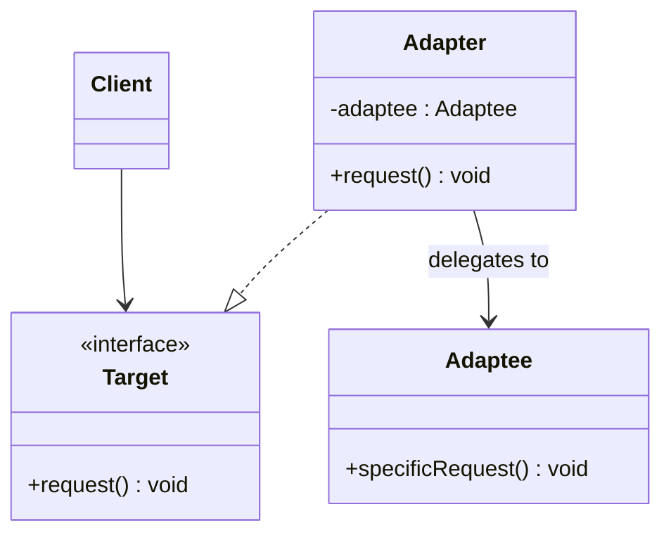

# Week 7-1. 어댑터(Adapter) 패턴

## 학습 정보

- **주차**: 7주차
- **챕터**: Chapter 07 — 적응시키기 (어댑터 패턴)
- **패턴명**: 어댑터 패턴 (Adapter Pattern)
- **학습일**: 2025-03-31
- **학습 범위**: Chapter 07 전반부 (어댑터 패턴)

---

## 학습 목표

- 어댑터 패턴의 구조와 동작 원리를 이해하고, 인터페이스 변환이 필요한 상황을 파악한다.
- 객체 어댑터와 클래스 어댑터의 차이를 이해한다.
- TypeScript로 어댑터 패턴을 구현하고, 실전 적용 사례를 학습한다.

---

## 핵심 개념

### 패턴이 해결하는 문제

한국에서 사용하던 전자제품을 영국에서 사용하려면 플러그 모양이 다르기 때문에 전원 어댑터가 필요하다.
<br />
소프트웨어에서도 동일한 상황이 발생한다.

기존 시스템에서 `Duck` 인터페이스를 사용하고 있는데, 새로운 업체에서 제공한 클래스가 `Turkey` 인터페이스를 사용한다고 가정하자.
<br />
`Turkey` 객체를 `Duck` 자리에 바로 넣을 수는 없다.
<br />
인터페이스가 다르기 때문이다.
<br />
그렇다고 기존 코드를 수정하거나 업체에서 제공한 클래스를 변경할 수도 없다.

이때 어댑터를 만들면 해결된다.
<br />
어댑터는 클라이언트가 기대하는 인터페이스(Target)를 구현하면서, 내부적으로는 실제 객체(Adaptee)의 메서드를 호출하여 요청을 변환해 준다.

### 패턴의 정의

> **어댑터 패턴(Adapter Pattern)** 은 특정 클래스 인터페이스를 클라이언트에서 요구하는 다른 인터페이스로 변환한다. 인터페이스가 호환되지 않아 같이 쓸 수 없었던 클래스를 사용할 수 있게 도와준다.

핵심은 다음 세 가지다.

- 클라이언트는 타깃 인터페이스에 맞게 구현되어 있다.
- 어댑터는 타깃 인터페이스를 구현하며, 내부에 어댑티(Adaptee) 인스턴스를 가지고 있다.
- 모든 요청은 어댑티에 위임된다. 클라이언트는 어댑터가 중간에 있다는 사실을 모른다.

### 주요 구성요소

- **Target (Duck)**: 클라이언트가 사용하는 인터페이스다.
- **Adaptee (Turkey)**: 기존과 다른 인터페이스를 가진, 적응시켜야 하는 클래스다.
- **Adapter (TurkeyAdapter)**: Target 인터페이스를 구현하고, 내부에서 Adaptee의 메서드를 호출하여 요청을 변환한다.
- **Client**: Target 인터페이스만 알고 있으며, Adapter를 통해 Adaptee를 사용한다.

---

## 패턴 구조

### UML 다이어그램 — 객체 어댑터



객체 어댑터는 구성(Composition)을 사용한다.
<br />
어댑터가 어댑티의 인스턴스를 멤버 변수로 가지고 있으며, 타깃 인터페이스의 메서드가 호출되면 어댑티의 메서드에 위임한다.

### 객체 어댑터 vs 클래스 어댑터

| 구분       | 객체 어댑터                                       | 클래스 어댑터                                          |
| ---------- | ------------------------------------------------- | ------------------------------------------------------ |
| 방식       | 구성(Composition) — 어댑티를 인스턴스 변수로 가짐 | 다중 상속 — 타깃과 어댑티를 모두 상속                  |
| 유연성     | 어댑티의 서브클래스에도 적용 가능                 | 특정 어댑티 클래스에만 적용                            |
| 언어 제약  | 제약 없음                                         | 다중 상속이 필요하므로 Java/TypeScript에서는 사용 불가 |
| 오버라이드 | 불가 (위임만 가능)                                | 어댑티의 행동을 오버라이드할 수 있음                   |
| 권장       | TypeScript에서는 객체 어댑터를 사용한다           | —                                                      |

TypeScript는 다중 상속을 지원하지 않으므로 이 챕터에서는 객체 어댑터만 다룬다.

### 동작 방식

1. 클라이언트가 타깃 인터페이스의 메서드(`quack()`, `fly()`)를 호출한다.
2. 어댑터가 해당 호출을 받아서 어댑티의 메서드(`gobble()`, `fly()`)로 변환하여 호출한다.
3. 클라이언트는 호출 결과를 받지만, 중간에 어댑터가 있었다는 사실을 전혀 모른다.

---

## 코드 예제

### 예제 상황

1장에서 만들었던 오리 시뮬레이션이다.
<br />
`Duck` 인터페이스를 사용하는 시스템에 `Duck` 객체가 부족하여 `Turkey` 객체를 대신 사용해야 하는 상황이다.
<br />
`Turkey`는 `quack()` 대신 `gobble()`을 사용하고, `fly()`는 짧은 거리만 날 수 있다.

### 타깃 인터페이스와 어댑티

```typescript
/** 타깃 인터페이스 — 클라이언트가 기대하는 인터페이스 */
interface Duck {
  quack(): void;
  fly(): void;
}

/** 어댑티 — 적응시켜야 하는 다른 인터페이스 */
interface Turkey {
  gobble(): void;
  fly(): void;
}

class MallardDuck implements Duck {
  public quack() {
    console.log("꽥꽥!");
  }

  public fly() {
    console.log("날고 있어요!");
  }
}

class WildTurkey implements Turkey {
  public gobble() {
    console.log("골골");
  }

  public fly() {
    console.log("짧은 거리를 날고 있어요!");
  }
}
```

### 어댑터 구현

```typescript
/**
 * TurkeyAdapter는 Duck 인터페이스를 구현한다.
 * 내부에서 Turkey 객체에 작업을 위임한다.
 */
class TurkeyAdapter implements Duck {
  constructor(private turkey: Turkey) {}

  public quack() {
    // Duck의 quack()이 호출되면 Turkey의 gobble()로 변환
    this.turkey.gobble();
  }

  public fly() {
    // 칠면조는 짧은 거리만 날 수 있으므로 5번 호출하여 보완
    for (let i = 0; i < 5; i++) {
      this.turkey.fly();
    }
  }
}
```

### 테스트 코드

```typescript
function testDuck(duck: Duck) {
  duck.quack();
  duck.fly();
}

// 오리 테스트
const duck = new MallardDuck();
console.log("오리가 말하길");
testDuck(duck);

// 칠면조를 어댑터로 감싸서 오리처럼 사용
const turkey = new WildTurkey();
const turkeyAdapter = new TurkeyAdapter(turkey);
console.log("\n칠면조 어댑터가 말하길");
testDuck(turkeyAdapter);
```

**실행 결과**

```
오리가 말하길
꽥꽥!
날고 있어요!

칠면조 어댑터가 말하길
골골
짧은 거리를 날고 있어요!
짧은 거리를 날고 있어요!
짧은 거리를 날고 있어요!
짧은 거리를 날고 있어요!
짧은 거리를 날고 있어요!
```

### 실전 예제: Enumeration을 Iterator로 적응시키기

Java에서 레거시 `Enumeration` 인터페이스를 새로운 `Iterator` 인터페이스에 맞게 적응시키는 사례가 책에 등장한다.
<br />
TypeScript에서도 유사한 상황이 있다.
<br />
예를 들어 구형 콜백 기반 API를 Promise 기반으로 적응시키는 것이 어댑터 패턴의 전형적인 적용이다.

```typescript
import { readFile } from "fs";

/**
 * 콜백 기반 fs.readFile을 Promise 기반으로 적응시키는 어댑터 함수.
 * 타깃 인터페이스: Promise<string>
 * 어댑티: 콜백 기반 fs.readFile
 */
function readFilePromise(path: string): Promise<string> {
  return new Promise((resolve, reject) => {
    readFile(path, "utf-8", (err, data) => {
      if (err) reject(err);
      else resolve(data);
    });
  });
}

// 클라이언트는 Promise 인터페이스만 사용
const content = await readFilePromise("./data.txt");
```

### 코드 설명

- **`TurkeyAdapter`는 `Duck` 인터페이스를 구현한다.** 클라이언트(`testDuck`)는 `Duck` 인터페이스만 알고 있으므로, 어댑터를 통해 `Turkey` 객체를 `Duck`처럼 사용할 수 있다.
- **인터페이스 차이를 어댑터 내부에서 처리한다.** `quack()` → `gobble()` 변환, `fly()` 5회 호출로 비행 거리 보완 등의 로직이 어댑터에 캡슐화되어 있다.
- **클라이언트 코드는 변경하지 않는다.** `testDuck()` 함수는 `Duck` 인터페이스에만 의존하므로, `MallardDuck`을 넣든 `TurkeyAdapter`를 넣든 동일하게 동작한다.
- **어댑티가 타깃 인터페이스의 모든 기능을 지원하지 못할 수도 있다.** Enumeration → Iterator 어댑터에서 `remove()` 메서드를 지원할 수 없어 예외를 던지는 것처럼, 완벽한 1:1 변환이 불가능한 경우도 있다.

---

## 실전 활용

### 언제 사용하면 좋을까?

- 기존 클래스를 사용하고 싶지만 인터페이스가 맞지 않을 때
- 업체에서 제공한 클래스를 수정할 수 없을 때
- 레거시 시스템과 새로운 시스템을 연결해야 할 때

### 장단점

**장점**

- 기존 코드를 변경하지 않고 새로운 클래스를 적응시킬 수 있다(OCP 준수).
- 클라이언트와 구현을 분리할 수 있다. 인터페이스가 바뀌더라도 변경 내역은 어댑터에 캡슐화된다.
- 어댑티의 모든 서브클래스에 대해서도 어댑터를 사용할 수 있다(객체 어댑터의 경우).

**단점**

- 어댑터 구현의 복잡도는 타깃 인터페이스의 크기에 비례한다. 대형 인터페이스를 적응시키려면 코드가 많아질 수 있다.
- 어댑티가 타깃의 모든 기능을 지원하지 못하면 완벽한 적응이 불가능하다.

### 실제 적용 사례

- **Node.js `util.promisify()`**: 콜백 기반 함수를 Promise 기반으로 변환하는 내장 어댑터 함수다.
- **TypeORM / Prisma의 Database Driver**: 각 데이터베이스(MySQL, PostgreSQL, SQLite)의 드라이버 인터페이스가 다르지만, ORM이 통일된 인터페이스를 제공하기 위해 내부적으로 어댑터를 사용한다.
- **React의 합성 이벤트(SyntheticEvent)**: 브라우저마다 다른 네이티브 이벤트 인터페이스를 React가 통일된 인터페이스로 감싸는 구조가 어댑터 패턴의 변형이다.
- **Axios**: `XMLHttpRequest`(브라우저)와 `http` 모듈(Node.js)이라는 서로 다른 HTTP 클라이언트를 통일된 인터페이스로 감싸고 있다.

---

## 핵심 정리

- 어댑터 패턴은 클라이언트가 기대하는 인터페이스(Target)를 구현하여, 호환되지 않는 인터페이스를 가진 클래스(Adaptee)를 사용할 수 있게 만든다.
- 객체 어댑터는 구성(Composition)을 사용하고, 클래스 어댑터는 다중 상속을 사용한다. TypeScript에서는 객체 어댑터만 사용 가능하다.
- 어댑터의 구현 복잡도는 타깃 인터페이스의 크기에 비례한다. 타깃이 클수록 어댑터 코드도 많아진다.
- 어댑터는 인터페이스를 변환할 뿐, 기능을 추가하지는 않는다. 기능 추가는 데코레이터 패턴의 영역이다.

---

## 함께 등장한 디자인 원칙

| 원칙                                          | 이 패턴에서의 적용                                                            |
| --------------------------------------------- | ----------------------------------------------------------------------------- |
| 바뀌는 부분은 캡슐화한다                      | 인터페이스 변환 로직(바뀌는 부분)을 어댑터 클래스에 캡슐화                    |
| 상속보다는 구성을 활용한다                    | 객체 어댑터는 상속 대신 구성을 사용하여 어댑티를 감싼다                       |
| 구현보다는 인터페이스에 맞춰서 프로그래밍한다 | 클라이언트는 타깃 인터페이스에만 의존하고, 어댑티의 구체 클래스를 알지 못한다 |

---

## 관련 패턴

- **데코레이터 패턴 (Decorator)**: 둘 다 객체를 감싸는(wrapping) 구조다. 하지만 어댑터는 인터페이스를 변환하고, 데코레이터는 인터페이스를 바꾸지 않고 책임(기능)을 추가한다. 목적이 근본적으로 다르다.
- **퍼사드 패턴 (Facade)**: 둘 다 인터페이스를 다루지만, 어댑터는 하나의 인터페이스를 다른 인터페이스로 변환하고, 퍼사드는 복잡한 서브시스템의 인터페이스를 단순화한다. 어댑터는 "변환", 퍼사드는 "단순화"가 목적이다.
- **프록시 패턴 (Proxy)**: 프록시는 같은 인터페이스를 유지하면서 접근을 제어한다. 어댑터처럼 객체를 감싸지만 인터페이스를 변환하지 않는다.
