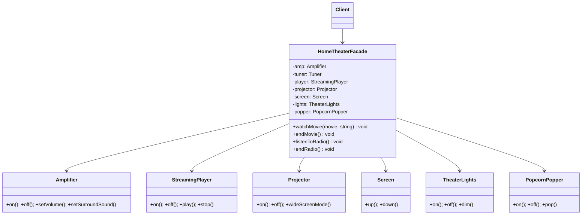

# Week 7-2. 퍼사드(Facade) 패턴

## 학습 정보

- **주차**: 7주차
- **챕터**: Chapter 07 — 적응시키기 (퍼사드 패턴)
- **패턴명**: 퍼사드 패턴 (Facade Pattern)
- **학습일**: 2025-03-31
- **학습 범위**: Chapter 07 후반부 (퍼사드 패턴)

---

## 학습 목표

- 퍼사드 패턴의 구조와 동작 원리를 이해하고, 복잡한 서브시스템을 단순화하는 방법을 학습한다.
- 최소 지식 원칙(데메테르의 법칙)을 이해하고, 퍼사드 패턴이 이 원칙을 어떻게 실현하는지 파악한다.
- 어댑터 패턴과 퍼사드 패턴의 차이를 명확히 구분한다.

---

## 핵심 개념

### 패턴이 해결하는 문제

홈시어터 시스템을 구축했다.
<br />
앰프, 튜너, 스트리밍 플레이어, 프로젝터, 스크린, 조명, 팝콘 기계 등 수많은 구성 요소가 있다.
<br />
영화를 보려면 다음과 같은 과정을 거쳐야 한다.

1. 팝콘 기계를 켠다
2. 팝콘을 튀긴다
3. 조명을 어둡게 조절한다
4. 스크린을 내린다
5. 프로젝터를 켠다
6. 프로젝터 입력을 스트리밍 플레이어로 설정한다
7. 프로젝터를 와이드 스크린 모드로 전환한다
8. 앰프를 켠다
9. 앰프 입력을 스트리밍 플레이어로 설정한다
10. 앰프를 서라운드 음향 모드로 전환한다
11. 앰프 볼륨을 중간(5)으로 설정한다
12. 스트리밍 플레이어를 켠다
13. 영화를 재생한다

클래스가 6개 이상이고, 영화를 끌 때는 이 과정을 전부 역순으로 처리해야 한다.
<br />
라디오를 들을 때도 비슷하게 복잡하다.
<br />
클라이언트가 서브시스템의 모든 클래스와 메서드를 알아야 하며, 사용법이 바뀔 때마다 클라이언트 코드를 수정해야 한다.

퍼사드 패턴은 이 복잡한 서브시스템에 **단순화된 통합 인터페이스**를 제공하여 문제를 해결한다.

### 패턴의 정의

> **퍼사드 패턴(Facade Pattern)** 은 서브시스템에 있는 일련의 인터페이스를 통합 인터페이스로 묶어 준다. 또한 고수준 인터페이스도 정의하므로 서브시스템을 더 편리하게 사용할 수 있다.

퍼사드(facade)는 "건물의 정면"이라는 뜻이다.
<br />
건물의 복잡한 내부 구조를 깔끔한 정면으로 가려주듯이, 복잡한 서브시스템을 간단한 인터페이스 뒤에 감춘다.

중요한 점은 퍼사드가 서브시스템을 캡슐화하는 것이 아니라는 것이다.
<br />
단순화된 인터페이스를 제공하면서도, 클라이언트가 필요하다면 서브시스템의 클래스에 직접 접근할 수 있다.

### 주요 구성요소

- **Facade (HomeTheaterFacade)**: 서브시스템의 구성 요소를 알고 있으며, 클라이언트의 요청을 적절한 서브시스템 객체에 위임한다. 간단한 메서드(`watchMovie()`, `endMovie()`)를 제공한다.
- **서브시스템 클래스들 (Amplifier, Projector, Screen 등)**: 실제 기능을 구현하는 클래스들이다. 퍼사드의 존재를 모르며, 독립적으로 동작한다.
- **Client**: 퍼사드의 단순한 인터페이스를 통해 서브시스템을 사용한다. 필요하면 서브시스템에 직접 접근할 수도 있다.

---

## 패턴 구조

### UML 다이어그램



### 동작 방식

1. 클라이언트가 퍼사드의 `watchMovie("인디아나 존스: 레이더스")`를 호출한다.
2. 퍼사드 내부에서 팝콘 기계, 조명, 스크린, 프로젝터, 앰프, 스트리밍 플레이어의 메서드를 적절한 순서로 호출한다.
3. 클라이언트는 서브시스템의 복잡한 호출 순서를 알 필요가 없다. `watchMovie()` 한 번이면 된다.
4. 퍼사드를 사용하더라도 서브시스템에 직접 접근할 수 있다. 퍼사드는 서브시스템을 가리는 것이지 차단하는 것이 아니다.

---

## 코드 예제

### 예제 상황

홈시어터 시스템이다.
<br />
앰프, 스트리밍 플레이어, 프로젝터, 스크린, 조명, 팝콘 기계를 모두 개별적으로 제어해야 하는 복잡한 과정을 `HomeTheaterFacade` 클래스로 단순화한다.

### 서브시스템 클래스

```typescript
class Amplifier {
  constructor(private description: string) {}

  public on() {
    console.log(`${this.description} 켜짐`);
  }

  public off() {
    console.log(`${this.description} 꺼짐`);
  }

  public setStreamingPlayer(player: StreamingPlayer) {
    console.log(`${this.description}를 스트리밍 플레이어와 연결`);
  }

  public setSurroundSound() {
    console.log(`${this.description}를 서라운드 모드로 설정`);
  }

  public setVolume(level: number) {
    console.log(`${this.description} 볼륨을 ${level}로 설정`);
  }
}

class StreamingPlayer {
  constructor(private description: string) {}
  public on() {
    console.log(`${this.description} 켜짐`);
  }

  public off() {
    console.log(`${this.description} 꺼짐`);
  }

  public play(movie: string) {
    console.log(`${this.description}에서 "${movie}"를 재생`);
  }

  public stop() {
    console.log(`${this.description} 재생 중지`);
  }
}

class Projector {
  constructor(private description: string) {}

  public on() {
    console.log(`${this.description} 켜짐`);
  }

  public off() {
    console.log(`${this.description} 꺼짐`);
  }

  public wideScreenMode() {
    console.log(`${this.description} 와이드 스크린 모드로 전환`);
  }
}

class Screen {
  constructor(private description: string) {}

  public up() {
    console.log(`${this.description} 올라감`);
  }

  public down() {
    console.log(`${this.description} 내려감`);
  }
}

class TheaterLights {
  constructor(private description: string) {}

  public on() {
    console.log(`${this.description} 켜짐`);
  }

  public off() {
    console.log(`${this.description} 꺼짐`);
  }

  public dim(level: number) {
    console.log(`${this.description} 밝기를 ${level}%로 조절`);
  }
}

class PopcornPopper {
  constructor(private description: string) {}

  public on() {
    console.log(`${this.description} 켜짐`);
  }

  public off() {
    console.log(`${this.description} 꺼짐`);
  }

  public pop() {
    console.log(`${this.description}에서 팝콘을 튀기는 중`);
  }
}
```

### 퍼사드 클래스

```typescript
class HomeTheaterFacade {
  constructor(
    private amp: Amplifier,
    private player: StreamingPlayer,
    private projector: Projector,
    private screen: Screen,
    private lights: TheaterLights,
    private popper: PopcornPopper,
  ) {}

  public watchMovie(movie: string) {
    console.log("영화 볼 준비 중...");
    this.popper.on();
    this.popper.pop();
    this.lights.dim(10);
    this.screen.down();
    this.projector.on();
    this.projector.wideScreenMode();
    this.amp.on();
    this.amp.setStreamingPlayer(this.player);
    this.amp.setSurroundSound();
    this.amp.setVolume(5);
    this.player.on();
    this.player.play(movie);
  }

  public endMovie() {
    console.log("홈시어터를 끄는 중...");
    this.popper.off();
    this.lights.on();
    this.screen.up();
    this.projector.off();
    this.amp.off();
    this.player.stop();
    this.player.off();
  }
}
```

### 사용 코드

```typescript
// 서브시스템 구성 요소 생성
const amp = new Amplifier("앰프");
const player = new StreamingPlayer("스트리밍 플레이어");
const projector = new Projector("프로젝터");
const screen = new Screen("스크린");
const lights = new TheaterLights("조명");
const popper = new PopcornPopper("팝콘 기계");

// 퍼사드 생성
const homeTheater = new HomeTheaterFacade(
  amp,
  player,
  projector,
  screen,
  lights,
  popper,
);

// 단순화된 인터페이스 사용
homeTheater.watchMovie("인디아나 존스: 레이더스");
homeTheater.endMovie();
```

### 코드 설명

- **`watchMovie()` 하나로 13단계의 복잡한 과정이 처리된다.** 클라이언트는 서브시스템의 클래스나 호출 순서를 알 필요가 없다.
- **퍼사드는 서브시스템을 캡슐화하지 않는다.** 클라이언트가 원하면 `amp.setVolume(7)` 처럼 서브시스템에 직접 접근할 수 있다.
- **퍼사드는 서브시스템의 기능을 추가하는 것이 아니라, 기존 기능에 대한 간단한 진입점을 제공한다.** 새로운 행동을 추가하고 싶다면 서브시스템 클래스를 확장하면 된다.
- **퍼사드에서 "스마트한" 기능을 추가할 수도 있다.** 예를 들어 `watchMovie()` 내부에서 팝콘 기계가 이미 켜져 있는지 확인한 후 중복 실행을 방지하는 로직을 넣을 수 있다.

---

## 구현 방식 비교

이 챕터에서 다루는 세 가지 래퍼 패턴을 비교한다.

| 구분            | 어댑터 패턴                                 | 데코레이터 패턴                                | 퍼사드 패턴                               |
| --------------- | ------------------------------------------- | ---------------------------------------------- | ----------------------------------------- |
| 목적            | 인터페이스를 다른 인터페이스로 **변환**     | 인터페이스는 바꾸지 않고 책임(기능)을 **추가** | 복잡한 인터페이스를 **단순화**            |
| 감싸는 대상     | 하나의 클래스 (또는 소수)                   | 하나의 객체 (중첩 가능)                        | 여러 클래스로 이루어진 서브시스템         |
| 클라이언트 관점 | 다른 인터페이스를 사용 중인 것처럼 보임     | 원래 객체와 동일한 인터페이스                  | 서브시스템의 복잡성을 모름                |
| 서브시스템 접근 | 어댑티에 직접 접근 불가 (어댑터를 통해서만) | 감싸진 객체에 직접 접근 가능                   | 퍼사드 없이도 서브시스템에 직접 접근 가능 |

---

## 최소 지식 원칙 (Principle of Least Knowledge)

이 챕터에서 새로 등장하는 디자인 원칙이다.

> **최소 지식 원칙**: 객체 사이의 상호작용은 될 수 있으면 아주 가까운 '친구' 사이에서만 허용하는 편이 좋다.

데메테르의 법칙(Law of Demeter)이라고도 한다.
<br />
어떤 메서드에서든 다음 네 종류의 객체의 메서드만 호출해야 한다.

- 객체 자체
- 메서드에 매개변수로 전달된 객체
- 메서드를 생성하거나 인스턴스를 만든 객체
- 객체에 속하는 구성 요소 (인스턴스 변수에 저장된 객체)

**원칙을 따르지 않는 경우**

```typescript
// station으로부터 thermometer 객체를 받은 다음,
// 그 객체의 getTemperature() 메서드를 직접 호출 — "친구의 친구"에게 요청
public getTemp() {
  const thermometer = this.station.getThermometer();
  return thermometer.getTemperature();
}
```

**원칙을 따르는 경우**

```typescript
// station에 직접 요청 — "친구"에게만 요청
public getTemp() {
  return this.station.getTemperature();
}
```

퍼사드 패턴은 이 원칙을 실현하는 대표적인 방법이다.
<br />
클라이언트의 친구는 퍼사드 하나뿐이고, 복잡한 서브시스템과의 상호작용은 퍼사드가 대신 처리한다.

---

## 실전 활용

### 언제 사용하면 좋을까?

- 복잡한 서브시스템에 간단한 인터페이스를 제공하고 싶을 때
- 클라이언트와 서브시스템 사이의 결합을 줄이고 싶을 때
- 서브시스템을 계층화하고 각 계층의 진입점을 만들고 싶을 때

### 장단점

**장점**

- 복잡한 서브시스템을 간단하게 사용할 수 있다. 클라이언트가 알아야 하는 클래스 수가 줄어든다.
- 클라이언트와 서브시스템의 결합을 느슨하게 만든다. 서브시스템이 변경되어도 퍼사드만 수정하면 된다.
- 서브시스템에 대한 직접 접근을 차단하지 않으므로 유연성을 유지한다.

**단점**

- 퍼사드 자체가 서브시스템의 모든 클래스에 결합되는 "갓 클래스(God Class)"가 될 수 있다.
- 추상화가 필요 없는 단순한 상황에서는 불필요한 계층만 추가하는 결과가 될 수 있다.

### 실제 적용 사례

- **jQuery**: 브라우저마다 다른 DOM API, AJAX API, 이벤트 API를 `$()`, `$.ajax()` 등의 단순한 인터페이스로 통합한 전형적인 퍼사드다.
- **NestJS 모듈**: 여러 서비스, 리포지토리, 프로바이더를 모듈로 묶고 모듈 단위로 export하는 구조가 퍼사드 패턴의 적용이다.
- **Next.js의 `getServerSideProps`**: 데이터 페칭, 인증, 리다이렉트 등 서버 사이드의 복잡한 로직을 하나의 함수 인터페이스로 단순화한다.
- **ORM (Prisma, TypeORM)**: SQL 쿼리 작성, 커넥션 풀 관리, 트랜잭션 처리 등 데이터베이스 서브시스템의 복잡성을 `prisma.user.findMany()` 같은 간단한 인터페이스로 감춘다.

---

## 핵심 정리

- 퍼사드 패턴은 복잡한 서브시스템에 간단한 통합 인터페이스를 제공한다. 클라이언트는 퍼사드의 고수준 메서드만 호출하면 되고, 서브시스템의 복잡한 호출 순서를 알 필요가 없다.
- 퍼사드는 서브시스템을 캡슐화하지 않는다. 단순화된 인터페이스를 제공하면서도 클라이언트가 필요하면 서브시스템에 직접 접근할 수 있다.
- 최소 지식 원칙에 따르면 객체는 가까운 "친구"의 메서드만 호출해야 한다. 퍼사드 패턴은 클라이언트의 친구를 퍼사드 하나로 줄여 이 원칙을 실현한다.
- 어댑터는 인터페이스를 "변환"하고, 데코레이터는 기능을 "추가"하고, 퍼사드는 인터페이스를 "단순화"한다. 세 패턴 모두 객체를 감싸지만 목적이 다르다.

---

## 함께 등장한 디자인 원칙

| 원칙                                                 | 이 패턴에서의 적용                                                                     |
| ---------------------------------------------------- | -------------------------------------------------------------------------------------- |
| 바뀌는 부분은 캡슐화한다                             | 서브시스템의 복잡한 호출 순서(바뀌는 부분)를 퍼사드 메서드 내부에 캡슐화               |
| 상호작용하는 객체 사이에서는 느슨한 결합을 사용한다  | 클라이언트가 서브시스템의 개별 클래스 대신 퍼사드에만 의존하여 결합도를 낮춤           |
| **진짜 절친에게만 이야기해야 한다 (최소 지식 원칙)** | 클라이언트의 "친구"를 퍼사드 하나로 제한. 서브시스템과의 상호작용은 퍼사드가 대신 처리 |

---

## 관련 패턴

- **어댑터 패턴 (Adapter)**: 어댑터는 하나의 인터페이스를 다른 인터페이스로 변환한다. 퍼사드는 서브시스템 전체의 인터페이스를 단순화한다. 감싸는 대상의 범위와 목적이 다르다.
- **싱글턴 패턴 (Singleton)**: 퍼사드 객체가 하나만 존재해야 하는 경우 싱글턴으로 구현하기도 한다.
- **미디에이터 패턴 (Mediator)**: 미디에이터는 서브시스템 구성 요소들 간의 통신을 중재한다. 퍼사드는 클라이언트와 서브시스템 사이의 인터페이스를 단순화한다. 미디에이터는 양방향, 퍼사드는 단방향이라는 차이가 있다.
