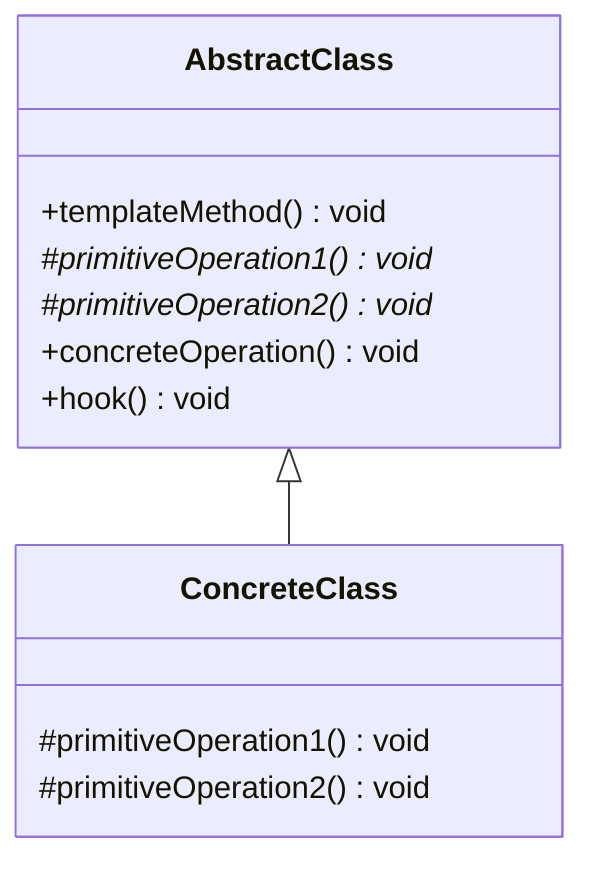

# Week 8. 템플릿 메소드(Template Method) 패턴

## 학습 정보

- **주차**: 8주차
- **챕터**: Chapter 08 — 알고리즘 캡슐화하기
- **패턴명**: 템플릿 메소드 패턴 (Template Method Pattern)
- **학습일**: 2025-04-07
- **학습 범위**: Chapter 08 전체

---

## 학습 목표

- 템플릿 메소드 패턴의 구조를 이해하고, 알고리즘의 골격을 정의하는 방법을 학습한다.
- 후크(Hook) 메소드의 역할과 활용법을 파악한다.
- 할리우드 원칙을 이해하고, 템플릿 메소드 패턴과 전략 패턴의 차이를 명확히 구분한다.

---

## 핵심 개념

### 패턴이 해결하는 문제

스타버즈 커피에서 커피와 홍차를 만드는 과정을 코드로 구현한다고 가정하자.

**커피 만드는 법**: 물을 끓인다 → 끓는 물에 커피를 우려낸다 → 커피를 컵에 따른다 → 설탕과 우유를 추가한다

**홍차 만드는 법**: 물을 끓인다 → 끓는 물에 찻잎을 우려낸다 → 홍차를 컵에 따른다 → 레몬을 추가한다

두 과정은 거의 동일한 알고리즘 구조를 가지고 있다.
<br />
"물을 끓인다"와 "컵에 따른다"는 완전히 같고, "우려낸다"와 "첨가물을 추가한다"는 세부 구현만 다를 뿐 같은 역할을 한다.
<br />
그런데 `Coffee`와 `Tea` 클래스를 따로 만들면 다음과 같은 문제가 발생한다.

- 동일한 알고리즘 구조(물 끓이기 → 우려내기 → 컵에 따르기 → 첨가물 추가)가 두 클래스에 중복된다.
- 알고리즘이 바뀌면 서브클래스를 일일이 열어서 여러 군데를 고쳐야 한다.
- 새로운 음료를 추가하려면 같은 구조를 또 처음부터 구현해야 한다.

템플릿 메소드 패턴은 **알고리즘의 골격을 슈퍼클래스에 정의하고, 달라지는 단계만 서브클래스에서 구현**하도록 하여 이 문제를 해결한다.

### 패턴의 정의

> **템플릿 메소드 패턴(Template Method Pattern)** 은 알고리즘의 골격을 정의한다.
> <br />
> 템플릿 메소드를 사용하면 알고리즘의 일부 단계를 서브클래스에서 구현할 수 있으며, 알고리즘의 구조는 그대로 유지하면서 알고리즘의 특정 단계를 서브클래스에서 재정의할 수도 있다.

간단히 말하면, 템플릿 메소드는 알고리즘의 **틀(템플릿)** 을 만든다.
<br />
일련의 단계로 알고리즘을 정의한 메소드이며, 여러 단계 가운데 하나 이상의 단계가 추상 메소드로 정의된다.
<br />
추상 메소드는 서브클래스에서 구현한다.
<br />
이렇게 하면 서브클래스가 알고리즘의 일부분을 구현하면서도 알고리즘의 구조는 바꾸지 않아도 된다.

### 주요 구성요소

- **AbstractClass (CaffeineBeverage)**: 템플릿 메소드를 정의하는 추상 클래스다. 템플릿 메소드는 알고리즘의 골격을 구현하며 `final`로 선언하여 서브클래스에서 오버라이드할 수 없게 만든다. 공통 단계는 직접 구현하고, 달라지는 단계는 추상 메소드로 선언한다.
- **ConcreteClass (Coffee, Tea)**: 추상 메소드를 구현하는 구상 클래스다. 템플릿 메소드에서 요구하는 모든 단계를 제공해야 한다.
- **템플릿 메소드 (prepareRecipe)**: 알고리즘의 각 단계를 정의하는 메소드다. 이 메소드는 서브클래스에서 오버라이드할 수 없다.
- **후크 메소드 (Hook)**: 추상 클래스에서 선언되지만 기본적인 내용만 구현되어 있거나 아무 코드도 들어있지 않은 메소드다. 서브클래스에서 필요에 따라 오버라이드할 수 있다.

---

## 패턴 구조

### UML 다이어그램



- **templateMethod()**: 알고리즘의 골격을 정의한다. `final`로 선언하여 서브클래스에서 변경할 수 없다.
- **primitiveOperation()**: 추상 메소드로 선언되어 서브클래스에서 반드시 구현해야 한다.
- **concreteOperation()**: 추상 클래스에서 구현이 완료된 구상 메소드다. 템플릿 메소드에서 직접 호출하거나 서브클래스에서 사용할 수 있다.
- **hook()**: 기본 구현이 아무것도 하지 않는(또는 기본값을 반환하는) 메소드다. 서브클래스에서 선택적으로 오버라이드할 수 있다.

### 동작 방식

커피와 홍차를 만드는 과정으로 살펴보자.

1. 클라이언트가 `Tea` 객체를 생성하고 `prepareRecipe()`를 호출한다.
2. `prepareRecipe()`는 `CaffeineBeverage`에 정의된 템플릿 메소드다. 이 메소드는 `boilWater()` → `brew()` → `pourInCup()` → `addCondiments()` 순서로 호출한다.
3. `boilWater()`와 `pourInCup()`은 `CaffeineBeverage`에서 구현된 공통 메소드이므로 그대로 실행된다.
4. `brew()`가 호출되면 서브클래스인 `Tea`의 구현("찻잎을 우려내는 중")이 실행된다.
5. `addCondiments()`가 호출되면 서브클래스인 `Tea`의 구현("레몬을 추가하는 중")이 실행된다.
6. 알고리즘의 구조(순서)는 슈퍼클래스가 제어하고, 달라지는 부분만 서브클래스가 처리한다.

---

## 코드 예제

### 예제 상황

스타버즈 커피의 음료 제조 시스템이다.
<br />
커피와 홍차는 제조 과정의 구조가 동일하지만, "우려내기"와 "첨가물 추가" 단계의 구체적인 방식이 다르다.
<br />
후크 메소드를 활용하여 고객이 첨가물을 원하는지 선택할 수 있는 기능도 추가한다.

### 추상 클래스: CaffeineBeverage

```typescript
abstract class CaffeineBeverage {
  /**
   * 템플릿 메소드 — 알고리즘의 골격을 정의한다.
   * 서브클래스에서 오버라이드할 수 없다.
   */
  public prepareRecipe() {
    this.boilWater();
    this.brew();
    this.pourInCup();

    // 후크 메소드로 첨가물 추가 여부를 제어
    if (this.customerWantsCondiments()) {
      this.addCondiments();
    }
  }

  // 추상 메소드 — 서브클래스에서 반드시 구현해야 한다
  protected abstract brew(): void;
  protected abstract addCondiments(): void;

  // 구상 메소드 — 공통 단계는 슈퍼클래스에서 구현
  private boilWater() {
    console.log("물 끓이는 중");
  }

  private pourInCup() {
    console.log("컵에 따르는 중");
  }

  /**
   * 후크 메소드 — 기본 구현은 true를 반환한다.
   * 서브클래스에서 필요에 따라 오버라이드할 수 있다.
   */
  protected customerWantsCondiments() {
    return true;
  }
}
```

### 구상 클래스: Tea, Coffee

```typescript
class Tea extends CaffeineBeverage {
  protected brew() {
    console.log("찻잎을 우려내는 중");
  }

  protected addCondiments() {
    console.log("레몬을 추가하는 중");
  }
}

class Coffee extends CaffeineBeverage {
  protected brew() {
    console.log("필터로 커피를 우려내는 중");
  }

  protected addCondiments() {
    console.log("설탕과 우유를 추가하는 중");
  }

  // 후크를 오버라이드하여 첨가물 추가 여부를 고객에게 물어본다
  protected customerWantsCondiments() {
    // 실제로는 사용자 입력을 받는 로직이 들어간다
    const answer = "y"; // 예시
    return answer.toLowerCase().startsWith("y");
  }
}
```

### 실행 코드

```typescript
console.log("홍차 준비 중...");
const tea = new Tea();
tea.prepareRecipe();

console.log("\n커피 준비 중...");
const coffee = new Coffee();
coffee.prepareRecipe();
```

**실행 결과**

```
홍차 준비 중...
물 끓이는 중
찻잎을 우려내는 중
컵에 따르는 중
레몬을 추가하는 중

커피 준비 중...
물 끓이는 중
필터로 커피를 우려내는 중
컵에 따르는 중
설탕과 우유를 추가하는 중
```

### 실전 예제: 정렬 알고리즘의 템플릿 메소드

Java의 `Arrays.sort()`가 템플릿 메소드 패턴의 대표적인 실전 사례다.
<br />
TypeScript에서도 동일한 구조를 만들 수 있다. `sort()` 메소드가 알고리즘의 골격을 제공하고, 비교 방법(`compareTo`)만 사용자가 구현한다.

```typescript
interface Comparable<T> {
  compareTo(other: T): number;
}

class Duck implements Comparable<Duck> {
  constructor(
    public name: string,
    public weight: number,
  ) {}

  public compareTo(other: Duck) {
    if (this.weight < other.weight) return -1;
    if (this.weight > other.weight) return 1;
    return 0;
  }

  public toString() {
    return `${this.name} 체중: ${this.weight}`;
  }
}

// 사용
const ducks = [
  new Duck("Daffy", 8),
  new Duck("Dewey", 2),
  new Duck("Howard", 7),
  new Duck("Louie", 2),
  new Duck("Donald", 10),
];

// sort()가 템플릿 메소드, compareTo()가 서브클래스(사용자)가 구현하는 단계
ducks.sort((a, b) => a.compareTo(b));
ducks.forEach((d) => console.log(d.toString()));
```

### 코드 설명

- **`prepareRecipe()`가 템플릿 메소드다.** 알고리즘의 각 단계를 정해진 순서로 호출한다. 이 메소드의 구조는 바꿀 수 없고, 서브클래스는 `brew()`와 `addCondiments()`만 구현하면 된다.
- **후크 메소드 `customerWantsCondiments()`**: 기본 구현은 `true`를 반환하여 항상 첨가물을 추가한다. `Coffee`에서 이 메소드를 오버라이드하여 고객의 선택에 따라 첨가물 추가 여부를 결정할 수 있다. 후크는 "필수가 아닌 선택적 확장 포인트"다.
- **공통 코드는 슈퍼클래스에 집중된다.** `boilWater()`와 `pourInCup()`은 모든 카페인 음료에서 동일하므로 슈퍼클래스에서 한 번만 구현한다. 코드 중복이 제거되고, 수정이 필요하면 한 곳만 고치면 된다.
- **TypeScript에서 `final` 키워드**: TypeScript에는 Java의 `final`이 없다. 템플릿 메소드를 오버라이드하지 못하게 강제하려면 런타임 체크를 추가하거나, 문서와 컨벤션으로 관리하는 것이 일반적이다.

---

## 후크(Hook) 메소드 상세

후크는 추상 클래스에서 선언되지만 기본적인 내용만 구현되어 있거나 아무 코드도 들어있지 않은 메소드다.
<br />
서브클래스에서 다양한 용도로 활용할 수 있다.

**후크의 용도**

- 알고리즘의 특정 단계를 선택적으로 처리할지 말지를 결정한다 (예: `customerWantsCondiments()`).
- 알고리즘의 특정 위치에서 서브클래스가 끼어들 수 있는 확장 포인트를 제공한다.
- 서브클래스가 추상 클래스에서 진행되는 작업에 반응할 수 있게 한다.

**추상 메소드 vs 후크**

| 구분      | 추상 메소드                         | 후크 메소드                           |
| --------- | ----------------------------------- | ------------------------------------- |
| 구현 강제 | 서브클래스에서 반드시 구현해야 한다 | 오버라이드는 선택 사항이다            |
| 기본 구현 | 없음                                | 아무 일도 하지 않거나 기본값을 반환   |
| 용도      | 알고리즘의 필수 단계                | 알고리즘의 선택적 단계 또는 조건 분기 |

알고리즘에서 필수적인 단계는 추상 메소드로, 선택적인 단계는 후크로 선언한다.
<br />
서브클래스에서 구현해야 하는 메소드가 너무 많아지면 단계를 더 세분화하거나 일부를 후크로 바꾸는 것이 좋다.

---

## 구현 방식 비교

템플릿 메소드 패턴과 전략 패턴은 둘 다 알고리즘을 캡슐화하지만 방식이 다르다.

| 구분          | 템플릿 메소드 패턴                                  | 전략 패턴                                         |
| ------------- | --------------------------------------------------- | ------------------------------------------------- |
| 캡슐화 대상   | 알고리즘의 일부 단계                                | 알고리즘 전체                                     |
| 확장 방식     | 상속 — 서브클래스에서 추상 메소드를 구현            | 구성 — 전략 객체를 주입하여 교체                  |
| 알고리즘 구조 | 슈퍼클래스가 고정. 서브클래스는 구조를 바꿀 수 없다 | 클라이언트가 전략을 선택하여 알고리즘 전체를 교체 |
| 코드 재사용   | 슈퍼클래스의 공통 코드를 서브클래스가 재사용        | 전략 객체 간에는 코드 공유가 어렵다               |
| 결합도        | 상속으로 인한 결합 (서브클래스가 슈퍼클래스에 의존) | 구성으로 느슨한 결합                              |
| 적합한 상황   | 알고리즘 구조가 고정되고 일부 단계만 달라질 때      | 알고리즘 전체를 런타임에 교체해야 할 때           |

팩토리 메소드 패턴은 템플릿 메소드 패턴의 특화된 형태라고 볼 수 있다. 팩토리 메소드는 "객체 생성"이라는 특정 단계를 서브클래스에 맡기는 것이다.

---

## 할리우드 원칙 (Hollywood Principle)

이 챕터에서 새로 등장하는 디자인 원칙이다.

> **할리우드 원칙**: 먼저 연락하지 마세요. 저희가 연락 드리겠습니다.

할리우드 원칙을 활용하면 **의존성 부패(dependency rot)** 를 방지할 수 있다.
<br />
의존성 부패는 고수준 구성 요소가 저수준 구성 요소에 의존하고, 저수준 구성 요소가 다시 고수준 구성 요소에 의존하는 식으로 의존성이 복잡하게 꼬여있는 상황을 말한다.

할리우드 원칙을 사용하면 저수준 구성 요소가 시스템에 접속할 수는 있지만, 언제 어떻게 그 구성 요소를 사용할지는 고수준 구성 요소가 결정한다.
<br />
저수준 구성 요소는 "먼저 연락하지 마"라고 하는 것이다.

**템플릿 메소드 패턴에서의 적용**
<br />
`CaffeineBeverage`(고수준)가 알고리즘의 흐름을 제어하고, `Coffee`와 `Tea`(저수준)는 호출당하기 전까지는 추상 클래스를 직접 호출하지 않는다.
<br />
슈퍼클래스가 "필요할 때 내가 너를 부를게"라는 방식으로 동작한다.

**할리우드 원칙 vs 의존성 뒤집기 원칙(DIP)**
<br />
두 원칙의 목적은 비슷하지만 DIP가 더 강한 가이드라인이다.
<br />
DIP는 구상 클래스 사용을 최대한 피하라고 하지만, 할리우드 원칙은 저수준 구성 요소와 고수준 구성 요소 사이의 순환 의존성을 피하는 데 초점을 맞춘다.

---

## 실전 활용

### 언제 사용하면 좋을까?

- 여러 클래스에서 거의 동일한 알고리즘을 사용하되, 일부 단계만 다를 때
- 알고리즘의 구조를 고정하고, 변경을 특정 단계로 제한하고 싶을 때
- 프레임워크를 만들 때 — 알고리즘의 각 단계를 사용자가 마음대로 지정할 수 있으면서 처리 순서는 프레임워크가 제어해야 할 때

### 장단점

**장점**

- 코드 중복을 제거한다. 공통 알고리즘 구조를 슈퍼클래스 한 곳에 모아 관리한다.
- 프레임워크를 만드는 데 유용하다. 알고리즘의 골격을 제공하고, 사용자가 특정 단계만 구현하면 된다.
- 할리우드 원칙을 준수한다. 고수준 구성 요소가 저수준 구성 요소를 언제 사용할지 결정한다.
- 후크를 통해 서브클래스에 선택적인 확장 포인트를 제공할 수 있다.

**단점**

- 상속을 사용하므로 서브클래스가 슈퍼클래스에 강하게 결합된다.
- 알고리즘의 단계가 많아지면 서브클래스에서 구현해야 할 메소드가 너무 많아질 수 있다.
- 클라이언트가 알고리즘의 골격을 바꾸고 싶다면 새로운 추상 클래스를 만들어야 한다.

### 실제 적용 사례

- **React 클래스 컴포넌트의 생명주기**: `componentDidMount()`, `componentDidUpdate()`, `render()` 등이 템플릿 메소드 패턴의 변형이다. React가 생명주기의 골격(마운트 → 업데이트 → 언마운트)을 제어하고, 개발자는 각 단계의 구체적인 동작만 구현한다.
- **Express/Koa 미들웨어**: 요청 처리 파이프라인의 골격(요청 → 미들웨어 체인 → 응답)은 프레임워크가 정의하고, 개발자는 각 미들웨어(단계)만 구현한다.
- **Java의 `Arrays.sort()`**: `sort()` 메소드가 정렬 알고리즘의 골격을 제공하고, `compareTo()` 메소드(비교 단계)만 사용자가 구현한다.
- **NestJS의 Guard/Interceptor**: `canActivate()`, `intercept()` 같은 메소드를 구현하면 프레임워크가 정해진 시점에 호출한다. 전형적인 할리우드 원칙의 적용이다.

---

## 핵심 정리

- 템플릿 메소드 패턴은 알고리즘의 골격을 슈퍼클래스에 정의하고, 달라지는 단계만 서브클래스에서 구현하도록 한다. 알고리즘의 구조는 변경하지 않으면서 특정 단계를 재정의할 수 있다.
- 후크 메소드는 추상 클래스에서 기본 구현(또는 빈 구현)을 제공하는 메소드로, 서브클래스에서 선택적으로 오버라이드할 수 있다. 알고리즘의 특정 지점에 조건 분기나 확장 포인트를 제공하는 데 사용된다.
- 할리우드 원칙("먼저 연락하지 마세요")에 따라 고수준 구성 요소(추상 클래스)가 알고리즘의 흐름을 제어하고, 저수준 구성 요소(서브클래스)는 호출당할 때만 동작한다.
- 템플릿 메소드 패턴은 상속을 통해 알고리즘의 "일부 단계"를 변경하고, 전략 패턴은 구성을 통해 알고리즘 "전체"를 교체한다. 팩토리 메소드 패턴은 템플릿 메소드의 특화된 형태다.

---

## 함께 등장한 디자인 원칙

| 원칙                                                               | 이 패턴에서의 적용                                                                                                |
| ------------------------------------------------------------------ | ----------------------------------------------------------------------------------------------------------------- |
| 바뀌는 부분은 캡슐화한다                                           | 알고리즘에서 달라지는 단계(brew, addCondiments)를 추상 메소드로 캡슐화하여 구조와 분리                            |
| 구현보다는 인터페이스에 맞춰서 프로그래밍한다                      | 클라이언트는 CaffeineBeverage 타입으로 프로그래밍하며, 구상 클래스(Coffee, Tea)를 알 필요 없음                    |
| **먼저 연락하지 마세요. 저희가 연락 드리겠습니다 (할리우드 원칙)** | 고수준 구성 요소(CaffeineBeverage)가 알고리즘 흐름을 제어하고, 저수준 구성 요소(Coffee, Tea)는 호출당할 때만 동작 |

---

## 관련 패턴

- **전략 패턴 (Strategy)**: 둘 다 알고리즘을 캡슐화하지만 방식이 다르다. 템플릿 메소드는 상속으로 알고리즘의 일부를 변경하고, 전략 패턴은 구성으로 알고리즘 전체를 교체한다. 구조를 고정하고 싶으면 템플릿 메소드, 런타임에 알고리즘을 바꾸고 싶으면 전략 패턴이 적합하다.
- **팩토리 메소드 패턴 (Factory Method)**: 템플릿 메소드 패턴의 특화된 형태다. `orderPizza()`라는 템플릿 메소드 안에서 `createPizza()`라는 특정 단계(객체 생성)를 서브클래스에 맡기는 구조가 바로 팩토리 메소드 패턴이다.
- **옵저버 패턴 (Observer)**: 할리우드 원칙을 활용하는 또 다른 패턴이다. 주제(고수준)가 옵저버(저수준)에게 "연락"하는 구조로, 옵저버는 주제에 등록만 해두고 먼저 연락하지 않는다.