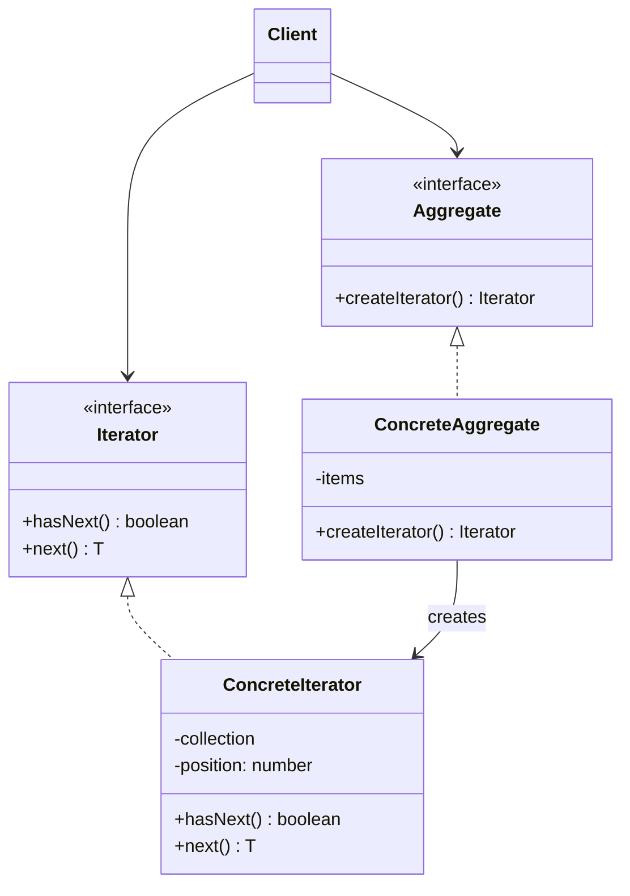

# Week 9-1. 반복자(Iterator) 패턴

## 학습 정보

- **주차**: 9주차
- **챕터**: Chapter 09 — 컬렉션 잘 관리하기 (반복자 패턴)
- **패턴명**: 반복자 패턴 (Iterator Pattern)
- **학습일**: 2025-04-14
- **학습 범위**: Chapter 09 전반부 (반복자 패턴)

---

## 학습 목표

- 반복자 패턴의 구조를 이해하고, 컬렉션의 내부 구현을 노출하지 않으면서 모든 항목에 접근하는 방법을 학습한다.
- 단일 역할 원칙(SRP)을 이해하고, 컬렉션과 반복 작업의 책임을 분리하는 이유를 파악한다.
- TypeScript의 Iterable/Iterator 프로토콜과 반복자 패턴의 관계를 학습한다.

---

## 핵심 개념

### 패턴이 해결하는 문제

객체마을 식당과 팬케이크 하우스가 합병했다.
<br />
두 식당의 메뉴를 하나로 합쳐야 하는데 문제가 있다.
<br />
팬케이크 하우스는 메뉴 항목을 `ArrayList`로 저장하고, 객체마을 식당은 `배열(Array)`로 저장하고 있다.
<br />
두 사람 모두 자기 방식을 바꿀 생각이 없다.

종업원(Waitress)이 두 메뉴를 출력하려면 다음과 같은 문제가 발생한다.

- 두 메뉴의 항목을 가져오는 방식이 다르다(ArrayList의 `get(i)` vs 배열의 `items[i]`).
- 종업원 코드에서 순환문을 2개 작성해야 한다. 새로운 메뉴(카페 메뉴 등)가 추가되면 순환문이 계속 늘어난다.
- 종업원이 각 메뉴의 내부 구현(ArrayList인지 배열인지)을 알아야 하므로 캡슐화 원칙이 지켜지지 않는다.

반복자 패턴은 **컬렉션의 내부 구현을 노출하지 않으면서 모든 항목에 순차적으로 접근할 수 있는 통일된 방법**을 제공하여 이 문제를 해결한다.

### 패턴의 정의

> **반복자 패턴(Iterator Pattern)** 은 컬렉션의 구현 방법을 노출하지 않으면서 집합체 내의 모든 항목에 접근하는 방법을 제공한다.

이 패턴을 사용하면 집합체 내에서 어떤 식으로 일이 처리되는지 전혀 모르는 상태에서 그 안에 들어있는 모든 항목을 대상으로 반복 작업을 수행할 수 있다.
<br />
컬렉션 객체 안에 들어있는 모든 항목에 접근하는 방식이 통일되므로 어떤 종류의 집합체에 대해서도 사용할 수 있는 다형적인 코드를 만들 수 있다.

### 주요 구성요소

- **Iterator (인터페이스)**: 모든 반복자가 구현하는 인터페이스. `hasNext()`와 `next()` 메서드를 정의한다.
- **ConcreteIterator (DinerMenuIterator 등)**: Iterator를 구현하는 구상 클래스. 특정 컬렉션(배열, 리스트 등)에 대한 반복 작업을 처리한다.
- **Aggregate (Menu 인터페이스)**: 컬렉션을 나타내는 인터페이스. `createIterator()` 메서드를 정의하여 해당 컬렉션에 맞는 반복자를 생성한다.
- **ConcreteAggregate (DinerMenu, PancakeHouseMenu 등)**: Aggregate를 구현하며, 자신에게 맞는 ConcreteIterator를 생성하여 반환한다.

---

## 패턴 구조

### UML 다이어그램



### 동작 방식

1. 클라이언트(Waitress)가 각 메뉴(Aggregate)에게 `createIterator()`를 호출하여 반복자를 받는다.
2. 클라이언트는 반복자의 `hasNext()`로 다음 항목이 있는지 확인하고, `next()`로 다음 항목을 가져온다.
3. 내부 구현이 배열이든 ArrayList든 HashMap이든 클라이언트는 동일한 `Iterator` 인터페이스로 순회한다.
4. 새로운 메뉴가 추가되어도 클라이언트 코드는 변경할 필요가 없다. 해당 메뉴에 맞는 Iterator만 구현하면 된다.

---

## 코드 예제

### 예제 상황

객체마을 식당과 팬케이크 하우스가 합병한 통합 식당이다.
<br />
팬케이크 하우스 메뉴는 배열로, 식당 메뉴는 Map으로 항목을 저장한다.
<br />
종업원(Waitress)은 두 메뉴의 내부 구현을 몰라도 모든 항목을 출력할 수 있어야 한다.

### 메뉴 항목과 인터페이스

```typescript
class MenuItem {
  constructor(
    public name: string,
    public description: string,
    public vegetarian: boolean,
    public price: number,
  ) {}
}

/** 반복자 인터페이스 */
interface Iterator<T> {
  hasNext(): boolean;
  next(): T;
}

/** 집합체 인터페이스 */
interface Menu {
  createIterator(): Iterator<MenuItem>;
}
```

### 배열 기반 메뉴와 반복자

```typescript
class DinerMenu implements Menu {
  private readonly MAX_ITEMS = 6;
  private items: (MenuItem | null)[];
  private numberOfItems = 0;

  constructor() {
    this.items = new Array(this.MAX_ITEMS).fill(null);
    this.addItem(
      "채식주의자용 BLT",
      "통밀 위에 콩고기 베이컨, 상추, 토마토를 얹은 메뉴",
      true,
      2.99,
    );
    this.addItem(
      "BLT",
      "통밀 위에 베이컨, 상추, 토마토를 얹은 메뉴",
      false,
      2.99,
    );
    this.addItem(
      "오늘의 스프",
      "감자 샐러드를 곁들인 오늘의 스프",
      false,
      3.29,
    );
  }

  public addItem(
    name: string,
    desc: string,
    vegetarian: boolean,
    price: number,
  ) {
    if (this.numberOfItems >= this.MAX_ITEMS) {
      console.error("메뉴가 꽉 찼습니다.");
      return;
    }

    this.items[this.numberOfItems] = new MenuItem(
      name,
      desc,
      vegetarian,
      price,
    );
    this.numberOfItems++;
  }

  public createIterator() {
    return new DinerMenuIterator(this.items);
  }
}

class DinerMenuIterator implements Iterator<MenuItem> {
  private position = 0;

  constructor(private items: (MenuItem | null)[]) {}

  public hasNext() {
    return (
      this.position < this.items.length && this.items[this.position] !== null
    );
  }

  public next() {
    const item = this.items[this.position]!;
    this.position++;
    return item;
  }
}
```

### Map 기반 메뉴와 반복자

```typescript
class CafeMenu implements Menu {
  private menuItems = new Map<string, MenuItem>();

  constructor() {
    this.addItem(
      "베지 버거와 에어 프라이",
      "통밀빵, 상추, 토마토, 감자 튀김이 첨가된 베지 버거",
      true,
      3.99,
    );
    this.addItem("오늘의 스프", "샐러드가 곁들여진 오늘의 스프", false, 3.69);
    this.addItem(
      "부리토",
      "통 핀토콩과 살사, 구아카몰이 곁들여진 푸짐한 부리토",
      true,
      4.29,
    );
  }

  public addItem(
    name: string,
    desc: string,
    vegetarian: boolean,
    price: number,
  ) {
    this.menuItems.set(name, new MenuItem(name, desc, vegetarian, price));
  }

  public createIterator() {
    // Map의 values()로 반복자를 생성
    const values = Array.from(this.menuItems.values());
    return new ArrayIterator(values);
  }
}

/** 범용 배열 반복자 */
class ArrayIterator<T> implements Iterator<T> {
  private position = 0;

  constructor(private items: T[]) {}

  public hasNext() {
    return this.position < this.items.length;
  }

  public next() {
    const item = this.items[this.position];
    this.position++;
    return item;
  }
}
```

### 클라이언트: 종업원

```typescript
class Waitress {
  constructor(private menus: Menu[]) {}

  public printMenu() {
    for (const menu of this.menus) {
      const iterator = menu.createIterator();
      this.printItems(iterator);
    }
  }

  private printItems(iterator: Iterator<MenuItem>) {
    while (iterator.hasNext()) {
      const item = iterator.next();
      console.log(`${item.name}, ${item.price} -- ${item.description}`);
    }
  }
}

// 사용
const dinerMenu = new DinerMenu();
const cafeMenu = new CafeMenu();
const waitress = new Waitress([dinerMenu, cafeMenu]);
waitress.printMenu();
```

### TypeScript의 내장 Iterable/Iterator 프로토콜

TypeScript(JavaScript)에는 `Symbol.iterator`를 사용한 내장 반복자 프로토콜이 있다. 이 프로토콜을 구현하면 `for...of` 문에서 직접 사용할 수 있다.

```typescript
class PancakeHouseMenu implements Iterable<MenuItem> {
  private menuItems: MenuItem[] = [];

  constructor() {
    this.menuItems.push(
      new MenuItem(
        "K&B 팬케이크 세트",
        "스크램블 에그와 토스트가 곁들어진 팬케이크",
        true,
        2.99,
      ),
    );
    this.menuItems.push(
      new MenuItem(
        "블루베리 팬케이크",
        "신선한 블루베리와 시럽으로 만든 팬케이크",
        true,
        3.49,
      ),
    );
  }

  // Symbol.iterator를 구현하면 for...of에서 사용 가능
  [Symbol.iterator](): IterableIterator<MenuItem> {
    return this.menuItems[Symbol.iterator]();
  }
}

// for...of로 간편하게 순회
const pancakeMenu = new PancakeHouseMenu();
for (const item of pancakeMenu) {
  console.log(`${item.name}, ${item.price}`);
}
```

### 코드 설명

- **종업원은 메뉴의 내부 구현을 모른다.** `printItems()` 메서드는 `Iterator` 인터페이스만 사용하므로 배열이든 Map이든 동일한 코드로 처리한다.
- **새로운 메뉴 추가 시 기존 코드를 변경하지 않는다.** 새 메뉴 클래스가 `Menu` 인터페이스를 구현하고 `createIterator()`를 제공하면 종업원 코드는 그대로 동작한다.
- **TypeScript의 내장 프로토콜**: `Symbol.iterator`를 구현하면 `for...of`, 스프레드 연산자, 구조 분해 할당 등 언어 차원의 반복 기능을 활용할 수 있다. 실무에서는 커스텀 Iterator 클래스를 만들기보다 이 내장 프로토콜을 사용하는 것이 일반적이다.

---

## 구현 방식 비교

반복자 패턴 도입 전후의 종업원 코드를 비교한다.

| 구분           | 반복자 패턴 없이                                 | 반복자 패턴 적용                     |
| -------------- | ------------------------------------------------ | ------------------------------------ |
| 메뉴별 순환문  | ArrayList용, 배열용 등 각각 별도의 순환문 필요   | 하나의 `printItems(iterator)`로 통일 |
| 메뉴 추가 시   | 새 순환문 추가 + 종업원 코드 수정 필요           | 종업원 코드 변경 불필요              |
| 내부 구현 노출 | 종업원이 ArrayList/배열 등 구체 타입을 알아야 함 | Iterator 인터페이스만 알면 됨        |
| OCP 준수       | 위반 (메뉴 추가 시 코드 변경)                    | 준수 (새 Iterator만 추가)            |

---

## 실전 활용

### 언제 사용하면 좋을까?

- 컬렉션의 내부 구현을 노출하지 않으면서 모든 항목에 접근해야 할 때
- 다양한 종류의 컬렉션에 대해 동일한 방식으로 반복 작업을 수행해야 할 때
- 하나의 집합체에 여러 종류의 반복 방식(정방향, 역방향, 필터링 등)을 제공하고 싶을 때

### 장단점

**장점**

- 컬렉션의 내부 구현을 캡슐화하여 클라이언트가 구현에 의존하지 않는다.
- 동일한 인터페이스로 다양한 컬렉션을 순회할 수 있어 다형적인 코드를 작성할 수 있다.
- 반복 작업을 별도의 객체로 캡슐화하여 단일 역할 원칙을 준수한다.

**단점**

- 간단한 컬렉션에 반복자 클래스를 별도로 만드는 것은 과도한 설계일 수 있다.
- 언어 차원에서 반복자를 지원하는 경우(TypeScript의 `for...of`) 커스텀 반복자가 불필요할 수 있다.

### 실제 적용 사례

- **TypeScript/JavaScript의 `for...of`와 `Symbol.iterator`**: 배열, Map, Set, 문자열 등 모든 이터러블 객체를 동일한 구문으로 순회한다. 반복자 패턴의 언어 차원 구현이다.
- **제너레이터 함수 (`function*`)**: `yield` 키워드로 지연 평가되는 반복자를 간결하게 구현할 수 있다. 무한 시퀀스나 대용량 데이터 스트림 처리에 유용하다.
- **데이터베이스 커서**: 쿼리 결과를 한 번에 메모리에 올리지 않고 커서(Iterator)를 통해 한 행씩 가져오는 구조다.
- **RxJS Observable**: `subscribe()`를 통해 비동기 데이터 스트림의 각 항목을 순차적으로 처리하는 구조가 반복자 패턴의 비동기 확장이다.

---

## 핵심 정리

- 반복자 패턴은 컬렉션의 내부 구현을 노출하지 않으면서 모든 항목에 접근하는 통일된 방법을 제공한다.
- 종업원(클라이언트)은 Iterator 인터페이스만 알면 되므로 컬렉션이 배열이든 Map이든 동일한 코드로 처리할 수 있다.
- TypeScript에서는 `Symbol.iterator`와 `for...of`를 통해 반복자 패턴이 언어 차원에서 지원된다. 실무에서는 커스텀 Iterator보다 이 내장 프로토콜을 사용하는 것이 일반적이다.
- 반복자 패턴을 사용하면 집합체 관리와 반복 작업이라는 두 가지 역할을 분리하여 단일 역할 원칙을 준수할 수 있다.

---

## 함께 등장한 디자인 원칙

| 원칙                                                                    | 이 패턴에서의 적용                                                                                                       |
| ----------------------------------------------------------------------- | ------------------------------------------------------------------------------------------------------------------------ |
| 바뀌는 부분은 캡슐화한다                                                | 컬렉션의 반복 방식(바뀌는 부분)을 Iterator 객체로 캡슐화하여 클라이언트에서 분리                                         |
| 구현보다는 인터페이스에 맞춰서 프로그래밍한다                           | 클라이언트는 Iterator/Menu 인터페이스에만 의존하며 구상 클래스를 알지 못함                                               |
| **어떤 클래스가 바뀌는 이유는 하나뿐이어야 한다 (단일 역할 원칙, SRP)** | 컬렉션 관리(항목 추가/삭제)와 반복 작업을 별도 클래스로 분리. 한 클래스가 두 가지 역할을 맡으면 변경 이유가 2가지가 된다 |

---

## 관련 패턴

- **컴포지트 패턴 (Composite)**: 반복자와 컴포지트는 자주 함께 사용된다. 컴포지트 패턴으로 트리 구조를 만들고, 반복자 패턴으로 그 트리를 순회한다. 이 챕터 후반부에서 다룬다.
- **팩토리 메소드 패턴 (Factory Method)**: `createIterator()` 메서드가 팩토리 메소드 패턴의 적용이다. 어떤 ConcreteIterator를 생성할지는 서브클래스(각 메뉴)에서 결정한다.
- **전략 패턴 (Strategy)**: 반복자 패턴은 클라이언트에서 객체 컬렉션과 개별 객체를 똑같은 식으로 처리할 수 있게 한다는 점에서, 전략 패턴과 함께 비교되곤 한다.