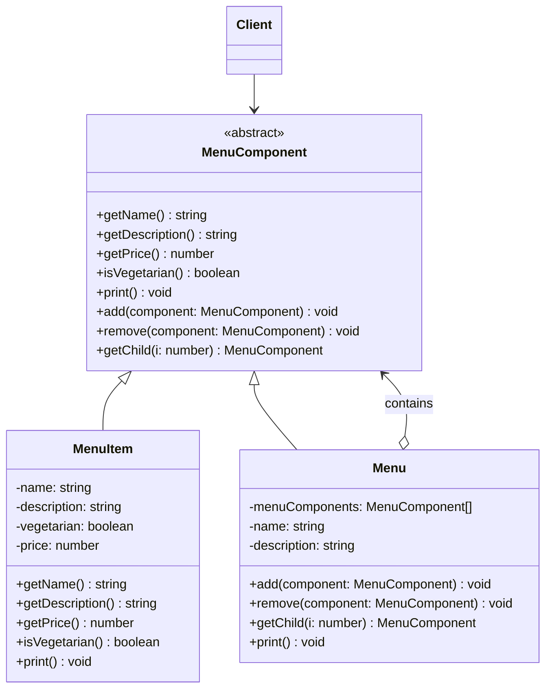

# Week 9-2. 컴포지트(Composite) 패턴

## 학습 정보

- **주차**: 9주차
- **챕터**: Chapter 09 — 컬렉션 잘 관리하기 (컴포지트 패턴)
- **패턴명**: 컴포지트 패턴 (Composite Pattern)
- **학습일**: 2025-04-14
- **학습 범위**: Chapter 09 후반부 (컴포지트 패턴)

---

## 학습 목표

- 컴포지트 패턴의 트리 구조를 이해하고, 개별 객체와 복합 객체를 동일하게 다루는 방법을 학습한다.
- 투명성(Transparency)과 안전성(Safety) 사이의 트레이드오프를 이해한다.
- 반복자 패턴과 컴포지트 패턴을 결합하여 트리 구조를 순회하는 방법을 익힌다.

---

## 핵심 개념

### 패턴이 해결하는 문제

반복자 패턴으로 메뉴 순회 문제를 해결했지만, 새로운 요구사항이 등장한다.
<br />
식당 메뉴(DinerMenu) 안에 디저트 서브메뉴를 넣어야 한다.
<br />
즉 메뉴 안에 메뉴가 들어가는 **트리 구조**가 필요하다.

기존 설계로는 이 문제를 해결할 수 없다.
<br />
`MenuItem` 배열에는 또 다른 메뉴(서브메뉴)를 넣을 수 없기 때문이다.
<br />
필요한 것은 다음과 같다.

- 메뉴, 서브메뉴, 메뉴 항목 등을 모두 넣을 수 있는 **트리 형태의 구조**가 필요하다.
- 각 메뉴에 있는 모든 항목을 대상으로 특정 작업을 수행할 수 있어야 하며, 그 방법은 적어도 지금 사용 중인 반복자만큼 편리해야 한다.
- 더 유연한 방법으로 아이템을 대상으로 반복 작업을 수행할 수 있어야 한다. 예를 들어 디저트 메뉴만 대상으로 반복 작업을 할 수도 있어야 한다.

컴포지트 패턴은 **객체를 트리구조로 구성하여 부분-전체 계층구조를 구현**하고, 클라이언트에서 개별 객체와 복합 객체를 똑같은 방법으로 다룰 수 있게 한다.

### 패턴의 정의

> **컴포지트 패턴(Composite Pattern)** 으로 객체를 트리구조로 구성해서 부분-전체 계층구조를 구현한다.
> <br />
> 컴포지트 패턴을 사용하면 클라이언트에서 개별 객체와 복합 객체를 똑같은 방법으로 다룰 수 있다.

핵심은 "부분-전체 계층구조(part-whole hierarchy)"다.
<br />
메뉴는 다른 메뉴와 메뉴 항목을 같은 구조에 넣어서 부분-전체 계층구조를 만들 수 있다.
<br />
복합 객체(Menu)와 개별 객체(MenuItem)를 동일한 인터페이스(MenuComponent)로 다루기 때문에, 클라이언트는 자신이 다루는 것이 복합 객체인지 개별 객체인지 구분할 필요가 없다.

### 주요 구성요소

- **Component (MenuComponent)**: Leaf와 Composite 모두가 구현하는 인터페이스다. Leaf용 메서드(getName, getPrice 등)와 Composite용 메서드(add, remove, getChild)를 모두 포함한다.
- **Leaf (MenuItem)**: 트리의 말단 노드. 자식이 없다. 자신의 고유한 행동(이름, 가격, 설명 출력 등)을 구현한다.
- **Composite (Menu)**: 자식이 있는 노드. 자식 목록을 관리하는 역할을 한다. `add()`, `remove()`, `getChild()` 같은 메서드를 구현하고, `print()` 같은 작업은 자식들에게 재귀적으로 위임한다.
- **Client (Waitress)**: Component 인터페이스만 사용하여 트리 전체를 다룬다. 개별 항목인지 복합 객체인지 알 필요가 없다.

---

## 패턴 구조

### UML 다이어그램



### 동작 방식

1. 최상위 `Menu`("전체 메뉴")를 만들고, 그 안에 하위 `Menu`(팬케이크 하우스 메뉴, 식당 메뉴, 카페 메뉴)를 추가한다.
2. 각 하위 `Menu` 안에 `MenuItem`을 추가한다. 식당 메뉴 안에 디저트 `Menu`(서브메뉴)를 넣을 수도 있다.
3. 종업원(Client)이 최상위 메뉴의 `print()`를 호출한다.
4. `Menu`의 `print()`는 자신의 이름을 출력한 뒤, 모든 자식(MenuComponent)의 `print()`를 순서대로 호출한다.
5. 자식이 `MenuItem`이면 이름, 가격, 설명을 출력한다. 자식이 또 다른 `Menu`라면 같은 방식으로 재귀적으로 `print()`를 호출한다.
6. 클라이언트는 트리 전체를 하나의 `print()` 호출로 순회한다.

---

## 코드 예제

### 예제 상황

통합 식당에 팬케이크 하우스 메뉴, 식당 메뉴, 카페 메뉴가 있다.
<br />
식당 메뉴 안에는 디저트 서브메뉴가 포함된다.
<br />
종업원은 `print()` 한 번으로 전체 메뉴(서브메뉴 포함)를 출력할 수 있어야 한다.

### Component: MenuComponent

```typescript
/**
 * Leaf(MenuItem)과 Composite(Menu) 모두가 상속하는 추상 클래스.
 * 기본 구현은 "지원하지 않는 작업"을 던진다.
 * 자기 역할에 맞지 않는 메서드는 기본 구현을 그대로 사용하면 된다.
 */
abstract class MenuComponent {
  public add(component: MenuComponent) {
    throw new Error("지원하지 않는 작업입니다");
  }

  public remove(component: MenuComponent) {
    throw new Error("지원하지 않는 작업입니다");
  }

  public getChild(i: number) {
    throw new Error("지원하지 않는 작업입니다");
  }

  public getName() {
    throw new Error("지원하지 않는 작업입니다");
  }

  public getDescription() {
    throw new Error("지원하지 않는 작업입니다");
  }

  public getPrice() {
    throw new Error("지원하지 않는 작업입니다");
  }

  public isVegetarian() {
    throw new Error("지원하지 않는 작업입니다");
  }

  public print() {
    throw new Error("지원하지 않는 작업입니다");
  }
}
```

### Leaf: MenuItem

```typescript
class MenuItem extends MenuComponent {
  constructor(
    private name: string,
    private description: string,
    private vegetarian: boolean,
    private price: number,
  ) {
    super();
  }

  public getName() {
    return this.name;
  }

  public getDescription() {
    return this.description;
  }

  public getPrice() {
    return this.price;
  }

  public isVegetarian() {
    return this.vegetarian;
  }

  public print() {
    let result = `  ${this.getName()}`;
    if (this.isVegetarian()) result += "(v)";
    result += `, ${this.getPrice()} -- ${this.getDescription()}`;
    console.log(result);
  }
}
```

### Composite: Menu

```typescript
class Menu extends MenuComponent {
  private menuComponents: MenuComponent[] = [];

  constructor(
    private name: string,
    private description: string,
  ) {
    super();
  }

  public add(component: MenuComponent) {
    this.menuComponents.push(component);
  }

  public remove(component: MenuComponent) {
    const index = this.menuComponents.indexOf(component);
    if (index !== -1) this.menuComponents.splice(index, 1);
  }

  public getChild(i: number) {
    return this.menuComponents[i];
  }

  public getName() {
    return this.name;
  }

  public getDescription() {
    return this.description;
  }

  public print() {
    console.log(`\n${this.getName()}, ${this.getDescription()}`);
    console.log("------------------------------");

    // 자식 컴포넌트의 print()를 재귀적으로 호출
    for (const component of this.menuComponents) {
      component.print();
    }
  }
}
```

### Client: Waitress

```typescript
class Waitress {
  constructor(private allMenus: MenuComponent) {}

  public printMenu() {
    // 단 한 줄로 전체 메뉴(서브메뉴 포함)를 출력
    this.allMenus.print();
  }
}
```

### 실행 코드

```typescript
// 각 메뉴 생성
const pancakeHouseMenu = new Menu("팬케이크 하우스 메뉴", "아침 메뉴");
const dinerMenu = new Menu("객체마을 식당 메뉴", "점심 메뉴");
const cafeMenu = new Menu("카페 메뉴", "저녁 메뉴");
const dessertMenu = new Menu("디저트 메뉴", "디저트를 즐겨 보세요!");

// 최상위 메뉴
const allMenus = new Menu("전체 메뉴", "전체 메뉴");
allMenus.add(pancakeHouseMenu);
allMenus.add(dinerMenu);
allMenus.add(cafeMenu);

// 메뉴 항목 추가
pancakeHouseMenu.add(
  new MenuItem(
    "K&B 팬케이크 세트",
    "스크램블 에그와 토스트가 곁들어진 팬케이크",
    true,
    2.99,
  ),
);
dinerMenu.add(
  new MenuItem(
    "파스타",
    "마리나라 소스 스파게티, 효모빵도 드립니다",
    true,
    3.89,
  ),
);

// 식당 메뉴 안에 디저트 서브메뉴 추가
dinerMenu.add(dessertMenu);
dessertMenu.add(
  new MenuItem(
    "애플 파이",
    "바삭바삭한 크러스트에 바닐라 아이스크림이 얹혀 있는 애플 파이",
    true,
    1.59,
  ),
);

// 종업원이 전체 메뉴 출력
const waitress = new Waitress(allMenus);
waitress.printMenu();
```

### 코드 설명

- **`MenuComponent`는 Leaf와 Composite의 공통 인터페이스다.** 모든 메서드에 기본 구현(예외 던지기)을 제공하여, 각 서브클래스가 자기 역할에 맞는 메서드만 오버라이드하면 된다.
- **`Menu.print()`의 재귀적 위임이 핵심이다.** `print()`를 호출하면 자식 목록을 순회하며 각 자식의 `print()`를 호출한다. 자식이 `MenuItem`이면 자신을 출력하고, `Menu`이면 또 자식들에게 재귀적으로 위임한다.
- **종업원 코드는 극도로 단순하다.** `allMenus.print()` 한 줄로 전체 트리를 순회하며 출력한다. 종업원은 `MenuItem`인지 `Menu`인지 구분할 필요가 없다.
- **투명성 vs 안전성 트레이드오프**: `MenuComponent`에 Leaf용 메서드와 Composite용 메서드를 모두 넣었기 때문에 클라이언트 입장에서 투명하게 사용할 수 있다(투명성). 하지만 `MenuItem`에서 `add()`를 호출하면 런타임 예외가 발생하는 문제가 있다(안전성 부족). 이 트레이드오프는 상황에 따라 적절하게 판단해야 한다.

---

## 구현 방식 비교

반복자 패턴만 사용한 경우와 컴포지트 패턴을 결합한 경우를 비교한다.

| 구분            | 반복자 패턴만 사용                           | 반복자 + 컴포지트 패턴                 |
| --------------- | -------------------------------------------- | -------------------------------------- |
| 서브메뉴 지원   | 불가능 (MenuItem 배열에 Menu를 넣을 수 없음) | 가능 (Menu 안에 Menu를 중첩 가능)      |
| 메뉴 구조       | 평탄한 리스트                                | 트리 구조 (부분-전체 계층구조)         |
| 클라이언트 코드 | 메뉴 종류별로 반복자를 각각 가져와야 함      | `print()` 한 번으로 전체 트리 순회     |
| 개별/복합 구분  | 클라이언트가 구분해야 함                     | 구분 불필요 (동일한 인터페이스로 처리) |
| 확장성          | 메뉴 추가 시 종업원 코드 수정 필요           | 트리에 노드 추가만 하면 됨             |

---

## 투명성과 안전성

컴포지트 패턴에서 가장 논쟁적인 부분이다.

**투명성(Transparency)**: Component 인터페이스에 Leaf와 Composite의 모든 메서드를 넣으면 클라이언트는 두 종류를 구분할 필요가 없다. 하지만 Leaf에서 `add()`를 호출하는 등 의미 없는 메서드가 호출될 수 있다.

**안전성(Safety)**: Leaf에서는 `add()`, `remove()` 등을 제공하지 않고 Composite에서만 제공하면 안전하다. 하지만 클라이언트가 두 타입을 구분해야 하므로 투명성이 떨어진다.

이 챕터에서는 투명성을 선택했다. Component에 모든 메서드를 넣되, 기본 구현에서 예외를 던지는 방식으로 처리한다. 상황에 따라 원칙을 적절하게 적용해야 한다는 점을 강조하고 있다.

---

## 실전 활용

### 언제 사용하면 좋을까?

- 부분-전체 계층구조(트리 구조)를 표현해야 할 때
- 클라이언트가 개별 객체와 복합 객체를 구분 없이 동일한 방식으로 다루어야 할 때
- 재귀적 구조를 가진 데이터(파일 시스템, 조직도, UI 컴포넌트 트리 등)를 처리해야 할 때

### 장단점

**장점**

- 클라이언트가 개별 객체와 복합 객체를 구분하지 않고 동일한 인터페이스로 다룰 수 있다.
- 새로운 종류의 구성 요소를 쉽게 추가할 수 있다. 기존 코드를 변경할 필요가 없다.
- 복잡한 트리 구조를 간단한 코드로 순회할 수 있다.

**단점**

- 투명성을 위해 단일 역할 원칙을 의도적으로 위반한다. Component가 Leaf와 Composite 두 가지 역할을 모두 담당한다.
- Leaf에서 의미 없는 메서드(`add()`, `remove()` 등)가 호출될 수 있어 런타임 에러 가능성이 있다.
- 특정 조건을 만족하는 구성 요소만 추가하도록 제한하기 어렵다.

### 실제 적용 사례

- **파일 시스템**: 파일(Leaf)과 디렉토리(Composite)가 동일한 인터페이스(`getSize()`, `list()`)를 제공한다. 디렉토리의 `getSize()`는 하위 파일들의 크기를 재귀적으로 합산한다.
- **React 컴포넌트 트리**: React의 컴포넌트는 다른 컴포넌트를 자식으로 가질 수 있는 트리 구조다. `render()`를 호출하면 재귀적으로 하위 컴포넌트를 렌더링한다.
- **DOM 트리**: HTML 문서의 DOM 구조가 전형적인 컴포지트 패턴이다. `Element`(Composite)는 다른 `Element`와 `Text`(Leaf)를 자식으로 가지며, `appendChild()`, `removeChild()` 등 동일한 인터페이스를 제공한다.
- **조직도**: 부서(Composite) 안에 팀(Composite)이 있고, 팀 안에 개인(Leaf)이 있는 구조다.

---

## 핵심 정리

- 컴포지트 패턴은 객체를 트리구조로 구성하여 부분-전체 계층구조를 구현한다. 클라이언트는 개별 객체(Leaf)와 복합 객체(Composite)를 동일한 인터페이스로 다룰 수 있다.
- Component에 Leaf와 Composite의 모든 메서드를 넣으면 투명성을 얻지만, 안전성(Leaf에서 의미 없는 메서드 호출 시 에러)과의 트레이드오프가 존재한다.
- `print()` 같은 작업은 Composite에서 자식들에게 재귀적으로 위임하는 방식으로 트리 전체를 순회한다. 클라이언트 코드는 극도로 단순해진다.
- 반복자 패턴과 컴포지트 패턴은 자주 함께 사용된다. 반복자로 컬렉션을 순회하고, 컴포지트로 트리 구조를 관리한다.

---

## 함께 등장한 디자인 원칙

| 원칙                                                | 이 패턴에서의 적용                                                                                                       |
| --------------------------------------------------- | ------------------------------------------------------------------------------------------------------------------------ |
| 바뀌는 부분은 캡슐화한다                            | 메뉴 구조의 복잡성(트리 구조)을 Component 인터페이스 뒤에 캡슐화                                                         |
| 구현보다는 인터페이스에 맞춰서 프로그래밍한다       | 클라이언트는 MenuComponent 인터페이스만 사용하며 MenuItem인지 Menu인지 알 필요 없음                                      |
| 어떤 클래스가 바뀌는 이유는 하나뿐이어야 한다 (SRP) | 컴포지트 패턴은 투명성을 위해 이 원칙을 **의도적으로 위반**한다. Component가 Leaf와 Composite 두 가지 역할을 동시에 담당 |

---

## 관련 패턴

- **반복자 패턴 (Iterator)**: 컴포지트 패턴으로 만든 트리 구조를 순회할 때 반복자 패턴을 사용한다. 이 챕터에서 두 패턴을 함께 다루는 이유다.
- **데코레이터 패턴 (Decorator)**: 둘 다 재귀적 구성(Composition)을 사용한다. 데코레이터는 기능을 추가하는 용도이고, 컴포지트는 구조를 표현하는 용도라는 점에서 목적이 다르다.
- **커맨드 패턴 (Command)**: 6장에서 만든 `MacroCommand`가 컴포지트 패턴의 적용이었다. 여러 커맨드를 하나의 커맨드처럼 다루는 구조가 바로 Composite다.
- **플라이웨이트 패턴 (Flyweight)**: 컴포지트 패턴의 Leaf 노드가 많아지면 메모리 문제가 생길 수 있다. 플라이웨이트 패턴으로 Leaf 객체를 공유하여 메모리를 절약할 수 있다.