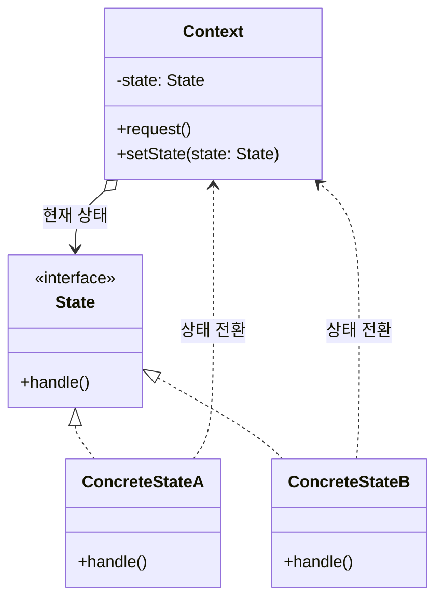
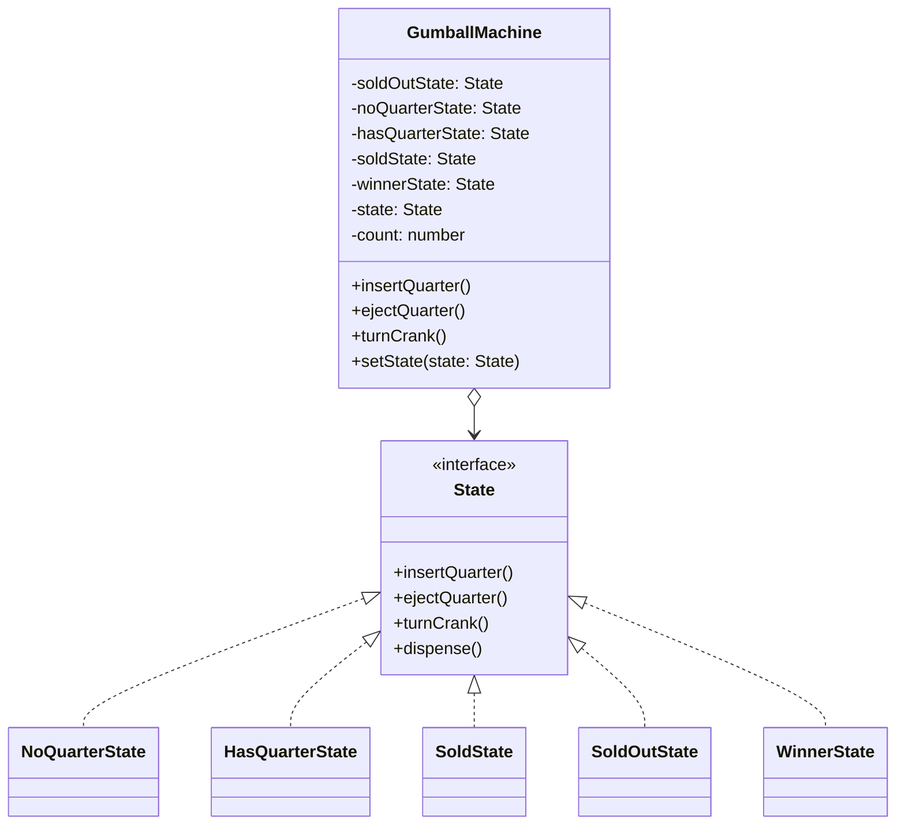

# Week 10. 상태(State) 패턴

## 학습 정보

| 항목      | 내용                                                            |
| --------- | --------------------------------------------------------------- |
| 주차      | 10주차                                                           |
| 챕터      | CHAPTER 10. 객체의 상태 바꾸기                                  |
| 패턴명    | 상태 패턴 (State Pattern)                                       |
| 학습일    | 2026-04-21                                                      |
| 학습 범위 | 뽑기 기계 예제, 상태 클래스 분리, OCP 적용, 상태/전략 패턴 비교 |

---

## 학습 목표

- 객체의 내부 상태에 따라 행동이 달라지는 시스템을 if/else 분기 없이 설계할 수 있다.
- 각 상태를 별도 클래스로 캡슐화하여 OCP를 지키며 새 상태를 추가할 수 있다.
- 구조가 동일한 상태 패턴과 전략 패턴의 의도 차이를 설명할 수 있다.

---

## 핵심 개념

### 패턴이 해결하는 문제

객체가 여러 상태를 가지고, 각 상태에서 같은 메서드라도 다르게 동작해야 하는 경우 보통 다음과 같이 작성한다.

```typescript
class GumballMachine {
  static readonly SOLD_OUT = 0;
  static readonly NO_QUARTER = 1;
  static readonly HAS_QUARTER = 2;
  static readonly SOLD = 3;

  private state = GumballMachine.SOLD_OUT;

  public insertQuarter() {
    if (this.state === GumballMachine.HAS_QUARTER) {
      console.log("동전은 한 개만 넣어 주세요.");
    } else if (this.state === GumballMachine.NO_QUARTER) {
      this.state = GumballMachine.HAS_QUARTER;
      console.log("동전을 넣으셨습니다.");
    } else if (this.state === GumballMachine.SOLD_OUT) {
      console.log("매진되었습니다. 다음 기회에 이용해 주세요.");
    } else if (this.state === GumballMachine.SOLD) {
      console.log("알맹이를 내보내고 있습니다.");
    }
  }

  // ejectQuarter, turnCrank, dispense 모두 동일한 if/else 사슬...
}
```

이 코드는 처음에는 잘 작동하지만 다음 문제가 있다.

- **OCP 위반**: 새 상태(예: 보너스 알맹이 당첨 `WINNER` 상태)를 추가하려면 모든 메서드의 if/else를 전부 수정해야 한다.
- **상태 전환 로직이 분산**: 상태 전환 코드가 모든 메서드에 흩어져 있어 한눈에 파악하기 어렵다.
- **캡슐화 실패**: "바뀌는 부분"인 상태별 행동이 캡슐화되지 않은 채 절차적으로 나열된다.

### 패턴의 정의

> 상태 패턴(State Pattern)을 사용하면 객체의 내부 상태가 바뀜에 따라서 객체의 행동을 바꿀 수 있다.
> <br />
> 마치 객체의 클래스가 바뀌는 것과 같은 결과를 얻을 수 있다.

정의의 핵심은 두 부분이다.
<br />
첫째, 상태별 행동을 별도 클래스로 캡슐화한 다음 현재 상태 객체에 행동을 위임한다.
<br />
둘째, 클라이언트 입장에서는 마치 객체의 클래스가 바뀐 것처럼 행동이 완전히 달라진다.

### 주요 구성요소

| 구성요소          | 역할                                                                                                                                  |
| ----------------- | ------------------------------------------------------------------------------------------------------------------------------------- |
| **Context**       | 여러 내부 상태를 가지는 객체. 현재 상태 객체에 작업을 위임한다. (예: `GumballMachine`)                                                |
| **State**         | 모든 구체 상태 클래스가 구현하는 공통 인터페이스. Context의 모든 행동을 메서드로 정의한다.                                            |
| **ConcreteState** | 각 상태에서의 행동을 구현한 클래스. 자기 상태에서 부적절한 요청은 거부 메시지를 출력하고, 적절한 요청은 처리 후 다음 상태로 전환한다. |

---

## 패턴 구조

### UML 다이어그램



뽑기 기계 예제에 적용하면 다음과 같다.



### 동작 방식

1. Context는 자신이 가질 수 있는 모든 상태 객체를 인스턴스 변수로 보유한다.
2. Context는 현재 상태를 가리키는 `state` 참조를 하나 가진다.
3. Context의 메서드(`insertQuarter`, `turnCrank` 등)가 호출되면, Context는 작업을 직접 처리하지 않고 현재 `state` 객체의 같은 이름 메서드에 위임한다.
4. 각 ConcreteState는 자기 상태에서 어떻게 동작해야 하는지 알고 있다. 적절하지 않은 행동은 거부 메시지를 출력하고, 적절한 행동은 처리한 뒤 `context.setState(다음상태)`를 호출해서 상태를 전환한다.
5. 다음 메서드 호출은 새로운 `state` 객체에 위임되므로, Context는 마치 다른 클래스로 변신한 것처럼 행동한다.

---

## 코드 예제

### 예제 상황

뽑기 기계 코드를 작성한다. 기계는 다음 4가지 상태를 가진다.

- **알맹이 매진(SoldOut)**: 알맹이가 다 떨어진 상태
- **동전 없음(NoQuarter)**: 동전을 기다리는 상태
- **동전 있음(HasQuarter)**: 동전이 투입된 상태
- **알맹이 판매(Sold)**: 손잡이를 돌려서 알맹이를 내보내는 상태

행동은 4가지다: 동전 투입, 동전 반환, 손잡이 돌림, 알맹이 내보냄.

여기에 추가로 "10번에 1번 꼴로 보너스 알맹이가 나오는" `Winner` 상태를 도입한다.

### 주요 코드 (TypeScript)

#### State 인터페이스

```typescript
// 모든 상태가 공통으로 구현하는 인터페이스
// 메서드는 뽑기 기계에서 일어날 수 있는 모든 행동에 대응한다
interface State {
  insertQuarter(): void;
  ejectQuarter(): void;
  turnCrank(): void;
  dispense(): void;
}
```

#### Context: GumballMachine

```typescript
class GumballMachine {
  // 모든 상태 객체를 인스턴스 변수로 보유한다
  public readonly soldOutState: State;
  public readonly noQuarterState: State;
  public readonly hasQuarterState: State;
  public readonly soldState: State;
  public readonly winnerState: State;

  // 현재 상태를 가리키는 참조
  private state: State;
  private count: number;

  constructor(numberGumballs: number) {
    // 상태 객체들은 자기 자신을 참조해야 하므로 this를 넘긴다
    this.soldOutState = new SoldOutState(this);
    this.noQuarterState = new NoQuarterState(this);
    this.hasQuarterState = new HasQuarterState(this);
    this.soldState = new SoldState(this);
    this.winnerState = new WinnerState(this);

    this.count = numberGumballs;
    // 알맹이가 0개보다 많으면 동전 대기 상태로, 아니면 매진 상태로 시작한다
    this.state = numberGumballs > 0 ? this.noQuarterState : this.soldOutState;
  }

  // 행동 메서드는 모두 현재 상태 객체에 그대로 위임한다
  public insertQuarter() {
    this.state.insertQuarter();
  }

  public ejectQuarter() {
    this.state.ejectQuarter();
  }

  public turnCrank() {
    this.state.turnCrank();
    this.state.dispense(); // turnCrank 처리 후 dispense까지 호출
  }

  // 상태 전환은 ConcreteState가 이 메서드로 요청한다
  public setState(state: State) {
    this.state = state;
  }

  public releaseBall() {
    console.log("알맹이를 내보내고 있습니다.");
    if (this.count > 0) this.count -= 1;
  }

  public getCount() {
    return this.count;
  }
}
```

#### ConcreteState: NoQuarterState

```typescript
class NoQuarterState implements State {
  constructor(private gumballMachine: GumballMachine) {}

  public insertQuarter() {
    console.log("동전을 넣으셨습니다.");
    // 적절한 행동을 처리한 뒤 다음 상태로 전환한다
    this.gumballMachine.setState(this.gumballMachine.hasQuarterState);
  }

  // 동전이 없는 상태에서 부적절한 행동들은 거부 메시지만 출력한다
  public ejectQuarter() {
    console.log("동전을 넣어 주세요.");
  }

  public turnCrank() {
    console.log("동전을 넣어 주세요.");
  }

  public dispense() {
    console.log("동전을 넣어 주세요.");
  }
}
```

#### ConcreteState: HasQuarterState (난수로 당첨 판정)

```typescript
class HasQuarterState implements State {
  constructor(private gumballMachine: GumballMachine) {}

  public insertQuarter() {
    console.log("동전은 한 개만 넣어 주세요.");
  }

  public ejectQuarter() {
    console.log("동전이 반환됩니다.");
    this.gumballMachine.setState(this.gumballMachine.noQuarterState);
  }

  public turnCrank() {
    console.log("손잡이를 돌리셨습니다.");
    // 10% 확률로 당첨, 알맹이가 2개 이상 남아 있을 때만 보너스 적용
    const winner = Math.floor(Math.random() * 10);
    if (winner === 0 && this.gumballMachine.getCount() > 1) {
      this.gumballMachine.setState(this.gumballMachine.winnerState);
    } else {
      this.gumballMachine.setState(this.gumballMachine.soldState);
    }
  }

  public dispense() {
    console.log("알맹이를 내보낼 수 없습니다.");
  }
}
```

#### ConcreteState: WinnerState (새로 추가된 상태)

```typescript
class WinnerState implements State {
  constructor(private gumballMachine: GumballMachine) {}

  public insertQuarter() {
    console.log("알맹이를 내보내고 있습니다.");
  }

  public ejectQuarter() {
    console.log("이미 손잡이를 돌리셨습니다.");
  }

  public turnCrank() {
    console.log("손잡이는 한 번만 돌려 주세요.");
  }

  public dispense() {
    // 알맹이를 한 개 내보낸다
    this.gumballMachine.releaseBall();
    if (this.gumballMachine.getCount() === 0) {
      this.gumballMachine.setState(this.gumballMachine.soldOutState);
      return;
    }
    // 축하 메시지와 함께 보너스 알맹이를 한 개 더 내보낸다
    console.log("축하드립니다! 알맹이를 하나 더 받으실 수 있습니다.");
    this.gumballMachine.releaseBall();
    this.gumballMachine.setState(
      this.gumballMachine.getCount() > 0
        ? this.gumballMachine.noQuarterState
        : this.gumballMachine.soldOutState,
    );
  }
}
```

### 코드 설명

- **Context는 위임만 한다**: `GumballMachine`의 행동 메서드는 if/else 분기 없이 현재 `state` 객체의 동일 메서드를 호출할 뿐이다.
- **상태 객체는 Context 참조를 보유한다**: 상태 객체는 행동을 처리한 뒤 `gumballMachine.setState(...)`로 다음 상태를 지정한다. 즉 상태 전환 흐름이 각 상태 클래스 내부에 국지화된다.
- **새 상태 추가는 새 클래스 추가**: `WinnerState`를 추가할 때 기존 코드 변경은 최소한이다. `GumballMachine`에 인스턴스 변수와 생성자 한 줄, 그리고 분기를 만들 `HasQuarterState` 한 곳만 수정하면 된다.
- **Context의 헬퍼 메서드**: `releaseBall()`처럼 여러 상태에서 공통으로 호출하는 동작은 Context에 헬퍼 메서드로 두면 중복을 줄일 수 있다.

---

## 구현 방식 비교

상태 처리 방식을 단계별로 비교하면 다음과 같다.

| 구분         | 절차적 방식 (if/else)         | 상태 패턴                          |
| ------------ | ----------------------------- | ---------------------------------- |
| 상태 표현    | 정수 상수 + state 변수        | 각 상태를 클래스로 표현            |
| 행동 결정    | 메서드마다 if/else 분기       | 현재 상태 객체에 위임              |
| 상태 전환    | 메서드 내부 분기에 흩어짐     | 각 상태 클래스 내부에 국지화       |
| 새 상태 추가 | 모든 메서드의 if/else 수정    | 새 클래스 추가 + Context 일부 수정 |
| OCP 준수     | 위반 (확장 시 기존 코드 수정) | 준수                               |
| 클래스 수    | 적음 (Context 1개)            | 많음 (Context + 상태 클래스 N개)   |

상태 전환 흐름을 어디에 둘지에 대한 트레이드오프도 있다.

| 위치              | 장점                                                       | 단점                                             |
| ----------------- | ---------------------------------------------------------- | ------------------------------------------------ |
| State 클래스 내부 | 동적 결정 가능, Context의 게터만 사용해 의존성 최소화 가능 | 상태 클래스 사이에 의존성이 생긴다               |
| Context 내부      | 상태 클래스가 서로 독립적                                  | 시스템이 커지면 Context의 코드가 점점 비대해진다 |

---

## 실전 활용

### 언제 사용하면 좋을까?

- 객체의 행동이 내부 상태에 따라 달라지고, 상태별 분기가 메서드마다 반복될 때.
- 상태 종류가 앞으로 더 늘어날 가능성이 높을 때.
- 상태 전환 규칙이 복잡하고, 한곳에 모아두기보다 상태별로 나눠서 관리하는 편이 명확할 때.
- 대표적인 도메인: 주문 상태 머신(결제 대기 → 결제 완료 → 배송 중 → 배송 완료), 인증 흐름, 게임 캐릭터 AI, 미디어 플레이어(재생/일시정지/정지), TCP 연결 상태.

### 장단점

**장점**

- 상태별 행동이 클래스 단위로 국지화되어, 한 상태의 변경이 다른 상태에 영향을 주지 않는다.
- if/else 사슬이 사라져 코드가 명확해지고, 새 상태를 추가할 때 기존 코드 수정이 최소화된다.
- Context는 상태에 따른 행동을 알 필요가 없으므로 단순해진다.

**단점**

- 클래스 수가 늘어난다. 상태가 많아질수록 파일과 클래스가 많아진다.
- 상태 객체가 인스턴스 변수를 가지지 않는다면 모든 Context에서 공유 가능(싱글턴 활용 가능)하지만, 상태가 가변 데이터를 가지면 Context마다 새 인스턴스가 필요하다.
- 단순한 분기 두세 개 정도라면 오히려 과한 설계가 될 수 있다.

### 실제 적용 사례

- **주문/결제 시스템**: 주문 상태별로 가능한 행동(취소, 환불, 배송 추적)이 다른 경우.
- **문서 편집기의 작업 모드**: 선택 모드, 그리기 모드, 텍스트 입력 모드 등에서 같은 마우스 이벤트가 다르게 동작.
- **워크플로 엔진**: 각 단계(작성 중, 검토 중, 승인됨, 반려됨)마다 허용되는 액션이 다른 경우.
- **유한 상태 머신(FSM)이 필요한 모든 곳**: UI 컴포넌트의 상호작용 상태 관리, 게임 엔진의 캐릭터 상태 등.

---

## 핵심 정리

- 상태 패턴은 객체의 내부 상태를 클래스로 캡슐화하고, Context가 현재 상태 객체에 행동을 위임하는 구조다.
- 각 상태별 행동과 상태 전환 규칙이 클래스 단위로 국지화되어 OCP를 자연스럽게 만족한다.
- Context는 상태 객체들의 컨테이너 역할만 하고, 실제 행동 로직은 모르는 채로 위임한다.
- 상태 패턴과 전략 패턴은 클래스 다이어그램이 거의 같지만 의도가 완전히 다르다. 상태는 내부 상태에 따라 자동 전환되는 행동을 위한 것이고, 전략은 클라이언트가 알고리즘을 선택해서 주입하는 것이다.
- 상태 객체에 변경 가능한 인스턴스 변수가 없다면 여러 Context에서 공유할 수 있다.

---

## 함께 등장한 디자인 원칙

| 원칙                                             | 적용                                                                                             |
| ------------------------------------------------ | ------------------------------------------------------------------------------------------------ |
| 바뀌는 부분을 캡슐화한다                         | 상태에 따라 바뀌는 행동을 각 ConcreteState 클래스로 캡슐화한다                                   |
| 상속보다는 구성을 활용한다                       | Context는 State 객체를 구성으로 보유하고, 런타임에 교체해서 행동을 바꾼다                        |
| 구현이 아니라 인터페이스에 맞춰서 프로그래밍한다 | Context는 State 인터페이스에만 의존하므로 새 상태가 추가되어도 Context 본체 로직은 변하지 않는다 |
| OCP (개방-폐쇄 원칙)                             | 새 상태를 추가할 때 기존 상태 클래스와 Context의 핵심 위임 로직은 수정하지 않는다                |

새로운 원칙은 등장하지 않았다. 4장(추상 팩토리)에서 도입된 OCP가 상태 패턴에서 가장 강력하게 재확인된다.

---

## 관련 패턴

- **전략 패턴 (Strategy Pattern)**: 클래스 다이어그램은 상태 패턴과 사실상 동일하다. 차이는 의도다. 전략은 **클라이언트가 알고리즘을 선택해서 주입**하고 보통 한 번 정해지면 바뀌지 않는다. 상태는 **객체 내부에서 상태 전환이 자동으로 일어나며**, 클라이언트는 상태 객체의 존재조차 모른다. 책에서는 두 패턴을 "쌍둥이"로 묘사한다.

- **싱글턴 패턴 (Singleton Pattern)**: ConcreteState가 인스턴스 변수를 가지지 않는다면(즉 행동이 순수 함수처럼 입력에만 의존한다면) 여러 Context에서 같은 상태 객체를 공유할 수 있다. 이때 각 ConcreteState를 싱글턴으로 만들어 메모리를 절약한다.

- **컴포지트 패턴 (Composite Pattern)**: 상태 패턴과 함께 사용되어 계층적 상태 머신(상태 안에 하위 상태가 있는 구조)을 표현할 수 있다.

- **플라이웨이트 패턴 (Flyweight Pattern)**: ConcreteState를 공유하는 위 싱글턴 활용은 사실상 플라이웨이트와 같은 발상이다. 상태 객체를 본질적인 정보(행동)와 외부 정보(Context)로 분리해서 공유한다.