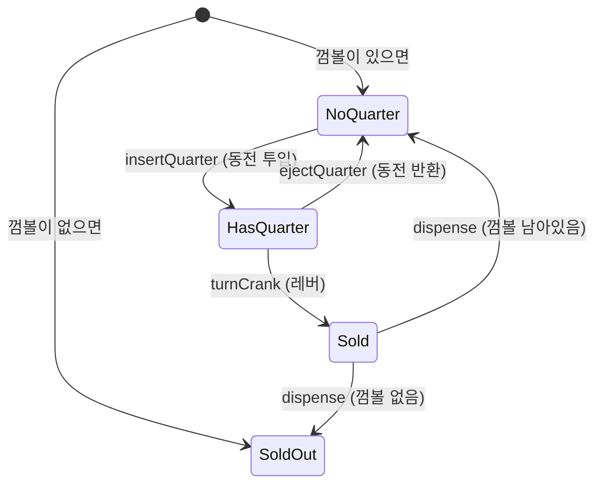

# 상태 패턴 (State Pattern) — 조건문 지옥에서 탈출하는 법

안녕하세요! 디자인 패턴 시리즈, 오늘은 **상태 패턴(State Pattern)** 입니다.

저는 처음에 이 패턴 이름을 보고 "상태? 그냥 `useState` 아니야?" 했는데요, 막상 공부해보니 **"아, 이래서 TanStack Query가 이렇게 편했구나"** 싶더라고요. 프론트엔드 개발자라면 이미 이 패턴의 혜택을 받고 있는 분들이 대부분일 거예요.

오늘 글에서는 헤드 퍼스트 디자인 패턴의 껌볼 머신 예제를 같이 살펴보고, 거기서 나온 아이디어를 프론트엔드 실무에서 어떻게 활용할 수 있는지 이야기해볼게요.

---

## 문제부터 시작해봐요

이런 코드를 작성해본 경험 있으신가요?

```ts
class VideoPlayer {
  // "현재 상태"를 문자열로 관리
  state: 'idle' | 'playing' | 'paused' | 'buffering' = 'idle';

  play() {
    if (this.state === 'idle') {
      console.log('재생 시작!');
      this.state = 'playing';
    } else if (this.state === 'paused') {
      console.log('이어서 재생');
      this.state = 'playing';
    } else if (this.state === 'playing') {
      console.log('이미 재생 중이에요');
    } else if (this.state === 'buffering') {
      console.log('버퍼링 중... 잠깐만요');
    }
  }

  pause() {
    if (this.state === 'playing') {
      console.log('일시정지');
      this.state = 'paused';
    } else if (this.state === 'paused') {
      console.log('이미 일시정지 상태예요');
    } else if (this.state === 'idle') {
      console.log('재생 중이 아닌데요?');
    } else if (this.state === 'buffering') {
      console.log('버퍼링 중에는 정지할 수 없어요');
    }
  }

  stop() { /* 또 4개 분기... */ }
}
```

`play()` 메서드 하나에만 조건문이 4개예요. `pause()`, `stop()`, `seek()` 다 합치면요? 같은 상태 분기가 메서드 개수만큼 반복되죠.

그리고 어느 날 기획자가 와서 이렇게 말합니다.

> "자막 로딩 중 상태도 추가해야 할 것 같아요."

`loading-captions`라는 상태가 추가됩니다. 그러면 `play()`, `pause()`, `stop()`, `seek()`... 전부 다 열어서 `else if` 하나씩 추가해야 해요. 메서드가 10개라면 10군데를 수정해야 하는 거죠.

이게 상태 패턴이 해결하려는 문제입니다.

---

## 헤드 퍼스트가 소개하는 껌볼 머신

책에서는 껌볼 자판기를 예제로 써요. 꽤 적절한 비유라 같이 살펴볼게요.

껌볼 머신에는 **4가지 상태**가 있어요.

- 🪙 **동전 없음** (NoQuarter): 동전을 기다리는 상태
- ✅ **동전 있음** (HasQuarter): 동전이 들어온 상태
- 🍬 **판매 중** (Sold): 껌볼이 나오는 중
- ❌ **품절** (SoldOut): 껌볼이 없는 상태

그리고 사용자가 할 수 있는 **4가지 행동**이 있어요.

- `insertQuarter()` — 동전 투입
- `ejectQuarter()` — 동전 반환
- `turnCrank()` — 레버 돌리기
- `dispense()` — 껌볼 나오기

### 처음에는 이렇게 만들었어요

```ts
class GumballMachine {
  // 상수로 상태를 표현
  static NO_QUARTER = 'NO_QUARTER';
  static HAS_QUARTER = 'HAS_QUARTER';
  static SOLD = 'SOLD';
  static SOLD_OUT = 'SOLD_OUT';

  state = GumballMachine.SOLD_OUT;
  count = 0;

  constructor(count: number) {
    this.count = count;
    if (count > 0) {
      this.state = GumballMachine.NO_QUARTER;
    }
  }

  insertQuarter() {
    if (this.state === GumballMachine.HAS_QUARTER) {
      console.log('이미 동전이 있어요');
    } else if (this.state === GumballMachine.NO_QUARTER) {
      this.state = GumballMachine.HAS_QUARTER;
      console.log('동전이 투입됐어요');
    } else if (this.state === GumballMachine.SOLD_OUT) {
      console.log('품절이에요. 동전을 받을 수 없어요');
    } else if (this.state === GumballMachine.SOLD) {
      console.log('잠깐만요, 껌볼이 나오는 중이에요');
    }
  }

  turnCrank() {
    if (this.state === GumballMachine.SOLD) {
      console.log('이미 껌볼이 나오고 있어요');
    } else if (this.state === GumballMachine.NO_QUARTER) {
      console.log('동전을 먼저 넣어주세요');
    } else if (this.state === GumballMachine.SOLD_OUT) {
      console.log('품절이에요');
    } else if (this.state === GumballMachine.HAS_QUARTER) {
      console.log('레버를 돌렸어요');
      this.state = GumballMachine.SOLD;
      this.dispense();
    }
  }

  // ejectQuarter(), dispense()도 비슷하게...
}
```

동작은 해요. 근데 이제 요구사항이 추가됩니다.

> "10번에 1번은 껌볼을 2개 주는 이벤트를 만들어 주세요! 당첨 기능이에요 🎉"

**Winner 상태**가 필요해졌어요. 이 상태를 추가하려면:

1. 상수 하나 더 (`WINNER = 'WINNER'`)
2. `insertQuarter` 열어서 분기 추가
3. `turnCrank` 열어서 분기 추가
4. `ejectQuarter` 열어서 분기 추가
5. `dispense` 열어서 분기 추가

메서드 하나 하나를 다 열어봐야 해요. 수정하다 실수라도 하면? 기존에 잘 동작하던 기능에 버그가 생길 수 있죠.

이 구조의 문제는 **"상태에 따른 행동"이 여러 메서드에 산산이 흩어져 있다**는 거예요. `NoQuarter` 상태일 때 어떻게 동작하는지 알고 싶다면, 모든 메서드를 다 들여다봐야 해요.

---

## 상태 패턴으로 다시 만들어 봐요

상태 패턴의 핵심 아이디어는 이거예요.

> **"상태 자체를 객체로 만들자. 각 상태가 스스로 자신의 행동을 책임지게 하자."**

구체적으로 이렇게 바뀌어요.

1. 모든 상태가 공통으로 가져야 할 행동을 **인터페이스**로 정의한다
2. 각 상태를 **별도 클래스**로 만들어서 그 인터페이스를 구현한다
3. `GumballMachine`은 현재 상태 객체에게 **위임**만 한다 (`this.state.insertQuarter()`)
4. 상태 전환(`NoQuarter → HasQuarter`)은 **상태 객체 스스로** 처리한다

### State 인터페이스 정의

```ts
interface State {
  insertQuarter(): void;
  ejectQuarter(): void;
  turnCrank(): void;
  dispense(): void;
}
```

껌볼 머신에서 일어날 수 있는 모든 행동을 인터페이스로 정의했어요.

### GumballMachine (Context) 정리

```ts
class GumballMachine {
  // 상태 객체들을 미리 만들어 둬요
  noQuarterState: State;
  hasQuarterState: State;
  soldState: State;
  soldOutState: State;

  state: State;
  count: number;

  constructor(count: number) {
    this.count = count;

    this.noQuarterState = new NoQuarterState(this);
    this.hasQuarterState = new HasQuarterState(this);
    this.soldState = new SoldState(this);
    this.soldOutState = new SoldOutState(this);

    // 초기 상태 설정
    this.state = count > 0 ? this.noQuarterState : this.soldOutState;
  }

  // 모든 행동을 현재 상태 객체에게 위임해요
  insertQuarter() { this.state.insertQuarter(); }
  ejectQuarter() { this.state.ejectQuarter(); }
  turnCrank() {
    this.state.turnCrank();
    this.state.dispense();
  }

  // 상태를 변경하는 메서드 (상태 객체가 호출해요)
  setState(state: State) {
    this.state = state;
  }

  releaseBall() {
    console.log('껌볼이 나왔어요! 🍬');
    if (this.count > 0) this.count--;
  }
}
```

`GumballMachine` 자체에서 조건문이 완전히 사라졌어요. "현재 상태 객체에게 물어봐" 하고 전달만 해주는 거죠.

### 각 상태 클래스

이제 각 상태가 자기 자신의 행동을 직접 책임져요.

```ts
// 동전 없는 상태
class NoQuarterState implements State {
  constructor(private machine: GumballMachine) {}

  insertQuarter() {
    console.log('동전이 투입됐어요');
    // 스스로 상태를 전환해요
    this.machine.setState(this.machine.hasQuarterState);
  }

  ejectQuarter() {
    console.log('동전을 넣지 않았어요');
  }

  turnCrank() {
    console.log('동전을 먼저 넣어주세요');
  }

  dispense() {
    console.log('먼저 동전을 넣어야 해요');
  }
}

// 동전 있는 상태
class HasQuarterState implements State {
  constructor(private machine: GumballMachine) {}

  insertQuarter() {
    console.log('이미 동전이 있어요');
  }

  ejectQuarter() {
    console.log('동전을 돌려드려요');
    this.machine.setState(this.machine.noQuarterState);
  }

  turnCrank() {
    console.log('레버를 돌렸어요!');
    this.machine.setState(this.machine.soldState);
  }

  dispense() {
    console.log('껌볼은 레버를 돌려야 나와요');
  }
}

// 껌볼 판매 중 상태
class SoldState implements State {
  constructor(private machine: GumballMachine) {}

  insertQuarter() { console.log('잠깐만요, 껌볼이 나오는 중이에요'); }
  ejectQuarter() { console.log('이미 레버를 돌렸어요'); }
  turnCrank() { console.log('한 번만 돌려주세요'); }

  dispense() {
    this.machine.releaseBall();
    // 껌볼 개수에 따라 다음 상태 결정
    if (this.machine.count > 0) {
      this.machine.setState(this.machine.noQuarterState);
    } else {
      console.log('품절이에요 😢');
      this.machine.setState(this.machine.soldOutState);
    }
  }
}
```

각 클래스를 보면, **이 상태에서 어떤 일이 일어나는지** 한눈에 파악할 수 있어요. 다른 상태 코드를 볼 필요가 없죠.

### 상태 전환 흐름



코드와 다이어그램이 1:1로 대응돼요. 상태 클래스 하나 = 다이어그램의 동그라미 하나, 상태 전환 코드 = 화살표 하나예요.

---

### 이제 Winner 상태를 추가해볼까요?

기억하시나요? 처음에는 모든 메서드를 다 열어야 했는데요. 이제는 어떨까요?

```ts
class WinnerState implements State {
  constructor(private machine: GumballMachine) {}

  insertQuarter() { console.log('잠깐만요!'); }
  ejectQuarter() { console.log('이미 레버를 돌렸어요'); }
  turnCrank() { console.log('한 번만 돌려주세요'); }

  dispense() {
    console.log('🎉 당첨! 껌볼 2개!');
    this.machine.releaseBall();
    if (this.machine.count > 0) {
      this.machine.releaseBall(); // 한 번 더!
    }
    this.machine.setState(
      this.machine.count > 0
        ? this.machine.noQuarterState
        : this.machine.soldOutState
    );
  }
}
```

그리고 `HasQuarterState.turnCrank()` 딱 한 곳만 수정해요.

```ts
turnCrank() {
  const isWinner = Math.random() < 0.1; // 10% 확률
  if (isWinner && this.machine.count > 1) {
    console.log('🎰 당첨!');
    this.machine.setState(this.machine.winnerState);
  } else {
    console.log('레버를 돌렸어요');
    this.machine.setState(this.machine.soldState);
  }
}
```

**수정한 곳은 딱 한 군데예요.** 나머지 상태 클래스는 전혀 건드리지 않았어요. 기존 코드를 잘못 건드려서 생기는 버그 위험도 최소화됐죠.

---

## 잠깐, 전략 패턴이랑 거의 똑같지 않나요?

눈치채신 분들이 있을 것 같아요. 전략 패턴도 인터페이스를 만들고, 구현체를 바꿔 끼우는 구조였잖아요.

맞아요. UML 다이어그램만 보면 거의 동일해요. 그래서 **의도로 구분**해야 해요.

|  | 전략 패턴 | 상태 패턴 |
|---|---|---|
| **누가 바꿔요?** | **외부(클라이언트)**가 전략을 주입 | **내부(상태 객체)**가 스스로 전환 |
| **언제 바뀌나요?** | 보통 설정 시점에 한 번 | 계속 자동으로 바뀜 |
| **상태끼리 알아요?** | 서로 몰라도 됨 | 서로를 알아야 함 |
| **관심사** | "어떻게 할 것인가" | "지금 나는 무엇인가" |

예를 들면 이렇게 구분할 수 있어요.

- **전략 패턴**: "결제할 때 카카오페이로 할게요" → 외부에서 선택해서 주입
- **상태 패턴**: "동전을 넣으면 자동으로 HasQuarter 상태로 바뀌어야 해" → 내부에서 알아서

---

## 프론트엔드에서 이미 쓰고 있는 상태 패턴

자, 이제 우리한테 친숙한 이야기로 와볼게요.

사실 우리는 이미 매일 상태 패턴의 혜택을 받고 있어요.

### 1. TanStack Query의 status

```tsx
function UserProfile({ userId }: { userId: string }) {
  const { data, status } = useQuery({
    queryKey: ['user', userId],
    queryFn: () => fetchUser(userId),
  });

  if (status === 'pending') return <Skeleton />;
  if (status === 'error') return <ErrorFallback />;
  return <Profile data={data} />;
}
```

이 `status`가 그냥 문자열처럼 보이지만, 내부적으로 Query 객체는 상태 머신처럼 동작해요.

- `pending` → `success` (fetch 성공)
- `pending` → `error` (fetch 실패)
- `success` → `pending` (refetch 시작)
- `error` → `pending` (retry 시작)

우리가 `isLoading`, `isFetching`, `isStale`, `isRefetching` 같은 플래그들을 직접 조합해서 관리하지 않아도 되는 이유가 여기 있어요. TanStack Query가 상태 기계를 내부에서 돌려주고, 우리는 현재 상태만 받아서 렌더링에 집중하면 되는 거죠.

### 2. useReducer + discriminated union

상태 패턴의 아이디어를 함수형으로 가장 잘 표현한 방식이에요.

```ts
// 상태 정의 — 각 상태가 가질 수 있는 데이터가 명확해요
type State =
  | { status: 'idle' }
  | { status: 'loading' }
  | { status: 'success'; data: User }
  | { status: 'error'; error: Error };

type Action =
  | { type: 'FETCH' }
  | { type: 'SUCCESS'; payload: User }
  | { type: 'FAILURE'; payload: Error }
  | { type: 'RESET' };

function reducer(state: State, action: Action): State {
  switch (state.status) {
    case 'idle':
      if (action.type === 'FETCH') return { status: 'loading' };
      return state;

    case 'loading':
      if (action.type === 'SUCCESS') return { status: 'success', data: action.payload };
      if (action.type === 'FAILURE') return { status: 'error', error: action.payload };
      return state;

    case 'success':
      if (action.type === 'RESET') return { status: 'idle' };
      if (action.type === 'FETCH') return { status: 'loading' }; // 재조회
      return state;

    case 'error':
      if (action.type === 'FETCH') return { status: 'loading' }; // 재시도
      return state;
  }
}
```

이 방식에서 **핵심은 `switch (state.status)`** 에 있어요.

상태에 따라 어떤 액션을 받아들일지가 달라지는 거죠. `loading` 상태에서는 `SUCCESS`나 `FAILURE`만 처리하고, `idle` 상태에서의 `SUCCESS`는 무시해요.

덕분에 이런 **불가능한 상태**가 타입 레벨에서 원천 차단돼요.

```ts
// ❌ 이런 상태는 존재할 수 없어요
const impossibleState = { status: 'loading', data: user }; // 타입 에러!
const anotherImpossible = { status: 'success' }; // data가 없으면 타입 에러!

// ✅ 이런 플래그 조합 지뢰밭도 없어져요
if (isLoading && data && !error) { /* 이게 가능한 상태인가요? */ }
```

### 3. XState — 상태 머신 전용 라이브러리

더 복잡한 상태 관리가 필요하다면 XState가 있어요. 상태 패턴 + FSM(유한 상태 기계) 이론을 라이브러리로 구현해 놓은 거예요.

```ts
import { createMachine } from 'xstate';

const signupFormMachine = createMachine({
  id: 'signupForm',
  initial: 'idle',
  states: {
    idle: {
      on: { SUBMIT: 'validating' }
    },
    validating: {
      on: {
        VALID: 'submitting',
        INVALID: 'idle'
      }
    },
    submitting: {
      on: {
        SUCCESS: 'done',
        FAILURE: 'error'
      }
    },
    done: { type: 'final' },
    error: {
      on: { RETRY: 'idle' }
    }
  }
});
```

이 코드 자체가 상태 다이어그램이에요. **어떤 상태에서 어떤 이벤트가 오면 어떤 상태로 가는지**가 선언적으로 한 눈에 보이죠.

실무에서 회원가입 폼, 결제 플로우, 멀티스텝 폼 같은 복잡한 플로우에 특히 유용해요.

---

## 언제 상태 패턴을 써야 할까요?

모든 상황에서 쓸 필요는 없어요. 상황을 잘 보고 적용해야 해요.

**이럴 때 쓰면 좋아요 ✅**

- 상태에 따라 여러 메서드의 동작이 크게 달라질 때
- 상태가 3개 이상이고, 앞으로 더 늘어날 것 같을 때
- 비슷한 조건문이 여러 메서드에서 반복될 때
- "이 상태에서 저 상태로 가는 게 맞나?" 하는 불가능한 조합을 타입으로 막고 싶을 때

**이럴 때는 오히려 과한 설계예요 ❌**

- 토글 하나 (`isOpen`, `isDark`)
- 상태가 2~3개이고 더 늘어날 일이 없을 때
- 각 메서드가 상태와 무관하게 동작할 때

---

## 마무리

상태 패턴을 한 문장으로 정리하면 이렇게 말할 수 있어요.

> **조건문 대신 객체로 상태를 표현해서, 상태마다 다른 행동을 캡슐화한다.**

헤드 퍼스트의 껌볼 머신 예제는 조금 낯설게 느껴질 수 있지만, TanStack Query의 `pending/success/error`, 폼의 `idle/loading/done`, 비디오 플레이어의 `playing/paused/buffering` — 우리가 매일 다루는 이것들이 모두 상태 패턴의 결과물이에요.

다음번에 `isLoading && !data && !error` 같은 조합 조건문이 보인다면, 그게 상태를 하나로 묶을 타이밍이에요. `useReducer`의 discriminated union이든, XState든, 직접 만든 상태 클래스든 — 방법은 달라도 패턴은 같아요.

---
