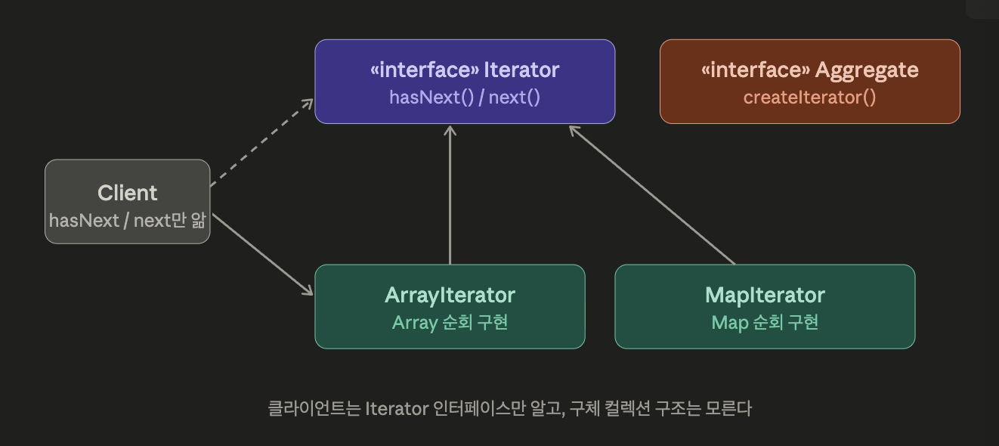
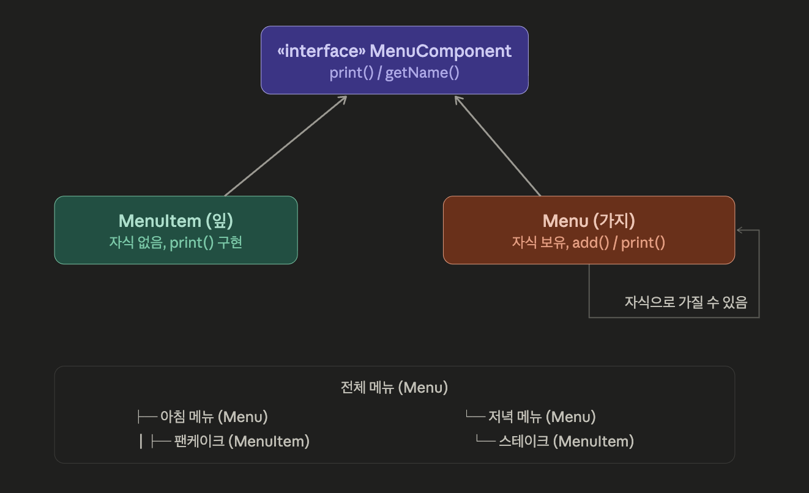
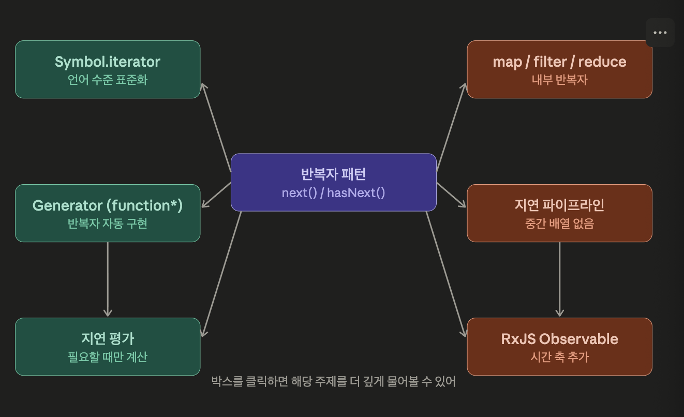
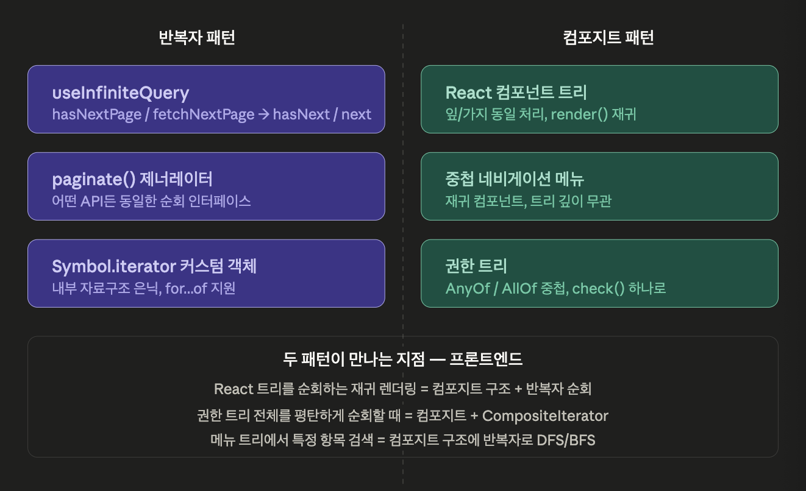

# 반복자 패턴과 컴포지트 패턴

## 두 패턴이 왜 한 챕터에?

둘 다 컬렉션(collection)을 다루는 문제에서 출발

- **반복자**는
    - “컬렉션을 어떻게 순회하는가”를 해결
- **컴포지트**는
    - “컬렉션이 중첩될 때 어떻게 다루는가” 를 해결
- 그리고,
    - 컴포지트 구조를 순회할 때 반복자가 필요해지면서 두 패턴이 자연스럽게 연결

## 이론 정리

### 1. 반복자 패턴 (Iterator Pattern)

> ***“컬렉션의 내부 구조를 몰라도, 모든 요소를 순서대로 접근할 수 있어야 한다.”***
> 

- 핵심은 “순회”라는 책임을 컬렉션 바깥으로 꺼내는 것.
- 컬렉션이든 배열이든, 링크드 리스트든, 해시맵이든
    - 사용하는 쪽은 그 내부 구조를 몰라도 된다.
    - `next()`와 `hasNext()`만 알면 된다.

#### 책의 예시

두 식당이 합병하는 예시

- 팬케이크 하우스는 메뉴를 `ArrayList`로
- 다이너는 `Array`로 관리

둘을 통합한 웨이트리스 코드를 짜려면?

```tsx
// 합병 전 — 자료구조가 달라서 순회 방식이 각각 다름
// 팬케이크 하우스
for (let i = 0; i < pancakeMenu.size(); i++) {
  pancakeMenu.get(i)
}

// 다이너
for (let i = 0; i < dinerMenu.length; i++) {
  dinerMenu[i]
}
```

자료구조가 바뀔 때마다 순회 코드가 바뀜

여기서 반복자를 뽑아내면,

```tsx
interface Iterator<T> {
  hasNext(): boolean
  next(): T
}

// 각 메뉴가 자기 자신의 반복자를 반환
class DinerMenu {
  createIterator(): Iterator<MenuItem> {
    return new DinerMenuIterator(this.items)
  }
}

// 사용하는 쪽 — 자료구조를 전혀 모름
function printMenu(iterator: Iterator<MenuItem>) {
  while (iterator.hasNext()) {
    const item = iterator.next()
    console.log(item.name)
  }
}

// 어떤 메뉴든 같은 코드로 순회
printMenu(pancakeMenu.createIterator())
printMenu(dinerMenu.createIterator())
```

- `printMenu` 는 내부가 `ArrayList` 인지 `Array` 인지 모른다. `Iterator` 인터페이스만 안다.
- 이때 적용되는 설계 원칙이 **단일 책임 원칙(SRP)**
- 컬렉션은 데이터를 관리하는 책임만 지고, 순회하는 책임은 반복자가 가져간다.



---

### 2. 컴포니트 패턴 (Composite Pattern)

> ***“개별 객체와 객체들의 묶음을 동일하게 다룰 수 있어야 한다.”***
> 

- 트리구조와 비슷, 파일 시스템에서 파일과 폴더가 있을 때
    - 폴더 안에는 파일도 있고 또 다른 폴더도 있음
    - 그런데 “크기 계산”, “삭제”같은 연산은 파일이든 폴더든 똑같이 적용
    - 이 때 클라이언트가 “이게 파일인지 폴더인지” 매번 확인하면서 다르게 처리해야 한다면 코드가 복잡해짐.

#### 책의 예시

메뉴 안에 서브메뉴가 생기는 상황

- 반복자로 해결한 메뉴 구조에 “디저트 서브메뉴”가 추가
- 메뉴 아이템(leaf)과 메뉴(branch)를 같은 방식으로 다뤄야 함.

```tsx
// 공통 인터페이스 — 잎(MenuItem)과 가지(Menu) 모두 구현
interface MenuComponent {
  getName(): string
  getDescription(): string
  print(): void
  // 가지만 의미있는 메서드 — 잎은 예외 던지거나 무시
  add?(component: MenuComponent): void
  remove?(component: MenuComponent): void
  getChild?(i: number): MenuComponent
}

// 잎 노드 — 자식 없음
class MenuItem implements MenuComponent {
  constructor(
    private name: string,
    private description: string,
    private price: number
  ) {}
  getName() { return this.name }
  print() { console.log(`  ${this.name}: ${this.price}`) }
}

// 가지 노드 — 자식을 가질 수 있음
class Menu implements MenuComponent {
  private components: MenuComponent[] = []

  constructor(private name: string) {}
  getName() { return this.name }

  add(component: MenuComponent) {
    this.components.push(component)
  }

  print() {
    console.log(`\n[ ${this.name} ]`)
    // 자식이 MenuItem이든 Menu든 동일하게 print() 호출
    this.components.forEach(c => c.print())
  }
}
```

- 클라이언트는 `MenuComponent.print()`만 호출
- 그게 `MenuItem`(leaf)인지, `Menu`(branch, 서브메뉴 포함)인지 신경 안써도 된다.



---

### 3. 두 패턴의 트레이드오프

#### 반복자

단일 책임 원칙을 지키는 대신, 컬렉션과 반복자가 짝으로 묶이기 때문에 관리할 클래스가 늘어남

#### 컴포지트

“잎과 가지를 동일하게 다룬다”는 편의를 위해 단일 책임 원칙을 일부 희생

- `MenuCompnent` 인터페이스에 잎에게 의미없는 `add()`, `remove()`가 포함
- 투명성(transparency)과 안정성(safety) 중 투명성을 택한 것

### 4. 두 패턴이 만나는 지점

- 컴포지트 구조(트리)를 순회할 때 반복자가 필요해짐.
- 중첩된 메뉴 전체를 순회하려면 재귀적으로 들어가야 하는데, 이 로직을 `CompositeIterator`로 캡슐화하면 클라이언트는 트리 구조를 모르고도 전체를 순회할 수 있음.

```tsx
// 트리 전체를 평탄하게 순회하는 반복자
class CompositeIterator implements Iterator<MenuComponent> {
  private stack: Iterator<MenuComponent>[] = []

  constructor(iterator: Iterator<MenuComponent>) {
    this.stack.push(iterator)
  }

  hasNext(): boolean {
    return this.stack.length > 0
  }

  next(): MenuComponent {
    const iterator = this.stack[this.stack.length - 1]
    if (!iterator.hasNext()) {
      this.stack.pop()
      return this.next()
    }
    const component = iterator.next()
    // 가지(Menu)면 그 자식 반복자를 스택에 쌓음
    if (component instanceof Menu) {
      this.stack.push(component.createIterator())
    }
    return component
  }
}
```

- 클라이언트는 트리가 몇 단계로 중첩됐는지 몰라도 `hasNext()` / `next()` 만으로 전체를 순회함.

## 부록

### 1. 내부 반복자 vs 외부 반복자

#### 개념 차이

- 외부 반복자
    - 클라이언트가 반복을 직접 제어한다.
    - `hasNext()`, `next()`를 클라이언트가 호출
    - 책에서 다룬 방식
- 내부 반복자
    - 반복자가 반복을 직접 제어
    - 클라이언트는 “각 요소에 뭘 할지”만 넘김

```tsx
// 외부 반복자 — 클라이언트가 흐름을 쥠
const iterator = menu.createIterator()
while (iterator.hasNext()) {
  const item = iterator.next()
  console.log(item.name)   // 뭘 할지는 여기서
}

// 내부 반복자 — 반복자가 흐름을 쥠
menu.forEach(item => {
  console.log(item.name)   // 뭘 할지만 넘김
})
```

- 외부 반복자는 유연성이 높음.
    - 중간에 멈추거나,
    - 두 컬렉션을 동시에 순회하거나,
    - 조건에 따라 건너뛸 수 있음
- 내부 반복자는 편리하지만 흐름 제어가 제한됨.

#### JS의 `Symbol.iterator` - 언어 수준의 반복자 프로토콜

JS/TS는 반복자 패턴을 언어 스펙으로 내장

→ `Symbol.iterator`

```tsx
// 어떤 객체든 Symbol.iterator를 구현하면
// for...of, 스프레드, 구조분해가 전부 동작한다
class MenuCollection {
  private items: MenuItem[] = []

  [Symbol.iterator](): Iterator<MenuItem> {
    let index = 0
    const items = this.items

    return {
      next(): IteratorResult<MenuItem> {
        if (index < items.length) {
          return { value: items[index++], done: false }
        }
        return { value: undefined as any, done: true }
      }
    }
  }
}

const menu = new MenuCollection()

// 이 세 가지가 전부 동작
for (const item of menu) { ... }          // for...of
const arr = [...menu]                      // 스프레드
const [first, second] = menu              // 구조분해
```

- 책의 `Iterator` 인터페이스(`hasNext/next`)를 
JS가 `{ next(): { value, done } }` 형태로 표준화한 것
- 중요한 것은 이 프로토콜이 덕 타이핑(duck typing)으로 작동한다는 점
- `Symbol.iterator`만 구현하면 클래스 계층과 무관하게 JS의 모든 순회 문법이 붙음

```tsx
// 커스텀 자료구조도 for...of로 순회 가능
class InfiniteCounter {
  [Symbol.iterator]() {
    let count = 0
    return {
      next() {
        return { value: count++, done: false }
      }
    }
  }
}

for (const n of new InfiniteCounter()) {
  if (n > 5) break   // 외부에서 제어 가능
  console.log(n)     // 0 1 2 3 4 5
}
```

### 2. 지연 평가 (Lazy Evaluation) - 반복자가 왜 제너레이터와 연결되는지

#### 즉시 평가 vs 지연 평가

```tsx
// 즉시 평가 — 결과를 미리 다 만들어놓음
const result = [1, 2, 3, 4, 5]
  .map(x => x * 2)       // 배열 [2,4,6,8,10] 생성
  .filter(x => x > 4)    // 배열 [6,8,10] 생성
  .slice(0, 2)            // 배열 [6,8] 생성
// 중간 배열 3개가 메모리에 올라감

// 지연 평가 — 실제로 필요할 때만 계산
function* lazyPipeline(source: Iterable<number>) {
  for (const x of source) {
    const doubled = x * 2
    if (doubled > 4) yield doubled
  }
}

const lazy = lazyPipeline([1, 2, 3, 4, 5])
const [first, second] = lazy   // 여기서야 비로소 계산 시작
// 중간 배열 없음, 필요한 것만 계산
```

- 반복자의 `next()`는 “다음 값이 필요할 때 그때 계산”하는 구조
- 지연 평가의 본질

#### 제너레이터 - 반복자를 쉽게 만드는 문법

- `Symbol.iterator` 를 직접 구현하면 보일러플레이트가 많음
- 제너레이터(`function*`)는 반복자 프로토콜을 자동으로 구현해줌

```tsx
// 직접 구현 — 장황함
function rangeIterator(start: number, end: number) {
  let current = start
  return {
    [Symbol.iterator]() { return this },
    next() {
      if (current <= end) {
        return { value: current++, done: false }
      }
      return { value: undefined, done: true }
    }
  }
}

// 제너레이터 — 같은 것, 훨씬 간결
function* range(start: number, end: number) {
  for (let i = start; i <= end; i++) {
    yield i   // 여기서 실행이 멈추고, next() 호출 시 재개
  }
}

for (const n of range(1, 1000000)) {
  if (n > 5) break
  // 100만 개짜리 배열을 만들지 않음
  // 필요한 만큼만 생성
}
```

- `yield`가 핵심.
- 제너레이터 함수는 `yield`를 만나면 실행을 일시 정지하고 값을 반환
- 다음 `next()` 호출 시 그 지점부터 제거
- 반복자의 `next()` 호출과 1:1로 대응

```tsx
// 제너레이터의 실행 흐름
function* gen() {
  console.log('A')
  yield 1          // 여기서 멈춤
  console.log('B')
  yield 2          // 여기서 멈춤
  console.log('C')
}

const g = gen()    // 아직 아무것도 실행 안 됨
g.next()           // 'A' 출력, { value: 1, done: false }
g.next()           // 'B' 출력, { value: 2, done: false }
g.next()           // 'C' 출력, { value: undefined, done: true }
```

프론트엔드에서 적용되는 케이스는

- 무한 스크롤
- 페이지네이션
- 대용량 데이터 처리

```tsx
// 무한히 다음 페이지를 가져오는 제너레이터
async function* fetchPages(endpoint: string) {
  let cursor: string | null = null

  while (true) {
    const response = await apiClient.get(endpoint, { cursor })
    yield response.items          // 이 페이지 데이터 반환 후 일시 정지
    cursor = response.nextCursor
    if (!cursor) break            // 마지막 페이지면 종료
  }
}

// 사용하는 쪽 — 필요할 때마다 다음 페이지 요청
for await (const items of fetchPages('/products')) {
  renderItems(items)
  if (userScrolledEnough()) continue
  break   // 더 안 봐도 되면 즉시 중단, 불필요한 요청 없음
}
```

### 3. 반복자 패턴과 함수형 파이프라인의 관계

`map` / `filter` / `reduce` 는 내부 반복자

```tsx
[1, 2, 3].map(x => x * 2)
```

- 배열이 순회 흐름을 쥐고, 클라이언트(`x ⇒ x * 2`)는 각 요소에 할 일만 넘김
- 차이는 반환값
    - `forEach`는 부수 효과만 있고,
    - `map` / `filter` / `reduce`는 새로운 컬렉션이나 값을 반환
        - 이 반환값이 체이닝을 가능하게 함.

#### 체이닝의 문제와 지연 평가의 해법

```tsx
const data = Array.from({ length: 1000000 }, (_, i) => i)

// 문제: 중간 배열이 3개 생성됨
const result = data
  .map(x => x * 2)          // 100만 개짜리 배열
  .filter(x => x % 3 === 0) // 또 다른 배열
  .slice(0, 10)              // 10개짜리 배열
```

- 즉시 평가 체인은 중가 결과물을 전부 메모리에 올림
- 제너레이터 기반 지연 파이프라인은 이것을 해결

```tsx
// 지연 평가 파이프라인 — 중간 배열 없음
function* lazyMap<T, U>(source: Iterable<T>, fn: (x: T) => U) {
  for (const x of source) yield fn(x)
}

function* lazyFilter<T>(source: Iterable<T>, pred: (x: T) => boolean) {
  for (const x of source) if (pred(x)) yield x
}

function take<T>(source: Iterable<T>, n: number): T[] {
  const result: T[] = []
  for (const x of source) {
    result.push(x)
    if (result.length >= n) break  // n개 얻으면 즉시 중단
  }
  return result
}

// 100만 개 중 실제로 계산되는 건 조건 충족하는 10개뿐
const result = take(
  lazyFilter(
    lazyMap(range(0, 1000000), x => x * 2),
    x => x % 3 === 0
  ),
  10
)
```

→ 이 구조가 RxJS, 그리고 TC39의 Iterator Helpers 제안으로 이어짐

#### RxJS - 반복자 + 관찰자 + 지연 평가의 결합

- RxJS의 `Observable`은 반복자 패턴에 시간 축을 추가한 것

```tsx
// 배열(동기, 이미 있는 데이터) → 반복자로 순회
[1, 2, 3].forEach(x => console.log(x))

// Observable(비동기, 시간에 따라 오는 데이터) → 구독으로 순회
fromEvent(button, 'click').pipe(
  map(e => e.target.value),
  filter(v => v.length > 2),
  debounceTime(300),
).subscribe(v => console.log(v))
```

- `pipe(map, filter)`는 지연 평가 파이프라인이고,
- `subscribe`가 실제 실행을 트리거함
- 구독 전까지는 아무것도 계산되지 않음

> 반복자가 “공간에 있는 컬렉션”을 다룬다면, 
RxJS Observable은 “시간에 따라 흐르는 컬렉션”을 같은 방식으로 다룸
> 



<aside>
🔥

반복자 패턴이 “순회를 추상화”했고,

→ JS가 `Symbol.iterator`로 언어 수준에서 표준화했고,

→ `function*`가 반복자를 쉽게 만드는 문법을 줬고,

→ 그 제너레이터가 지연 평가를 가능하게 했고,

→ 지연 평가가 `map / filter / reduce` 체인의 성능 문제를 해결하고,

→ 거기에 시간 축을 더하면 RxJS

</aside>

## 활용 예시 - 전통적 프로그래밍

### 반복자 패턴 - 자료구조 추상화

- 서로 다른 자료구조를 통일된 방식으로 순회하는 것
- Java의 `Collection` 프레임워크

```tsx
// ArrayList든 LinkedList든 HashSet이든
// Iterator 인터페이스 하나로 동일하게 순회
Iterator<String> it = anyCollection.iterator();
while (it.hasNext()) {
    System.out.println(it.next());
}
```

- 내부가 배열 기반인지, 링크드 리스트인지, 해시 버킷인지 → 사용하는 쪽은 완전히 모름

### 컴포지트 패턴 - 파일 시스템

- OS의 파일 시스템이 교과서적 예시

```tsx
interface FileSystemNode {
  getName(): string
  getSize(): number   // 파일은 자신의 크기, 디렉토리는 자식 합산
  delete(): void
}

class File implements FileSystemNode {
  getSize() { return this.bytes }
}

class Directory implements FileSystemNode {
  private children: FileSystemNode[] = []

  getSize() {
    // 자식이 File이든 Directory든 동일하게 호출
    return this.children.reduce((sum, c) => sum + c.getSize(), 0)
  }
}
```

- `getSize()`를 루트 디렉토리에 호출하면 재귀적으로 전체 트리를 계산
- 클라이언트는 트리 구조를 직접 탐색하지 않음

## 활용 예시 - 프론트엔드 생태계

### 반복자 패턴

#### 1. TanStack Query의 `useInfiniteQuery` - 페이지 반복자

- 무한 스크롤의 핵심 구조
- “다음 페이지”를 요청하는 행위가 `next()` 호출과 동일한 의도

```tsx
const {
  data,
  fetchNextPage,
  hasNextPage,        // hasNext()
  isFetchingNextPage,
} = useInfiniteQuery({
  queryKey: ['products'],
  queryFn: ({ pageParam = null }) =>
    apiClient.get('/products', { cursor: pageParam }),

  // 다음 반복자의 커서 — next()가 반환할 값
  getNextPageParam: (lastPage) => lastPage.nextCursor ?? undefined,
})

// hasNextPage가 true인 동안 fetchNextPage()를 호출
// 반복자의 hasNext() / next() 구조 그대로
const { ref } = useIntersectionObserver(() => {
  if (hasNextPage) fetchNextPage()
})
```

- `hasNextPage()`는 `hasNext()`
- `fetchNextPage()`는 `next()`

#### 2. 커스텀 이터러블 - 페이지네이션 추상화

여러 곳에서 페이지네이션을 쓴다면 제너레이터로 추상화 가능

```tsx
async function* paginate<T>(
  fetcher: (cursor: string | null) => Promise<{ items: T[], nextCursor: string | null }>
) {
  let cursor: string | null = null

  while (true) {
    const { items, nextCursor } = await fetcher(cursor)
    yield items
    if (!nextCursor) break
    cursor = nextCursor
  }
}

// 어떤 API든 동일한 방식으로 페이지네이션
for await (const products of paginate(c => apiClient.get('/products', { cursor: c }))) {
  renderProducts(products)
}

for await (const orders of paginate(c => apiClient.get('/orders', { cursor: c }))) {
  renderOrders(orders)
}
```

- 순회의 흐름은 `paginate` 안에 고정
- 각 API의 fetcher만 교체
- 템플릿 메서드 패턴과 반복자 패턴이 결합된 상태.

#### 3. Server-Sent Events / 스트리밍 응답 처리

ChatGPT 같은 스트리밍 UI

```tsx
async function* streamChat(prompt: string) {
  const response = await fetch('/api/chat', {
    method: 'POST',
    body: JSON.stringify({ prompt })
  })

  const reader = response.body!.getReader()
  const decoder = new TextDecoder()

  while (true) {
    const { done, value } = await reader.read()
    if (done) break
    yield decoder.decode(value)   // 청크가 올 때마다 yield
  }
}

// 컴포넌트에서
async function handleSubmit() {
  setLoading(true)
  for await (const chunk of streamChat(input)) {
    setResponse(prev => prev + chunk)  // 스트리밍으로 UI 업데이트
  }
  setLoading(false)
}
```

- 스트림이 끝날 때까지 청크를 받아서 처리하는 것이 목적

#### 3. `Symbol.iterator` 로 커스텀 자료구조 순회

도메인 객체를 직접 순회 가능하게 만드는 경우

```tsx
class CartItems {
  private items: Map<string, CartItem> = new Map()

  add(item: CartItem) { this.items.set(item.id, item) }
  remove(id: string) { this.items.delete(id) }

  // Map 내부 구조를 숨기고 순회 인터페이스만 노출
  [Symbol.iterator]() {
    return this.items.values()
  }

  get totalPrice() {
    return [...this].reduce((sum, item) => sum + item.price, 0)
  }
}

const cart = new CartItems()
for (const item of cart) { ... }          // 내부가 Map인지 모름
const items = [...cart]                    // 스프레드
const [first] = cart                       // 구조분해
```

- `CartItems`가 내부적으로 `Map`을 쓰는지, `Array`를 쓰는지 외부에서 알 수 없음
- 자료구조를 바꿔도 순회 코드는 안 바뀜

### 컴포지트 패턴

#### 1. React의 컴포넌트 트리 - 패턴의 직접 구현

`ReactElement` (leaf)와 컴포넌트(branch)를 동일하게 다룸

```tsx
// React는 이걸 동일하게 처리한다
// 잎 — 더 이상 자식 없음
<input type="text" />

// 가지 — 자식을 가짐
<Form>
  <Input />        // 잎일 수도
  <Section>        // 또 다른 가지일 수도
    <Input />
    <Button />
  </Section>
</Form>
```

- `ReactDOM.render(<App />)` 하나로 전체 트리를 렌더링
- 트리가 몇 단계로 중첩됐는지, 각 노드가 leaf인지 branch인지
- 렌더러는 신경 쓰지 않음, `render()`를 재귀적으로 호출할 뿐

#### 2. 메뉴/네비게이션 구조

```tsx
// 메뉴 노드 — 잎과 가지 동일한 인터페이스
interface MenuNode {
  id: string
  label: string
  path?: string              // 잎만 가짐
  children?: MenuNode[]      // 가지만 가짐
}

// 재귀 컴포넌트 — 트리 구조를 그대로 반영
function MenuItem({ node }: { node: MenuNode }) {
  if (!node.children) {
    // 잎 — 링크 렌더링
    return <a href={node.path}>{node.label}</a>
  }

  // 가지 — 자식을 재귀 렌더링
  return (
    <div>
      <span>{node.label}</span>
      <ul>
        {node.children.map(child => (
          <MenuItem key={child.id} node={child} />
        ))}
      </ul>
    </div>
  )
}

// 사용하는 쪽 — 트리 깊이와 무관
<MenuItem node={navigationTree} />
```

- `MenuItem`은 자신이 leaf인지 branch인지 런타임에 판단
- 트리가 몇 단계든 같은 컴포넌트가 처리

#### 3. 권한(Permission) 트리

```tsx
interface Permission {
  key: string
  label: string
  children?: Permission[]
  check(user: User): boolean
}

// 잎 권한 — 직접 체크
class AtomicPermission implements Permission {
  check(user: User) {
    return user.permissions.includes(this.key)
  }
}

// 가지 권한 — 자식 중 하나라도 통과하면 OK
class AnyOfPermission implements Permission {
  check(user: User) {
    return this.children.some(p => p.check(user))
  }
}

// 가지 권한 — 자식 전부 통과해야 OK
class AllOfPermission implements Permission {
  check(user: User) {
    return this.children.every(p => p.check(user))
  }
}

// 사용하는 쪽 — 구조와 무관하게 check() 하나로
const canAccessAdmin = adminPermission.check(currentUser)
```

- 권한 구조가 얼마나 복잡하게 중첩되든 `check(user)` 하나로 평가



### 마무리…

- 두 패턴의 공통 가치는 “복잡한 구조를 단순한 인터페이스 뒤에 숨기는 것”
- 반복자는 자료구조의 복잡성을,
- 컴포짓은 트리의 중첩 복잡성을 각각 감춤
- 사용하는 쪽은 그 복잡성을 모르고도 동작할 수 있음.