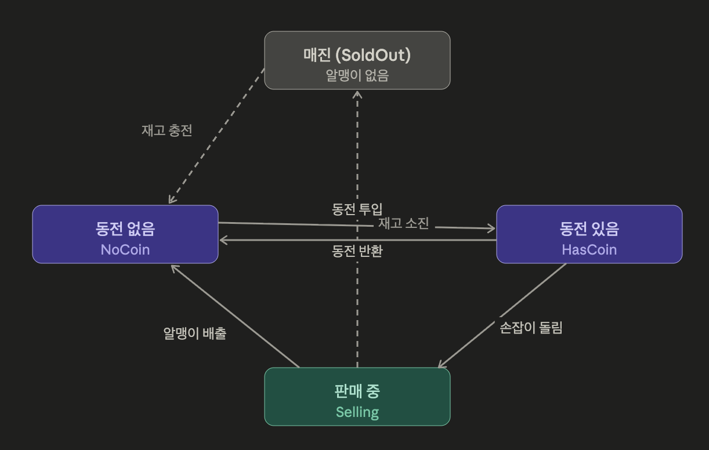
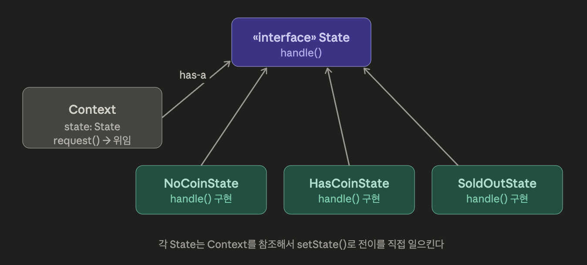
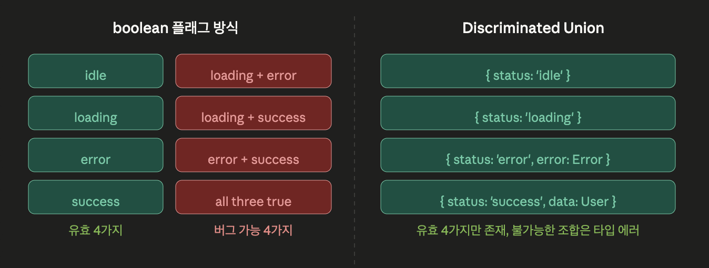
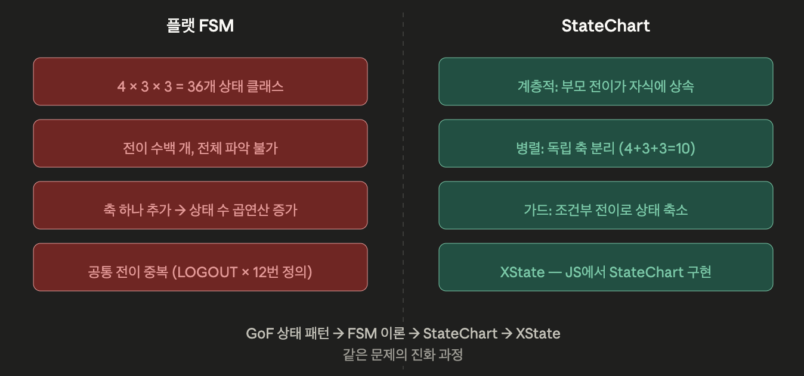
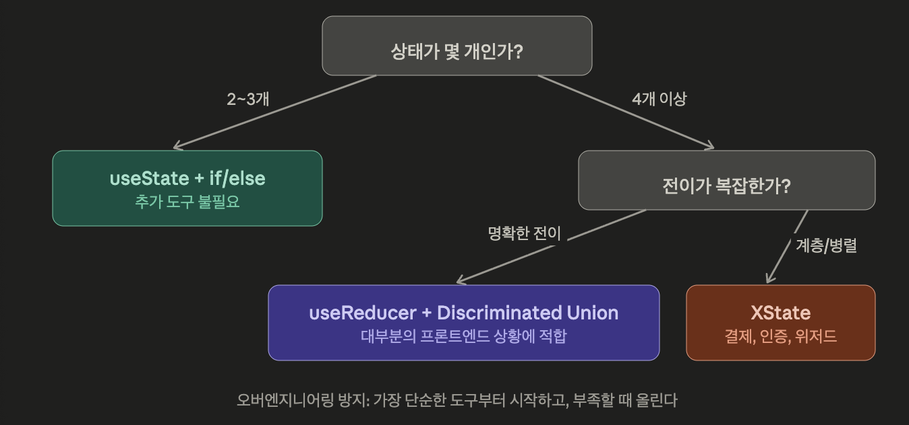

# 상태 패턴

## 이론

### 상태 패턴이란?

> “객체의 내부 상태가 바뀔 때, 객체의 행동도 바뀜. 
마치 객체의 클래스가 바뀌는 것처럼”
> 
1. “상태에 따라 행동이 달라진다”
    - 자판기가 동전이 있을 때와 없을 때, “동전 넣기” 버튼의 동작이 다름
    - 로그인 상태에 따라 버튼이 하는 일이 다름
2. “클래스가 바뀌는 것처럼”
    - 실제로 클래스가 바뀌지는 않지만, 상태 객체를 교체함

### 문제의 상황

> “상태 패턴이 해결하려는 문제는 상태 분기의 폭발”
> 

```tsx
  class GumballMachine {
  private state: string = 'NO_COIN'

  insertCoin() {
    if (this.state === 'NO_COIN') {
      this.state = 'HAS_COIN'
    } else if (this.state === 'HAS_COIN') {
      console.log('이미 동전이 있습니다')
    } else if (this.state === 'SOLD_OUT') {
      console.log('매진입니다')
    } else if (this.state === 'SELLING') {
      console.log('잠깐만요')
    }
  }

  turnCrank() {
    if (this.state === 'NO_COIN') {
      console.log('동전을 넣어주세요')
    } else if (this.state === 'HAS_COIN') {
      // ...
    }
    // ... 또 4개의 분기
  }
  // 메서드마다 4개 분기 × 4개 메서드 = 16개 분기
}
```

- 상태가 하나 추가되면? 모든 메서드의 분기를 다 뒤져야 함

### 상태를 클래스로 분리

각 상태를 별도 클래스로 만들고, 상태별 행동을 그 클래스 안에 담음

```tsx
// 상태 인터페이스
interface State {
  insertCoin(): void
  ejectCoin(): void
  turnCrank(): void
  dispense(): void
}

// 각 상태가 자신의 행동을 직접 정의
class NoCoinState implements State {
  constructor(private machine: GumballMachine) {}

  insertCoin() {
    console.log('동전을 넣었습니다')
    this.machine.setState(this.machine.hasCoinState)
  }
  ejectCoin() { console.log('동전이 없습니다') }
  turnCrank() { console.log('동전을 먼저 넣어주세요') }
  dispense() { console.log('동전을 먼저 넣어주세요') }
}

class HasCoinState implements State {
  constructor(private machine: GumballMachine) {}

  insertCoin() { console.log('이미 동전이 있습니다') }
  ejectCoin() {
    console.log('동전을 반환합니다')
    this.machine.setState(this.machine.noCoinState)
  }
  turnCrank() {
    console.log('손잡이를 돌렸습니다')
    this.machine.setState(this.machine.soldState)
  }
  dispense() { console.log('먼저 손잡이를 돌려주세요') }
}

// 자판기 — 현재 상태에게 모든 행동을 위임
class GumballMachine {
  noCoinState: State
  hasCoinState: State
  soldState: State
  soldOutState: State

  private state: State

  constructor(count: number) {
    this.noCoinState = new NoCoinState(this)
    this.hasCoinState = new HasCoinState(this)
    this.soldState = new SoldState(this)
    this.soldOutState = new SoldOutState(this)

    this.state = count > 0 ? this.noCoinState : this.soldOutState
  }

  insertCoin() { this.state.insertCoin() }  // 현재 상태에 위임
  turnCrank() { this.state.turnCrank() }
  setState(state: State) { this.state = state }
} 
```

- 이제 상태가 추가되면 새 클래스 하나만 추가하면 됨
- 기존 코드를 건드리지 않음 → OCP

### 전략 패턴과의 결정적 차이

- 둘 다 인터페이스를 구현한 객체를 교체
- 차이 : “누가 교체하는가"와 “왜 교체하는가”

|  | **전략 패턴** | 상태 패턴 |
| --- | --- | --- |
| 교체 주체 | 클라이언트 | 상태 객체 스스로 |
| 교체 이유 | 알고리즘 선택 | 상태 전이 |
| 클라이언트가 상태를 앎 | 알고 있음 | 몰라도 됨 |
| 의도 | 행동 교체 | 상태 기계 표현 |
- 전략 패턴 : 클라이언트가 “어떤 전략을 쓸지”를 결정해서 주입
- 상태 패턴 : 상태 객체가 스스로 “다음 상태로 전이”

### 상태 전이 다이어그램

- 상태 패턴을 이해하는 데, 상태 전이도가 핵심.
- 코드를 보기 전에 다이어그램을 먼저 그리는게 설계 순서



(약간 의사코드 같음)

구조 다이어그램



### 핵심 트레이드오프

> “상태 패턴이 분기 폭발을 해결하는 대신 치르는 비용이 있음”
> 
- 클래스 수 증가
    - 상태마다 클래스가 생김
    - 상태가 10개면 클래스가 10개
    - 단순한 케이스에 쓰면 오버 엔지니어링
- 상태 전이 로직의 분산
    - 전이 로직이 각 상태 클래스 안에 흩어짐
    - 전체 흐름을 파악하려면 여러 클래스를 봐야 함
    - 상태 전이 다이어그램을 문서로 유지해야 하는 이유..

→ 상태가 3개 이하이고 단순하면 `if/else`가 낫다. 상태가 많고, 각 상태별 행동이 복잡하고, 상태가 추가될 가능성이 있을 때 상태 패턴이 정당화!

## 부록

### * 상태 전이 로직을 어디에 둘 것인가?

#### 1. 상태 안에 두기 (책의 방식)

```tsx
class HasCoinState implements State {
  turnCrank() {
    this.machine.setState(this.machine.soldState)  // 전이 로직이 여기
  }
}
```

- 장 :
    - 각 상태가 자기 행동과 전이를 모두 알고 있어서 응집도가 높음
    - 상태 하나만 보면 “이 상태에서 뭘 할 수 있고, 어디로 가는지”가 다 보임
- 단 :
    - 전체 흐름을 파악하려면 모든 상태 클래스를 열어봐야 함
    - “이 전이가 어디서 일어나지?”를 찾기 어려움

#### 2. 전이 테이블로 분리

 전이 로직을 상태 바깥으로 꺼내서 하나의 테이블에 선언

```tsx
// 전이 규칙이 한 곳에 모여 있음
const transitions = {
  NoCoin: {
    INSERT_COIN: 'HasCoin',
  },
  HasCoin: {
    EJECT_COIN: 'NoCoin',
    TURN_CRANK: 'Selling',
  },
  Selling: {
    DISPENSE: (ctx) => ctx.count > 0 ? 'NoCoin' : 'SoldOut',
  },
  SoldOut: {
    REFILL: 'NoCoin',
  },
} as const

// 전이 실행
function transition(current: StateKey, event: EventKey, ctx: Context): StateKey {
  const next = transitions[current]?.[event]
  if (!next) throw new Error(`Invalid: ${current} + ${event}`)
  return typeof next === 'function' ? next(ctx) : next
}
```

- 장 :
    - 전체 상태 흐름이 한 눈에 보임
    - 추가/수정이 선언적
    - 테스트가 쉬움
- 단 :
    - 상태별 복잡한 부수효과를 표현하기 어려움
    - 테이블이 커지면 가독성이 떨어짐

#### 3. Context가 상태 전이를 관리

상태 객체는 행동만 정의하고, 전이는 Context가 결정

```tsx
class GumballMachine {
  turnCrank() {
    this.state.turnCrank()
    // 전이를 Context가 결정
    if (this.state instanceof HasCoinState) {
      this.setState(this.soldState)
    }
  }
}
```

- 장 :
    - 전이 흐름이 Context 한 곳에 모임
- 단 :
    - Context가 뚱뚱해지고, 상태 클래스의 자율성이 사라짐
    - `instanceof` 체크가 다시 등장하면서 패턴의 가치가 퇴색

### * 유한 상태 기계(FSM) 이론과의 연결

> “상태 패턴은 컴퓨터 과학의 유한 상태 기계(Finite State Machine)를 OOP로 구현한 것”
> 

#### FSM의 형식적 정의 (5-tuple)

```
FSM = (S, Σ, δ, s₀, F)

S  = 유한한 상태 집합     → { NoCoin, HasCoin, Selling, SoldOut }
Σ  = 입력(이벤트) 집합    → { INSERT_COIN, EJECT_COIN, TURN_CRANK, DISPENSE }
δ  = 전이 함수            → (현재 상태, 이벤트) → 다음 상태
s₀ = 초기 상태            → NoCoin
F  = 종료 상태 집합       → { SoldOut } (있을 수도 없을 수도)
```

#### GoF의 상태 패턴과 FSM 이론의 대응은?

```
FSM 이론             →  상태 패턴
─────────────────────────────────
상태 집합 S          →  State 인터페이스 구현 클래스들
이벤트 Σ             →  State 인터페이스의 메서드들
전이 함수 δ          →  각 State의 메서드 안의 setState() 호출
현재 상태             →  Context.state 필드
초기 상태 s₀         →  생성자에서 설정하는 초기 상태
```

- FSM은 수학적으로 결정적(deterministic)
- 같은 상태에서 같은 이벤트가 오면 항상 같은 다음 상태로 감. (예외 없음)
- 상태 패턴도 이 성질을 따를 때 가장 깔끔.
- 상태 전이에 외부 조건이 많이 끼어들수록 예측하기 어려워짐.

### * 불가능한 상태를 불가능하게

흔한 코드 :

```tsx
type FormState = {
  isLoading: boolean
  isError: boolean
  isSuccess: boolean
  data: User | null
  error: Error | null
}
```

→ 이 type은 불가능한 조합을 허용

```tsx
// 이게 타입 상 가능한데, 실제로는 말이 안 됨
{
  isLoading: true,
  isError: true,      // 로딩 중인데 에러?
  isSuccess: true,     // 로딩 중이면서 성공?
  data: someUser,
  error: someError,    // 데이터도 있고 에러도 있음?
}
```

→ `boolean` 플래그 3개면 가능한 조합이 8개인데, 유효한 조합은 4가지 뿐.

#### Discriminated Union으로 불가능한 상태 제거

```tsx
type FormState =
  | { status: 'idle' }
  | { status: 'loading' }
  | { status: 'error'; error: Error }
  | { status: 'success'; data: User }
```

→ 이제 `status`가 `'loading'` 이면 `error`와 `data` 필드 자체가 타입에 존재하지 않음 → 불가능한 조합을 컴파일 타임에 차단

```tsx
function renderForm(state: FormState) {
  switch (state.status) {
    case 'idle':
      return <EmptyForm />
    case 'loading':
      return <Spinner />
    case 'error':
      return <ErrorMessage error={state.error} />  // error가 반드시 있음
    case 'success':
      return <UserProfile user={state.data} />      // data가 반드시 있음
  }
}
```

→ 각 `case`에서 TS가 타입을 자동으로 좁혀줌(type narrowing). 
`state.status === ‘error’` 이면 `state.error`가 `Error` 타입으로 확정됨

```tsx
// 각 상태에서 가능한 이벤트만 허용
type StateEvent =
  | { state: 'idle'; event: 'SUBMIT' }
  | { state: 'loading'; event: 'SUCCESS'; data: User }
  | { state: 'loading'; event: 'ERROR'; error: Error }
  | { state: 'error'; event: 'RETRY' }
// 'idle' 상태에서 'ERROR' 이벤트는 타입 레벨에서 불가능
```



### * 상태 폭발 문제 - StateChart

상태가 조합적으로 늘어남

```
데이터 상태: idle | loading | error | success  (4개)
인증 상태: loggedIn | loggedOut | expired       (3개)
유효성 상태: valid | invalid | unchecked         (3개)
```

→ 이론상 36개 조합이 존재 → 상태 조합 36개…

#### David Harel이 제안한 StateChart

1. 계층적 상태 (Hierarchical States)
    - 상태 안에 하위 상태를 넣음 → 컴포짓 패턴과 같은 구조
    
    ```tsx
    // 플랫하게 나열하면 폭발
    type State = 'loggedIn_editing' | 'loggedIn_saving' | 'loggedIn_idle'
               | 'loggedOut_editing' | 'loggedOut_saving' | 'loggedOut_idle'
    
    // 계층적으로 중첩하면 관리 가능
    const machine = {
      states: {
        loggedIn: {
          states: {
            idle: {},
            editing: {},
            saving: {},
          }
        },
        loggedOut: {}
      }
    }
    ```
    
    - 전이를 부모에 한번만 정의하면 자식 상태 전부에 상속
2. 병렬 상태 (Parallel/Orthogonal States)
    - 독립적인 축은 따로 관리
    
    ```tsx
    // 36개가 아니라, 독립적인 축 3개로 분리
    const machine = {
      type: 'parallel',
      states: {
        data: {
          states: { idle: {}, loading: {}, error: {}, success: {} }
        },
        auth: {
          states: { loggedIn: {}, loggedOut: {}, expired: {} }
        },
        validation: {
          states: { valid: {}, invalid: {}, unchecked: {} }
        }
      }
    }
    ```
    
    - 각 축이 독립적으로 전이
    - `data`가 `loading`에서 `success`로 갈 때, `auth`와 `validation`은 영향받지 않음
    - 36개 상태가 10개(4+3+3)로 줄어듬
3. 가드 조건 (Guards)
    - 같은 이벤트라도 조건에 따라 다른 상태로 분기
    
    ```tsx
    // 같은 SUBMIT 이벤트, 조건에 따라 다른 전이
    {
      on: {
        SUBMIT: [
          { target: 'submitting', guard: 'isValid' },
          { target: 'validationError', guard: 'isInvalid' },
        ]
      }
    }
    ```
    



## 예시 - 전통적인 프로그래밍 관점

### TCP 커넥션

- `CLOSED → LISTEN → SYN_SENT → ESTABLISHED → FIN_WAIT → CLOSED`
- 각 상태에서 `open()`, `close()`, `acknowledge()`의 동작이 달라짐

### 주문 처리

- 주문 상태 : `CREATED → PAID → SHIPPED → DELIVERED → COMPLETED`
- 각 상태에서 `cancel()`이 가능한지 여부가 다름. `SHIPPED`이후에는  취소가 불가능
- 상태 객체가 이 규칙을 캡슐화

## 예시 - 프론트엔드 관점

### 1. Discriminated Union + useReducer

- `useState` 여러 개로는 불가능한 상태가 생기는
- 대부분 프론트엔드 상황에서 이 조합이 가장 현실적

```tsx
// 상태 정의 — 불가능한 조합이 타입 레벨에서 차단
type AsyncState<T> =
  | { status: 'idle' }
  | { status: 'loading' }
  | { status: 'error'; error: Error; retryCount: number }
  | { status: 'success'; data: T }

// 이벤트 정의
type AsyncEvent<T> =
  | { type: 'FETCH' }
  | { type: 'SUCCESS'; data: T }
  | { type: 'ERROR'; error: Error }
  | { type: 'RETRY' }
  | { type: 'RESET' }

// 전이 함수 — FSM의 δ를 reducer로 표현
function asyncReducer<T>(
  state: AsyncState<T>,
  event: AsyncEvent<T>
): AsyncState<T> {
  switch (state.status) {
    case 'idle':
      if (event.type === 'FETCH') return { status: 'loading' }
      return state

    case 'loading':
      if (event.type === 'SUCCESS') return { status: 'success', data: event.data }
      if (event.type === 'ERROR') return { status: 'error', error: event.error, retryCount: 0 }
      return state

    case 'error':
      if (event.type === 'RETRY') return { status: 'loading' }
      if (event.type === 'RESET') return { status: 'idle' }
      return state

    case 'success':
      if (event.type === 'FETCH') return { status: 'loading' }
      if (event.type === 'RESET') return { status: 'idle' }
      return state
  }
}

// 컴포넌트에서 사용
function UserProfile({ userId }: { userId: string }) {
  const [state, dispatch] = useReducer(asyncReducer<User>, { status: 'idle' })

  useEffect(() => {
    dispatch({ type: 'FETCH' })
    getUser(userId)
      .then(data => dispatch({ type: 'SUCCESS', data }))
      .catch(error => dispatch({ type: 'ERROR', error }))
  }, [userId])

  switch (state.status) {
    case 'idle':    return <p>검색해주세요</p>
    case 'loading': return <Spinner />
    case 'error':   return (
      <div>
        <p>{state.error.message}</p>
        <button onClick={() => dispatch({ type: 'RETRY' })}>재시도</button>
      </div>
    )
    case 'success': return <Profile user={state.data} />
  }
}
```

- `state.status`로 `switch`하는 것이 사실상 상태 패턴
- 대응
    - `case`가 상태 클래스
    - `dispatch`가 이벤트 발생
    - `reducer`가 전이 함수

### 2. 멀티스텝 폼

```tsx
type FormStep =
  | { step: 'info'; data: Partial<UserInfo> }
  | { step: 'address'; data: UserInfo & Partial<Address> }
  | { step: 'payment'; data: UserInfo & Address & Partial<Payment> }
  | { step: 'confirm'; data: UserInfo & Address & Payment }
  | { step: 'complete'; orderId: string }
  | { step: 'error'; error: Error; lastStep: FormStep }

type FormEvent =
  | { type: 'NEXT'; data: Record<string, unknown> }
  | { type: 'BACK' }
  | { type: 'SUBMIT' }
  | { type: 'ERROR'; error: Error }
  | { type: 'RESET' }

function formReducer(state: FormStep, event: FormEvent): FormStep {
  switch (state.step) {
    case 'info':
      if (event.type === 'NEXT')
        return { step: 'address', data: { ...state.data, ...event.data } as any }
      return state

    case 'address':
      if (event.type === 'NEXT')
        return { step: 'payment', data: { ...state.data, ...event.data } as any }
      if (event.type === 'BACK')
        return { step: 'info', data: state.data }
      return state

    case 'payment':
      if (event.type === 'NEXT')
        return { step: 'confirm', data: { ...state.data, ...event.data } as any }
      if (event.type === 'BACK')
        return { step: 'address', data: state.data }
      return state

    case 'confirm':
      if (event.type === 'SUBMIT')
        return state  // 비동기 처리 후 COMPLETE 이벤트 기대
      if (event.type === 'BACK')
        return { step: 'payment', data: state.data }
      return state

    // ...
  }
}
```

- 각 스텝에서 가능한 이벤트가 명시적
- 타입이 각 단계별 필수 데이터도 보장

## 마무리



- 상태 관리가 프론트엔드에서 가장 어려운 문제라고 자주 말하지만
- 실제로 어려운 것은 “지금 어떤 상태이고, 여기서 뭘 할 수 있는가”를 코드가 명시하지 않는 것
- 상태 패턴이 해결하는 것은,
    - “현재 상태를 하나의 값으로 명시하고, 그 상태에서 가능한 전이를 코드로 표현하는 것”
- 상태가 명시적이면 디버깅이 쉬워지고,
- 불가능한 전이가 타입으로 차단되면 버그가 줄어듬