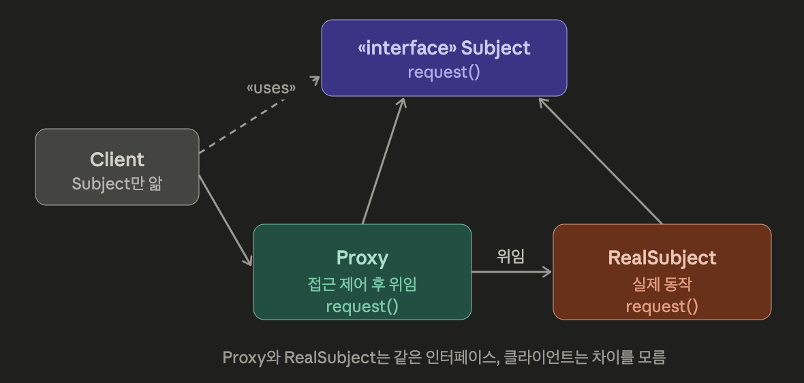
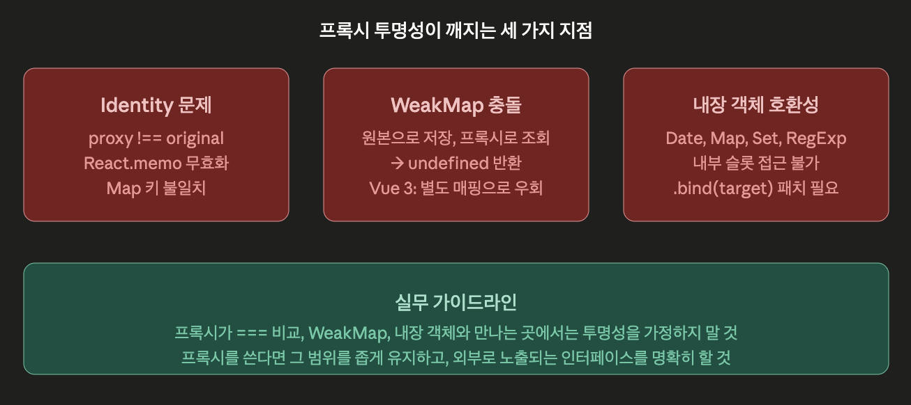
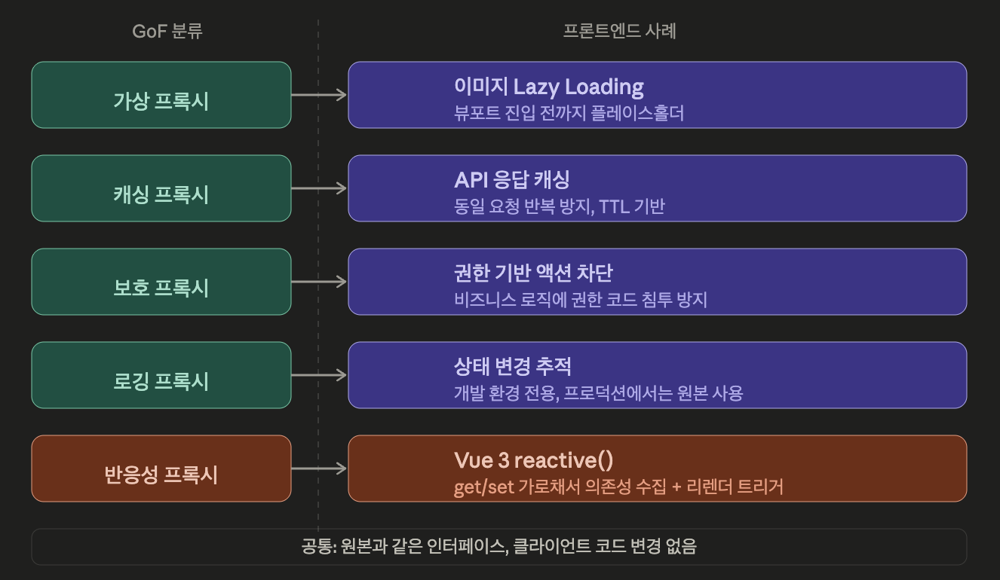

# Proxy 패턴

## 이론

### 프록시 패턴이란?

> “진짜 **객체에 대한 접근을 제어**하는 대리인을 둔다”
> 

- 핵심 키워드는 ‘제어’
- 프록시는 진짜 객체와 같은 인터페이스를 가지면서, 클라이언트와 진짜 객체 사이에 끼어들어 접근 자체를 관리

```yaml
클라이언트  →  프록시  →  진짜 객체 (Real Subject)
                ↑
          여기서 접근 제어
```

### 프록시의 세 가지 종류

#### 1. 원격 프록시 (Remote Proxy)

- 다른 주소 공간에 있는 객체를 로컬 객체처럼 쓰게 함

```tsx
// 클라이언트는 이게 원격 객체인지 모름
const machine = getGumballMachine('seattle')
machine.getCount()  // 실제로는 네트워크 너머의 객체
```

- 클라이언트가 `getCount()`를 호출하면 → 프록시가 네트워크 요청으로 바꿔서 원격 서버에서 보내고 → 응답을 받아서 돌려줌
- 클라이언트는 네트워크의 존재를 모른다

#### 2. 가상 프록시 (Virtual Proxy)

- 생성 비용이 큰 객체의 생성을 실제 필요할 때까지 미룸

```tsx
class ImageProxy implements Image {
  private realImage: RealImage | null = null

  display() {
    if (!this.realImage) {
      // 처음 호출될 때야 비로소 이미지 로딩
      this.realImage = new RealImage(this.url)
    }
    this.realImage.display()
  }
}
```

- 클라이언트가 `display()`를 호출하기 전까지 무거운 이미지 로딩이 일어나지 않음.

#### 3. 보호 프록시 (Protection Proxy)

- 접근 권한에 따라 메서드 호출을 허용하거나 차단

```tsx
class AdminOnlyProxy implements UserService {
  constructor(
    private realService: UserService,
    private currentUser: User
  ) {}

  deleteUser(id: string) {
    if (this.currentUser.role !== 'admin') {
      throw new Error('권한이 없습니다')
    }
    this.realService.deleteUser(id)
  }
}
```

- 같은 인터페이스인데 프록시가 권한 체크를 끼워넣음

### 구조 및 구분



> “프록시와 RealSubject가 같은 인터페이스를 구현, 클라이언트는 프록시와 진짜 객체 차이를 모름”
> 

|  | 프록시 | 어댑터 | 데코레이터 |
| --- | --- | --- | --- |
| 인터페이스 | 같음 | 다른 걸 같게 만듦 | 같음 |
| 목적 | 접근 제어 | 인터페이스 변환 | 기능 추가 |
| 클라이언트 인식 | 모름 (투명) | 다른 인터페이스 기대 | 모를 수도 있음 |
| 비유 | 비서가 전화를 대신 받음 | 돼지코 어댑터 | 옷 위에 코트를 입음 |

### JS의 Proxy 객체 - 언어 수준 구현

- 반복자 패턴의 `Symbol.iterator`가 언어 수준 구현이었던 것처럼, JS는 `Proxy`를 언어 스펙에 내장

```tsx
const user = { name: '홍길동', role: 'viewer' }

const protectedUser = new Proxy(user, {
  set(target, prop, value) {
    if (prop === 'role') {
      throw new Error('role은 직접 변경할 수 없습니다')
    }
    target[prop] = value
    return true
  },

  get(target, prop) {
    console.log(`${String(prop)} 접근`)  // 접근 로깅
    return target[prop]
  }
})

protectedUser.name = '이순신'    // OK
protectedUser.role = 'admin'     // Error!
```

- Vue 3의 반응성 시스템이 Proxy 객체로 만들어져있음
    - `reactive()`가 반환하는 객체가 `Proxy`

### (부록) JS Proxy 트랩 심화

- `get`/ `set` 은 프로퍼티 접근/할당만 가로챔.
- 하지만, Proxy가 가로챌 수 있는 연산은 13가지나 됨.

#### 1. `apply` - 함수 호출 가로채기

- 타켓이 함수일 때만 동작 - 함수가 호출되는 순간을 가로챌 수 있음

```tsx
function fetchUser(id: string) {
  return apiClient.get(`/users/${id}`)
}

// 함수 호출을 가로채서 로깅/캐싱/계측 추가
const trackedFetchUser = new Proxy(fetchUser, {
  apply(target, thisArg, args) {
    const start = performance.now()
    console.log(`fetchUser 호출: args=${JSON.stringify(args)}`)

    const result = Reflect.apply(target, thisArg, args)

    // Promise면 비동기 계측
    if (result instanceof Promise) {
      return result.then(data => {
        console.log(`fetchUser 완료: ${performance.now() - start}ms`)
        return data
      })
    }
    return result
  }
})

// 사용하는 쪽은 차이를 모름
const user = await trackedFetchUser('user-123')
```

- 원래 함수를 수정하지 않고, 호출 계측을 끼워 넣음
- AOP(관점 지향 프로그래밍)의 자바스크립트 구현

#### 2. `has` - `in` 연산자 가로채기

```tsx
const featureFlags = new Proxy({}, {
  has(target, prop) {
    // 실제로는 원격 설정 서버에서 확인
    return enabledFeatures.includes(prop as string)
  }
})

// 직관적인 문법으로 피처 플래그 체크
if ('darkMode' in featureFlags) {
  enableDarkMode()
}
```

#### 3. `deleteProperty` - 삭제 방지

```tsx
const config = new Proxy(appConfig, {
  deleteProperty(target, prop) {
    if (prop === 'apiKey' || prop === 'baseUrl') {
      throw new Error(`${String(prop)}는 삭제할 수 없습니다`)
    }
    return Reflect.deleteProperty(target, prop)
  }
})

delete config.apiKey  // Error!
delete config.tempCache  // OK
```

#### 4. `construct` - `new` 연산자 가로채기

```tsx
class UserService {
  constructor(private apiUrl: string) {}
}

// 인스턴스 생성을 가로채서 싱글톤 강제
let instance: UserService | null = null
const SingletonUserService = new Proxy(UserService, {
  construct(target, args) {
    if (!instance) {
      instance = Reflect.construct(target, args)
    }
    return instance
  }
})

const a = new SingletonUserService('/api')
const b = new SingletonUserService('/api')
console.log(a === b)  // true
```

### (부록) 프록시 체이닝

- 프록시의 타겟이 또 다른 프록시가 될 수 있음 → 이것으로 관심사를 분리해 쌓을 수 있음

#### 유용한 패턴 - 레이어별 분리

```tsx
const user = { name: '홍길동', role: 'viewer', email: 'hong@test.com' }

// Layer 1: 로깅
const withLogging = new Proxy(user, {
  get(target, prop) {
    console.log(`[LOG] ${String(prop)} 읽음`)
    return Reflect.get(target, prop)
  }
})

// Layer 2: 유효성 검사 (로깅 프록시를 감쌈)
const withValidation = new Proxy(withLogging, {
  set(target, prop, value) {
    if (prop === 'email' && !value.includes('@')) {
      throw new Error('유효하지 않은 이메일')
    }
    return Reflect.set(target, prop, value)
  }
})

// Layer 3: 접근 제어 (유효성 프록시를 감쌈)
const secured = new Proxy(withValidation, {
  get(target, prop) {
    if (prop === 'email' && !currentUser.isAdmin) {
      return '***'  // 마스킹
    }
    return Reflect.get(target, prop)  // 아래 레이어로 위임
  }
})

secured.name      // [LOG] name 읽음 → '홍길동'
secured.email     // [LOG] email 읽음 → '***' (비관리자일 때)
secured.email = 'bad'  // Error: 유효하지 않은 이메일
```

호출 흐름 : 

```tsx
secured.name
  → 접근 제어 (get trap, 통과)
    → 유효성 검사 (get trap 없음, 통과)
      → 로깅 (get trap, 로그 찍음)
        → 원본 user 객체
```

- 각 프록시가 하나의 관심사만 담당
- 미들웨어 체인과 같은 구조

#### 위험 - 이 구조가 무너지는 순간

1. 성능 저하
    - 프록시를 하나 거칠 때마다 트랩 함수 호출이 추가
    - 3개 쌓으면 `get` 한 번에 함수 호출 3번
    - 루프 안에서 프로퍼티를 수천 번 접근하면 체감
    
    ```tsx
    // 이런 코드에서 프록시 3겹이면 눈에 띄게 느려진다
    for (let i = 0; i < 100000; i++) {
      total += secured.price  // 트랩 3번 × 10만 = 30만 번 함수 호출
    }
    ```
    
2. 디버깅 지옥
    - 에러가 나면 어느 레이어의 어느 트랩에서 터졌는지 추적이 어려움
    - 스택 트레이스에 `Proxy` 내부가 제대로 안 찍힘
    
    ```tsx
    // 실제 에러 메시지
    TypeError: Cannot read property 'name' of undefined
        at Object.get (<anonymous>)    // 어느 프록시?
        at Object.get (<anonymous>)    // 또 어느 프록시?
    ```
    
3. `this` 바인딩 깨짐
    - 프록시를 통해 메서드를 호출하면 `this`가 프록시 자체를 가리킬 수 있음
    - 체인이 길어지면 `this`가 어느 레이어를 가리키는지 예측 불가능해짐
    
    ```tsx
    const obj = {
      name: '원본',
      getName() { return this.name }  // this가 뭘 가리킬까?
    }
    
    const proxy1 = new Proxy(obj, { /* ... */ })
    const proxy2 = new Proxy(proxy1, { /* ... */ })
    
    // proxy2.getName()에서 this는 proxy2
    // proxy2의 get 트랩을 타고, proxy1의 get 트랩을 타고...
    // 의도한 동작이 아닐 수 있음
    ```
    
    - 프록시 체인은 2겹 이내. 그 이상 필요하면 설계를 다시 보자

### 투명 프록시의 한계

- 프록시의 가장 큰 약속은 “클라이언트가 프록시인 것을 모른다”는 투명성(transparency)
- 하지만, JS에서 이것이 깨지는 케이스가 있음

#### 1. 동일성 (Identity) 문제

```tsx
const original = { name: '홍길동' }
const proxy = new Proxy(original, {})

original === proxy          // false!
original === original       // true

// Map, Set에서 키로 쓰면 다른 키로 취급됨
const map = new Map()
map.set(original, '원본')
map.get(proxy)              // undefined — 다른 객체 취급
```

- 프록시와 원본은 `===`로 비교하면 항상 다름
- 이것이 문제되는 상황은?
    
    ```tsx
    // React에서 props 비교
    // React.memo는 Object.is (===)로 비교한다
    const MemoizedChild = React.memo(({ user }) => <div>{user.name}</div>)
    
    // user가 프록시로 감싸져 있으면
    // 매 렌더마다 다른 참조 → memo가 매번 무효화
    <MemoizedChild user={proxiedUser} />
    ```
    

#### 2. WeakMap / WeakSet과의 충돌

- WeakMap의 키는 객체 참조 기반, 프록시와 원본이 다른 참조이므로

```tsx
const weakMap = new WeakMap()
const original = {}
const proxy = new Proxy(original, {})

weakMap.set(original, 'data')
weakMap.get(proxy)       // undefined!
weakMap.has(proxy)       // false!
```

- Vue3는 이 문제를 내부적으로 해결하기 위해 `ReactiveFlags`와 별도의 `WeakMap`으로 원본-프록시 매핑을 관리

```tsx
// Vue 3의 내부 접근방식 (단순화)
const reactiveMap = new WeakMap()

function reactive(target) {
  // 이미 프록시가 있으면 같은 프록시 반환
  if (reactiveMap.has(target)) {
    return reactiveMap.get(target)
  }

  const proxy = new Proxy(target, handlers)
  reactiveMap.set(target, proxy)  // 원본 → 프록시 매핑
  return proxy
}
```

- 같은 원본에 대해 항상 같은 프록시를 반환해서 동일성 문제를 우회

#### 3. 내장 객체에서 깨짐

- `Date`, `Map`, `Set`, `RegExp` 같은 내장 객체는 내부 슬롯에 의존
- 프록시는 이 내부 슬롯을 가지고 있지 않아서 메서드가 터짐

```tsx
const date = new Date()
const proxiedDate = new Proxy(date, {})

proxiedDate.getTime()
// TypeError: this is not a Date object

const map = new Map([[1, 'a']])
const proxiedMap = new Proxy(map, {})

proxiedMap.get(1)
// TypeError: Method Map.prototype.get called on incompatible receiver
```

- 해결하려면 `get` 트랩에서 메서드를 원본에 바인딩해줘야 함

```tsx
const proxiedMap = new Proxy(map, {
  get(target, prop) {
    const value = Reflect.get(target, prop)
    // 메서드면 원본에 바인딩해서 반환
    if (typeof value === 'function') {
      return value.bind(target)
    }
    return value
  }
})

proxiedMap.get(1)  // 'a' — 이제 동작
```

→ 이런 패치가 필요하다는 것 자체가 프록시의 투명성에 구멍이 있다는 뜻



## 예시 - 전통적인 프로그래밍

### 원격 프록시 - 네트워크 너머 객체

- 책의 RMI 예시, 현대적으로는 gRPC, GraphQL의 클라이언트 SDK가 원격 프록시
    - 메서드를 호출하면 내부에서 네트워크 요청이 나감
    - 호출하는 쪽은 로컬 객체처럼 씀

### 가상 프록시 - ORM의 Lazy Loading

- 데이터베이스 ORM에서 관계 데이터를 즉시 안 불러오고, 실제 접근 시점에 쿼리를 날리는 것
- Hibernate의 `LazyInitializationProxy`, Prisma의 관계 필드 접근이 이 패턴

```tsx
// user.posts에 접근하는 순간 비로소 DB 쿼리 실행
const user = await prisma.user.findUnique({ where: { id: 1 } })
const posts = await user.posts  // 이 시점에 SELECT * FROM posts WHERE ...
```

## 예시 - 프론트엔드

### 1. 가상 프록시 - 이미지 Lazy Loading

- 뷰포트에 들어오기 전까지 이미지를 로딩하지 않음

```tsx
function LazyImage({ src, alt }: { src: string; alt: string }) {
  const [loaded, setLoaded] = useState(false)
  const { ref, inView } = useIntersectionObserver({ triggerOnce: true })

  return (
    <div ref={ref}>
      {inView ? (
         setLoaded(true)}
          style={{ opacity: loaded ? 1 : 0, transition: 'opacity 0.3s' }}
        />
      ) : (
        // 프록시 — 진짜 이미지 대신 플레이스홀더
        <div style={{ width: 300, height: 200, background: 'var(--color-background-secondary)' }} />
      )}
    </div>
  )
}
```

- Placeholder가 프록시, ``가 RealSubject
- 뷰포트에 들어오는 순간 프록시가 진짜 객체로 교체

### 2. 캐싱 프록시 - API 요청 캐싱

- TanStack Query

```tsx
function createCachingProxy<T extends Record<string, (...args: any[]) => Promise<any>>>(
  api: T,
  ttl: number = 30000
): T {
  const cache = new Map<string, { data: any; timestamp: number }>()

  return new Proxy(api, {
    get(target, prop) {
      const original = Reflect.get(target, prop)
      if (typeof original !== 'function') return original

      // 함수 호출을 가로채서 캐싱
      return async (...args: any[]) => {
        const key = `${String(prop)}:${JSON.stringify(args)}`
        const cached = cache.get(key)

        if (cached && Date.now() - cached.timestamp < ttl) {
          return cached.data   // 캐시 히트 — 네트워크 안 탐
        }

        const data = await original(...args)
        cache.set(key, { data, timestamp: Date.now() })
        return data
      }
    }
  }) as T
}

// 원래 API 클라이언트
const userApi = {
  getUser: (id: string) => fetch(`/api/users/${id}`).then(r => r.json()),
  getOrders: (id: string) => fetch(`/api/orders/${id}`).then(r => r.json()),
}

// 캐싱 프록시로 감쌈 — 사용 코드 변경 없음
const cachedApi = createCachingProxy(userApi, 60000)

await cachedApi.getUser('123')  // 네트워크 요청
await cachedApi.getUser('123')  // 캐시에서 반환, 네트워크 안 탐
```

- `userApi`를 쓰던 코드가 `cachedApi`로 바뀌어도 인터페이스 동일

### 3. 보호 프록시 - 권한 기반 UI 제어

- 컴포넌트 레벨에서 보호 프록시를 적용하면 권한 체크를 비즈니스 로직과 분리할 수 있음

```tsx
// 액션 객체에 보호 프록시 적용
function withPermission<T extends Record<string, (...args: any[]) => any>>(
  actions: T,
  requiredRole: string,
  currentUser: User
): T {
  return new Proxy(actions, {
    get(target, prop) {
      const action = Reflect.get(target, prop)
      if (typeof action !== 'function') return action

      return (...args: any[]) => {
        if (!currentUser.roles.includes(requiredRole)) {
          toast.error('권한이 없습니다')
          return   // 차단
        }
        return action(...args)
      }
    }
  }) as T
}

// 원래 액션
const orderActions = {
  cancel: (id: string) => apiClient.post(`/orders/${id}/cancel`),
  refund: (id: string) => apiClient.post(`/orders/${id}/refund`),
  delete: (id: string) => apiClient.delete(`/orders/${id}`),
}

// 관리자만 호출 가능하도록 보호
const protectedActions = withPermission(orderActions, 'admin', currentUser)

// 컴포넌트에서 — 권한 체크 코드가 없음
<button onClick={() => protectedActions.refund(orderId)}>환불</button>
// 비관리자가 누르면 toast.error, 관리자면 실제 실행
```

### 4. 로깅 프록시 - 상태 변경 추적

- 디버깅할 때 상태 객체의 모든 읽기/쓰기를 추적하고 싶을 때.

```tsx
function createDebugProxy<T extends object>(target: T, label: string): T {
  return new Proxy(target, {
    get(obj, prop) {
      const value = Reflect.get(obj, prop)
      console.log(`[${label}] GET ${String(prop)} →`, value)
      return value
    },
    set(obj, prop, value) {
      const old = Reflect.get(obj, prop)
      console.log(`[${label}] SET ${String(prop)}: ${old} → ${value}`)
      return Reflect.set(obj, prop, value)
    }
  }) as T
}

// 개발 환경에서만 적용
const store = process.env.NODE_ENV === 'development'
  ? createDebugProxy(appStore, 'AppStore')
  : appStore

store.user = newUser
// [AppStore] SET user: {name: '홍길동'} → {name: '이순신'}
```

- 프로덕션에서는 원본, 개발에서는 프록시. 코드 변경 없이 디버깅 레이어를 껐다 켤 수 있음.

### 5. Vue 3의 반응성

- Vue3으 `reactive()`가 반환하는 모든 객체가 Proxy

```tsx
import { reactive, watchEffect } from 'vue'

const state = reactive({
  count: 0,
  user: { name: '홍길동' }
})

// state는 Proxy — get/set이 가로채여서
// 어떤 프로퍼티를 읽었는지 추적 (의존성 수집)
watchEffect(() => {
  console.log(state.count)
  // Vue가 get 트랩으로 "이 이펙트는 count에 의존함"을 기록
})

state.count++
// set 트랩 발동 → count에 의존하는 이펙트 재실행
// console: 1
```

```
state.count 읽기
  → Proxy get 트랩
    → "현재 실행 중인 이펙트"를 count의 의존성 목록에 추가
    
state.count 쓰기
  → Proxy set 트랩
    → count의 의존성 목록에 있는 모든 이펙트 재실행
```

- React는 이 문제를 `setState` / `useState`의 명시적 호출로 해결
- Vue는 Proxy로 프로퍼티 접근 자체를 가로채서 자동으로 해결

## 마무리



- 프록시는 다른 패턴들과 달리 코드를 건드리지 않고 행동을 끼워넣는 유일한 방법.
    - 어댑터는 인터페이스를 바꾸고,
    - 데코레이터는 기능을 얹고
    - 퍼사드는 감춤
    - 프록시는 원본과 클라이언트 사이에 투명하게 끼어들어서 캐싱, 권한, 로깅, 지연 로딩을 수행
- JS `Proxy`의 투명성은 완벽하지 않음. identity, WeakMap, 내장 객체에서 깨짐

→ “프록시의 범위를 좁게, 한계를 인지하고 쓰자”
